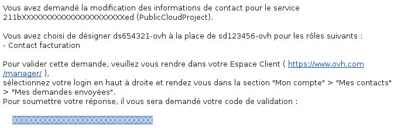

## 
Il Public Cloud OVH ti permette di modificare il contatto amministratore e di fatturazione dei tuoi progetti, ad esempio per assegnare la gestione delle tue fatture e delle tue istanze a due diversi account.

Questa guida ti mostra la procedura da seguire per modificare i tuoi contatti.

## Requisiti necessari

- 2 account OVH
- un progetto Public Cloud

## 
Accedi al tuo Spazio Cliente OVH Cloud e clicca su Gestione e consumo del progetto.

{.thumbnail}
Nella nuova pagina, clicca sul tab Contatti e permessi.

{.thumbnail}
Visualizzi i tuoi contatti amministratore e di fatturazione correnti.

{.thumbnail}
Clicca su Modificare per essere reindirizzato alla pagina in cui effettuare la tua modifica:

{.thumbnail}
Una volta inseriti i nuovi contatti, i 2 account OVH riceveranno via email il codice di conferma della modifica del contatto:

{.thumbnail}
Per diventare effettiva, la modifica deve essere accettata da entrambi gli account.

Per confermare l'operazione, clicca sul nome del tuo account in alto a destra, seleziona "Il tuo account" e poi "I tuoi contatti":

{.thumbnail}
A questo punto, il contatto iniziale dovrà accedere alla sezione Le tue richieste inviate e il nuovo contatto alla sezione Le tue richieste ricevute.
Compare una riga di questo tipo:

{.thumbnail}
Per applicare la modifica, ognuno degli account deve inserire il codice ricevuto via email nella finestra che si apre dopo la conferma della procedura.

## 

- [Delega i diritti per gestire i tuoi progetti]({legacy}1914)
- [Analizza i tuoi consumi e gestisci la tua fatturazione]({legacy}2031)

## 
[Ritorna all'indice delle guide Cloud]({legacy}1785)

