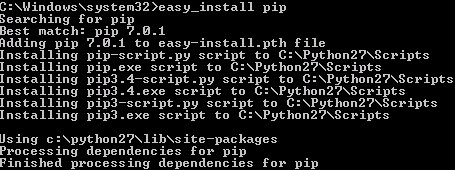

## 
In order to manage your Public Cloud services from a terminal, you can install OpenStack clients with Python.
This will allow you to manage Object Storage and automate the different actions which you can run with these clients.

This guide explains how to install the OpenStack clients.


## With Debian

- Open a terminal, or an SSH connection for the environment that you want to configure

- [Become root](https://docs.ovh.com/gb/en/public-cloud/become_root_and_select_a_password/)

- Update repositories:

```
root@vps187763:~# apt-get update
```


- Install clients for Nova (compute) and glance (image service)

```
root@vps187763:~# apt-get install python-glanceclient python-novaclient -y
```


Once this stage is complete, we recommend that you create a specific user, so that you are not working as the root user.

- For help with the nova and glance command lines, enter the following command:

```
admin@vps187763:~$ nova help
```


```
admin@vps187763:~$ glance help
```


- Complete documentation for the OpenStack API can be found [here](http://docs.openstack.org/cli-reference/content/)


## Under CentOS

- Open a terminal, or an SSH connection for the environment you want to configure

- [Become root](https://docs.ovh.com/gb/en/public-cloud/become_root_and_select_a_password/)

- Install rpm rdo-release:

```
[root@vps187769 ~]# yum install -y https://rdoproject.org/repos/rdo-release.rpm
```

- Update repositories:

```
root@vps187763:~# yum update
```

- Install nova

```
[root@vps187769 ~]# yum install -y python-novaclient
```


- Install glance

```
[root@vps187769 ~]# yum install -y python-novaclient
```


Source: [https://www.rdoproject.org/Quickstart](https://www.rdoproject.org/Quickstart)
Once this stage is complete, we recommend that you create a specific user, so that you are not working as the root user.

- For help with the nova and glance command lines, enter the following command:

```
[root@vps187769 ~]# nova help
```


```
[root@vps187769 ~]# glance help
```


- Complete documentation for the OpenStack API can be found [here](http://docs.openstack.org/cli-reference/content/)


## 

- Download and install version 
[2.7.10 of Python](https://www.python.org/downloads/release/python-2710/)

- Launch a command promt

- Install PIP with easy_install :


{.thumbnail}

- Install Swift


{.thumbnail}

- For help with the command lind, use this command:


```
C:\Windows\system32>swift --help
```

