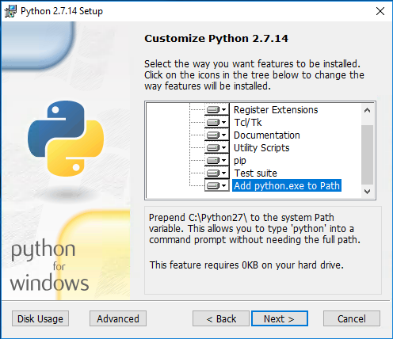
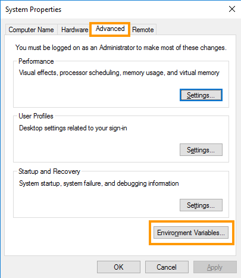
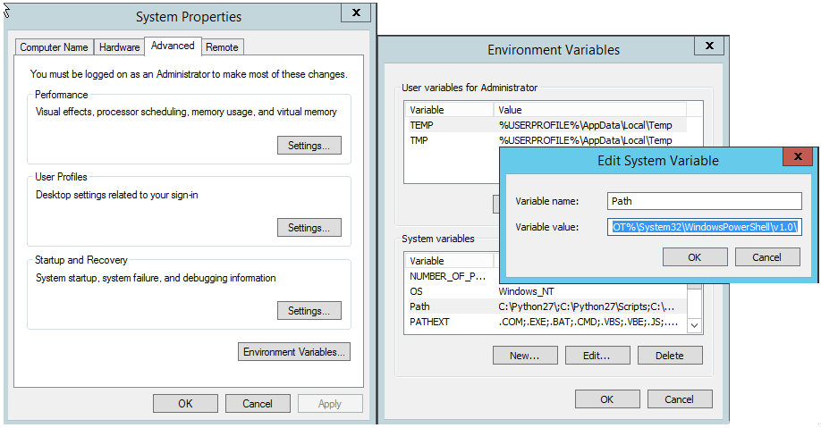
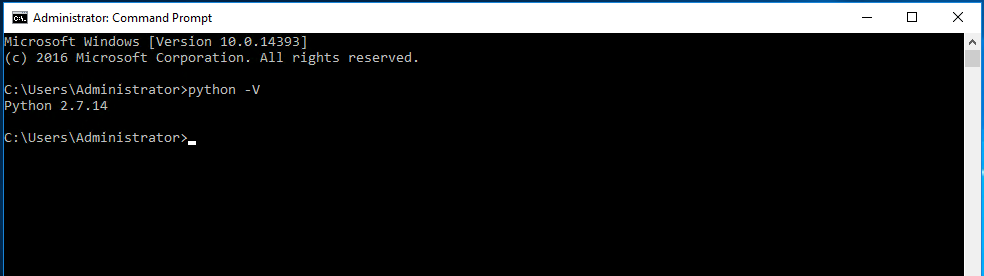

**Dernière mise à jour le 21/01/2019**

## Objectif

Il est possible d'administrer les services Public Cloud à l’aide des commandes issues de la console système, après le téléchargement et l’installation des outils OpenStack.

Grâce à l'API OpenStack, vous pouvez automatiser cette gestion en générant des scripts. Le client Nova OpenStack permet d'administrer les instances et l'espace disque. Le client Glance OpenStack, lui, vous offre la possibilité de gérer les images et les sauvegardes. Quant au client Swift, il permet de diriger l'espace de stockage des objets.

**Découvrez comment installer ces outils OpenStack.**

## Prérequis

- Disposer d'un accès **root** à l'environnement que vous souhaitez configurer.

## En pratique

### Sous Debian

Ouvrez le terminal ou connectez-vous en SSH à l'environnement que vous souhaitez préparer.

Mettez à jour le cache des paquets, grâce à la commande `apt-get update`:

```sh
apt-get update
```

Utilisez la commande ci-dessous pour installer les clients Nova (application de calcul), Glance (image service) et Swift :

```sh
apt-get install python-openstackclient python-novaclient -y
```

À l'issue de cette étape, nous vous recommandons de créer un utilisateur spécial pour ne pas vous servir de l’utilisateur root.

Pour accéder aux outils d'aide, exécutez la commande suivante :

```sh
openstack --help
nova help
```

> [!primary]
> 
> La documentation relative à l’API OpenStack est disponible [sur cette page](https://docs.openstack.org/python-openstackclient/latest/){.external}.
> 

### Sous CentOS

Ouvrez le terminal ou connectez-vous en SSH à l'environnement que vous souhaitez préparer.

Mettez à jour le cache des paquets grâce à la commande suivante  :

```sh
yum update -y
```
Installez le rpm rdo-release avec la commande suivante :

```sh
yum install -y https://rdoproject.org/repos/rdo-release.rpm
```

Puis le client OpenStack :

```sh
yum install -y python-openstackclient
```

Et enfin le client Nova :

```sh
yum install -y python-novaclient
```

À l'issue de cette étape, nous vous recommandons de créer un utilisateur spécial pour ne pas vous servir de l’utilisateur root.

Pour accéder aux outils d'aide, exécutez la commande suivante :

```sh
openstack --help
nova help
```

> [!primary]
> 
> La documentation relative à l’API OpenStack est disponible [sur cette page](https://docs.openstack.org/python-openstackclient/latest/){.external}.
> 

### Sous Windows

Téléchargez et installez la version 2.7.10 de Python. Vous pouvez choisir d'ajouter automatiquement le langage de programmation Python à Path, en cochant cette option dans le configurateur d'installation :

{.thumbnail}

Vous pouvez également effectuer l'installation par vous-même. Pour ce faire, suivez les actions décrites ci-dessous :

#### Étape 1 : éditer les variables d'environnement du système

Recherchez les paramètres des variables d'environnement du système et positionnez-vous sur « Éditer les variables environnement du système » :

{.thumbnail}

#### Étape 2 : éditer les paramètres du système

Passez à l’onglet `Avancé`{.action} et cliquez sur `Variables environnement`{.action}, pour éditer les paramètres.

{.thumbnail}

#### Étape 3 : configurer les variables d'environnement 

Dans la section « Variables système », choisissez « Nouveau », attribuez le nom « PYTHON_HOME » et ajoutez le chemin jusqu'à Python. Par défaut, celui-ci sera : « C:\Python27 ».

{.thumbnail}

#### Étape 4 : ajouter le chemin pour les variables

Après l’ajout de Python, éditez « Path » (chemin) dans les variables système et ajoutez à la fin du chemin :

`...;%PYTHON_HOME%\;%PYTHON_HOME%\Script`

#### Étape 5 : redémarrer Windows

Les modifications introduites seront prises en compte une fois le système redémarré.

#### Étape 6 : installer le client OpenStack

Connecté en tant qu'administrateur, ouvrez le programme en ligne de commande (CMD) et installez le client OpenStack en utilisant la commande suivante :

```sh
# pip install python-openstackclient
```

Si l'opération s'est correctement déroulée, un résumé s'affiche :

{.thumbnail}

Vous pouvez vérifier la version d'installation dans la fenêtre CMD (ligne de commande) nouvellement ouverte, en saisissant « python-V » depuis n'importe quel emplacement du système.

{.thumbnail}

## Aller plus loin

Rejoignez la communauté de nos utilisateurs à l'adresse <https://community.ovh.com/>.