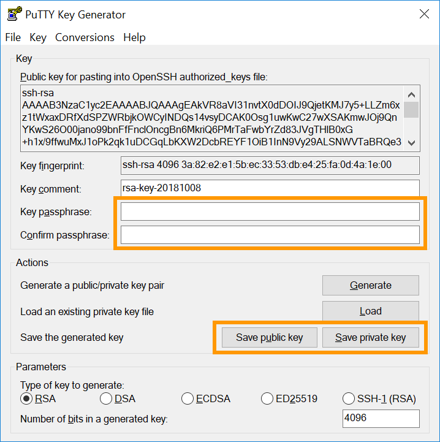
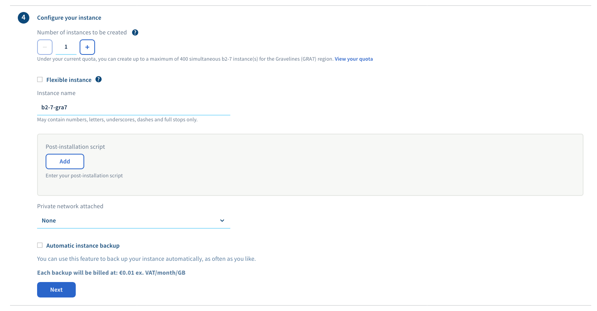
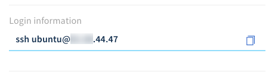
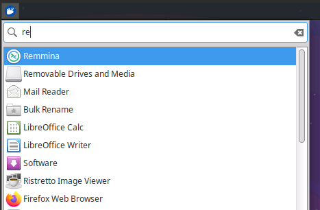

**Last updated 1st July 2020**

## Objective

Considering best practices, OVHcloud Public Cloud instances require a different approach than a VPS or Dedicated server solution.

**This guide will take you through the first steps of creating and connecting to a Public Cloud instance.**

## Requirements

- a [Public Cloud project](https://www.ovhcloud.com/en-gb/public-cloud/) in your OVHcloud account
- access to the [OVHcloud Control Panel](https://www.ovh.com/auth/?action=gotomanager)


## Instructions

### Step 1: Creating SSH keys

The SSH protocol ensures encrypted client-server communication. Using SSH keys further improves security by preventing any connections from a device that does not possess the matching key. Creating an SSH key set provides you with a public and a private key.

- The **public key** will be added to your Public Cloud instance at installation.

- The **private key**, stored on your client device, will then enable access to your instance without requiring the user password. 

> [!primary]
>
Please note that a key-based SSH login is mandatory for connections to Public Cloud instances with the exception of those running Windows operating systems. Public SSH keys added to your OVHcloud Control Panel will be available for Public Cloud services of all regions and data centres. You can only store **RSA** and **ECDSA** encrypted keys; ED25519 is currently not supported. 
>
Login authentication on Windows instances requires only username and password.
>

#### Creating an SSH key using a Linux or Mac operating system

From a Mac computer or a device with a Linux OS installed, first open the command line application (Terminal). Verify that you have a ".ssh" folder in your $HOME directory. If the folder does not exist, create it:

```sh
# mkdir ~/.ssh
# chmod 700 ~/.ssh
```

Use the following command to create a 4096 bit RSA key:

```sh
# ssh-keygen -b 4096
```
Using the "-t" option with this command allows you to specify a different encryption method, for example:

```sh
# ssh-keygen -t ecdsa -a 256
```

The command will prompt you to save the newly created key in the standard file:

```sh
Generating public/private rsa key pair.
Enter file in which to save the key (/home/user/.ssh/id_rsa):
```

You can accept the default file by pressing "↩". Now you will have the option to enter a passphrase to password-protect your SSH key. This is recommended for added security. Since only the corresponding private key will be required to access your Public Cloud instance from your working device, appropriate security measures should be applied at this point. The passphrase has to be entered when a connection to the instance is established.

Your SSH keys should be stored in the ".ssh" directory. The public key file will have ".pub" added to the filename.

```ssh
Your identification has been saved in /home/user/.ssh/id_rsa.
Your public key has been saved in /home/user/.ssh/id_rsa.pub.
The key fingerprint is:
SHA256:MRk+Y0zCOoOkferhkTvMpcMsYspj212lK7sEauNap user@hostname
The key's randomart image is:
+---[RSA 4096]----+
|     .. o        |
|    . .= o       |
|   o o  X        |
|. . . .          |
|. .=.o .S.       |
| =o.o.  .   .    |
|o +   .  . o ..  |
|.. .  .   oEoo . |
|o.        .o+oo  |
+----[SHA256]-----+
```

> [!warning]
>
> The private key should always be kept safe, and access to it strictly limited to authorised people only.
> 

In order to view and export your public key, use the "cat" command on your ".pub" key file and copy the output:

```ssh
# cat ~/.ssh/id_rsa.pub
ssh-rsa AAAAB3NzaC1yc2EAAAADAQABAAABAQC8teh2NJ42qYZV98gTNhumO1b6rMYIkAfRVazl
k6dSS3xf2MXJ4YHsDacdjtJ+evXCFBy/IWgdkFtcvsGAMZ2N1RdvhDyQYcy6NDaJCBYw1K6Gv5fJ
SHCiFXvMF0MRRUSMneYlidxUJg9eDvdygny4xOdC6c1JrPrSgOc2nQuKeMpOoOWLINIswg1IIFVk
kFMPrFivP8Z6tidzVpAtbr1sXmJGZazYWrU3FoK2a1sF1zEWrmlMOzX81zEWrmlMOzX8CpZW8Rae
i4ANmLy7NULWK36yU0Rp9bFJ4o0/4PTkZiDCsK0QyHhAJXdLN7ZHpfJtHIPCnexmwIMLfIhCWhO5
 user@hostname
```

> [!primary]
>
>In a MacOS Terminal, you can also use the "pbcopy" and "pbpaste" commands to handle key strings. For example, use this command to copy the key from the file "id_rsa.pub" to the clipboard:
>

```ssh
$ pbcopy < ~/.ssh/id_rsa.pub
```

#### Creating an SSH key using a Windows operating system

[PuTTY](https://putty.org/){.external} is an open source SSH client software with a graphical user interface, available for Windows and other operating systems. You can use it to remotely connect to a Linux server. Its companion software, PuTTY Key Generator (PuTTYgen), can be used to create SSH keys.

First, download PuTTY from [the official website](https://www.chiark.greenend.org.uk/~sgtatham/putty/latest.html), if it is not already installed. The recommended standard installation package includes PuTTYgen but it is available as a standalone file there as well. To find out if you have it available already, check your "programs" menu or use the Windows Search.

Open PuTTYgen and select a supported encryption algorithm. The example uses RSA. Enter 4096 as the number of bits, then click the `Generate`{.action} button.

{.thumbnail}

Next, randomly move your mouse cursor about the area below the progress bar:

{.thumbnail}

The key is ready when the progress bar is full. 

{.thumbnail}

You can select and copy the public key from this window to save it in your OVHcloud Control Panel in [Step 2](./#step-2-storing-public-keys-in-the-ovhcloud-control-panel_1).

Save both keys to files and use the option to enter a passphrase. Since only the corresponding private key will be required to access your Public Cloud instance from your working device, appropriate security measures should be applied at this point. The passphrase has to be entered when a connection to the instance is established.

### Step 2: Storing public keys in the OVHcloud Control Panel

Regardless of the method that was used to create the SSH keys, you will now have a public key ready to be added to a Public Cloud instance. You can store public keys in the Public Cloud section of the OVHcloud Control Panel, in order to have them readily available when creating an instance.

> [!primary]
>
Stored SSH keys are useful for a faster creation of your instances. To change key pairs and add users afterwards, please refer to the guide on [Configuring additional SSH keys](../configuring_additional_ssh_keys/).
>

Log in to the [OVHcloud Control Panel](https://www.ovh.com/auth/?action=gotomanager), go to the `Public Cloud`{.action} section and select the Public Cloud project concerned. Then, click on `SSH Keys`{.action} in the left-hand navigation bar under "Project Management".

Click on the `Add an SSH key`{.action} button. In the new window, enter a name for the key and paste your key string (copied in [Step 1](./#step-1-creating-ssh-keys) from the public key file or the PuTTYgen window) into the "Key" field. Confirm by clicking `Add`{.action}.

{.thumbnail}


### Step 3: Creating an instance

Log in to the [OVHcloud Control Panel](https://www.ovh.com/auth/?action=gotomanager), go to the `Public Cloud`{.action} section and select the Public Cloud project concerned. On the "Home" page, click on `Create an instance`{.action}. (You can find the same functionality on the "Instances" page by clicking `Instances`{.action} in the left-hand navigation bar under "Compute".)

{.thumbnail}

First, choose a server template according to your needs. The assistant will provide descriptions about the various use cases and server model availability. You can choose from these customised categories:

| Server Type | Guaranteed Resources | Usage notes |
| :---         |     :---:      |          :--- |
| General Purpose   | ✓     | Development servers, web or business applications    |
| CPU     | ✓       | Video encoding or other high-performance computing      |
| RAM   | ✓     | Databases, analysis, and in-memory calculations    |
| GPU     | ✓       | Massively parallel processing power for specialised applications (rendering, big data, deep learning, etc.)       |
| Sandbox    | -       | Hosted on shared resources for testing and development environments      |
| IOPS   | ✓     | Optimised for disk data transfer    |


> [!primary]
>
Your Public Cloud resources total will initially be limited for security reasons. You can verify quotas and request an increase in your OVHcloud Control Panel by clicking `Quota and Localisation`{.action} in the left-hand navigation bar under "Project Management".
>
Note that you can upgrade your instance later but you will not be able to switch to a smaller model, unless you choose the "Flex" option in step 4 of the creation. Please see below for more details on this.
>

In the next step, choose a data centre for your Public Cloud instance.

The third option is where you select an operating system for the instance. Which images are available in this step depends on the choices made in previous steps, i.e. compatibility with the server type and the region. Operating systems with pre-installed applications are also available.

{.thumbnail}

> [!primary]
>
If you select an operating system that requires paid licensing, these costs will automatically be included in the monthly or hourly billing.
>

This step also requires an SSH key to be added (Windows instances excluded), either by pasting the key directly via `Add a key`{.action} or selecting it from the list, provided you have stored it in the Control Panel in [Step 2](./#step-2-storing-public-keys-in-the-ovhcloud-control-panel_1).

{.thumbnail}

The fourth step allows to configure some additional options.

{.thumbnail}

- You can deploy multiple instances with the chosen setup (within your initial quota mentioned above).
- You can choose to create a flexible instance which allows you to later downgrade to a smaller model (even switching server model categories) but it will limit the instance to 50GB of **included storage** at all times, regardless of upgrades or downgrades.
- You can change the display name for your instance.
- You can add a post-installation script.
- You can connect the instance(s) to an existing private network (vRack).
- You can enable automatic backups for the instance(s). Please take note of the pricing information and the rotation option details.

When you have applied your choices, click `Next`{.action} to proceed to the final step and decide on a billing method.

{.thumbnail}

We recommend to choose hourly billing if there is any doubt regarding the usage period, because it is not possible to choose it afterwards. You will have the option to switch to a monthly subscription as soon as the instance is available on the "Instances" page.

> [!warning]
>
>If you choose to be billed hourly, you will continue to be billed as long as the instance is not deleted. It does not matter if the instance is actually used or not.
>

Once you have made sure that your configuration choices are correct, click on the `Create an instance`{.action} button to finish creating your new instance. It may take a few minutes until your service is delivered.

### Step 4: Connecting to your instance

Log in to the [OVHcloud Control Panel](https://www.ovh.com/auth/?action=gotomanager), go to the `Public Cloud`{.action} section and select the Public Cloud project concerned. Then, click on `Instances`{.action} in the left-hand navigation bar under "Compute". Your instance is ready when the "Status" column in the table is set to "Activated". To verify, you can click on the "Refresh" button right next to `Create an instance`{.action}.

{.thumbnail}

A user with elevated permissions is automatically created on the instance. The username reflects the chosen image, e.g "ubuntu", "debian", "fedora", "arch" etc. You can verify this, as well as all other specifications on the instance's "Dashboard" by clicking on `...`{.action} and then on `Instance details`{.action}.

> [!primary]
>
If you encounter issues with your connection, i.e. errors regarding your SSH keys, please refer to the guide on [Replacing your lost SSH key pair](../replacing_your_lost_ssh_key_pair/).
>

#### Connecting to a Linux OS instance from Linux OS / Mac

You can now access your instance through a command line interface (Terminal) via SSH. Replace "username" in the following examples with your default user as explained above. You can also simply copy the complete login command from the [OVHcloud Control Panel](https://www.ovh.com/auth/?action=gotomanager) by clicking on it in the instance's "Dashboard" and then paste it into your Terminal.

{.thumbnail}

Type the passphrase for your private key when prompted. 

```sh
ssh username@IPv4_of_your_instance
Enter passphrase for key '/Users/username/.ssh/id_rsa':
```
Since you are logged in with root privileges ("sudo user"), you can immediately enter commands to perform administrative tasks. It is advisable to first change your password:

```sh
$ sudo passwd
New password:
Retype new password:
passwd: password updated successfully
```
You can now use these credentials to log in via the `VNC console`{.action} in your [OVHcloud Control Panel](https://www.ovh.com/auth/?action=gotomanager). Next, switch to the "root" user and set a secure password, then switch back to the previous user:

```sh
$ sudo su -
# passwd
New password:
Retype new password:
passwd: password updated successfully
# su - username
```
Note that switching to the "root" user is rarely necessary; as a best practice for administration tasks that require root privileges, log in and execute commands as a user who is included in the "sudo" group.

#### Connecting to a Linux OS instance from Windows

After creating and saving your SSH keys (in [Step 1](./#step-1-creating-ssh-keys)) and installing your instance with the public key (in [Step 3](./#step-3-creating-an-instance)), you can use [PuTTY](https://www.chiark.greenend.org.uk/~sgtatham/putty/latest.html) and your private key to connect to your instance.

Open PuTTY and expand "SSH" in the left-hand menu, then click on "Auth" to see the authentication options.

{.thumbnail}

Click the `Browse`{.action} button to navigate to the folder where your private key file (.ppk) is located and open it. Next, switch to "Session" via the left-hand menu and enter your login credentials (username@IPv4_address). Replace "ubuntu" in the example screenshots with your appropriate default user according to the instance's "Dashboard" in your [OVHcloud Control Panel](https://www.ovh.com/auth/?action=gotomanager). (Click on `Instances`{.action} in the left-hand navigation bar, then click on the instance's name.)

For future connections, you can now save this session to have it available from the list in this interface. Enter a descriptive name under "Saved Sessions" and click on `Save`{.action} to add it.

{.thumbnail}

Next, click on `Open`{.action} and you will be prompted to enter the key's passphrase.

{.thumbnail}


> [!primary]
>
The instructions above describe a best practice approach to connect to your Public Cloud instances in a secure manner. For convenience and security purposes, consider to also use a password manager on your device, such as the free and open source solution **KeePass**.
>


#### Connecting to a Windows OS instance

After the instance has been created, the Windows installation needs to be finalised (_sysprep_). To achieve this, click on `...`{.action} and then on `Instance details`{.action}. Switch to the tab `VNC console`{.action}. The console should already display the post-installation interface.

{.thumbnail}

In the first step, decide on your localisation settings by selecting a region, a language and a keyboard layout. Click on `Next`{.action} to proceed.

{.thumbnail}

The second step requires to set up the default "Administrator" account. Enter your passphrase twice and click on `Finish`{.action} to complete the installation process. Use the eye symbol to check if all the characters entered into the fields match the actual layout of your keyboard.

The instance will reboot and you will be able to log in with these credentials using a remote desktop client. 

##### **From Windows**

Use the Windows Search if necessary and open the native "Remote Desktop Connection" client application.

{.thumbnail}

Enter the IPv4 address of your instance and "Administrator" as the user, then type your passphrase. Usually, a warning message will appear, asking to confirm the connection because of an unknown certificate. Click on `Yes`{.action} to log in to the instance.

> [!primary]
>
If you experience any issues with this procedure, verify that remote (RDP) connections are allowed on your device by checking your system settings, firewall rules and possible network restrictions.
>

##### **From a Linux OS**

Public Cloud instances can be accessed via the built-in VNC console in the [OVHcloud Control Panel](https://www.ovh.com/auth/?action=gotomanager). From your local device, connections must be established by a client application that is capable of the Remote Desktop Protocol (RDP).

For example, Remmina Remote Desktop Client is a compatible application which should be included in an Ubuntu Desktop installation. If you do not find Remmina in your environment, you can obtain it from the [official website](https://remmina.org/).

{.thumbnail}

Open Remmina and make sure the connection protocol is set to "RDP". Enter the IPv4 address of your Public Cloud instance and press "↩".

{.thumbnail}

If a certificate message appears, click on `Yes`{.action}. Next, enter username and password for the instance and click on `OK`{.action} to establish the connection.

{.thumbnail}


## Go further

[Backing up an instance](../back-up-instance/)

[Increasing Public Cloud quota](../increase-public-cloud-quota/)

[Switching from hourly to monthly billing](../change-public-cloud-billing-rate/)

[Configuring additional SSH keys](../configuring_additional_ssh_keys/)

Join our community of users on <https://community.ovh.com/en/>.