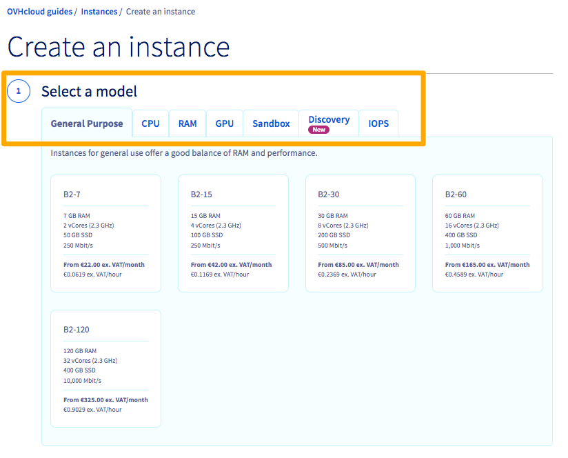

**Última atualização: 02/08/2022**

## Objetivo

As instâncias Public Cloud OVHcloud requerem uma abordagem diferente da de uma solução VPS ou Servidor Dedicado.

**Este guia vai ajudá-lo a criar e a aceder a uma instância Public Cloud.**

## Requisitos

- um projeto [Public Cloud](https://www.ovhcloud.com/pt/public-cloud/) criado na sua conta OVHcloud;
- ter acesso à [Área de Cliente OVHcloud](https://www.ovh.com/auth/?action=gotomanager&from=https://www.ovh.pt/&ovhSubsidiary=pt).


## Instruções

### Etapa 1: Criação de chaves SSH

O protocolo SSH assegura a encriptação das comunicações cliente-servidor. O uso de chaves SSH também aumenta a segurança ao evitar conexões de aparelhos que não dispõem da chave correta. A criação de uma chave SSH fornece-lhe uma chave pública e outra privada.

- A **chave pública** será adicionada à sua instância de Public Cloud no momento da instalação.

- A **chave privada**, armazenada na máquina do seu cliente, irá permitir o acesso à sua instância sem requerer a palavra-passe de utilizador. 

> [!primary]
>
Tenha em atenção que as conexões a instâncias de Public Cloud exigem um login SSH com chave, com exceção das que se baseiam em sistemas operativos Windows. As chaves públicas SSH adicionadas à sua Área de Cliente OVHcloud ficarão disponíveis para serviços Public Cloud em todas as regiões e datacenters. Só poderá armazenar chaves encriptadas **RSA** e **ECDSA**; a ED25519 não é suportada atualmente. 
>
A autenticação de conexão em instâncias Windows só requer o nome de utilizador e a palavra-passe.
>

#### Criação de uma chave SSH num sistema operativo Linux ou Mac

A partir de um computador Mac ou de uma máquina com um SO Linux, comece por abrir a aplicação de linhas de comando (Terminal). Confirme que tem uma pasta «.ssh» no seu diretório $HOME. Se esta pasta não existir, crie uma:

```bash
$ mkdir ~/.ssh
$ chmod 700 ~/.ssh
```

Utilize o seguinte comando para criar uma chave RSA de 4096 bits:

```bash
$ ssh-keygen -b 4096
```
A utilização da opção «-t» com este comando permite-lhe especificar um método de encriptação diferente, por exemplo:

```bash
$ ssh-keygen -t ecdsa -a 256
```

O comando irá solicitar-lhe que guarde a chave recém-criada no ficheiro padrão:

```bash
Generating public/private rsa key pair.
Enter file in which to save the key (/home/user/.ssh/id_rsa):
```

Pode aceitar o ficheiro padrão fazendo «Enter». A seguir terá a opção de introduzir uma frase de acesso para proteger a sua chave SSH. Esta ação é recomendada para uma maior segurança. Já que só será exigida uma chave privada correspondente para o acesso à instância de Public Cloud a partir do seu posto de trabalho, neste ponto impõe-se a aplicação de medidas de segurança adequadas. Quando se estabelecer uma conexão à instância, será preciso introduzir uma frase de acesso.

As suas chaves SSH devem ser guardadas no diretório «.ssh». Ao nome do ficheiro de chave pública será acrescentado «.pub».

```ssh
Your identification has been saved in /home/user/.ssh/id_rsa.
Your public key has been saved in /home/user/.ssh/id_rsa.pub.
The key fingerprint is:
SHA256:MRk+Y0zCOoOkferhkTvMpcMsYspj212lK7sEauNap user@hostname
The key's randomart image is:
+---[RSA 4096]----+
|     .. o        |
|    . .= o       |
|   o o  X        |
|. . . .          |
|. .=.o .S.       |
| =o.o.  .   .    |
|o +   .  . o ..  |
|.. .  .   oEoo . |
|o.        .o+oo  |
+----[SHA256]-----+
```

> [!warning]
>
> A chave privada deve ser sempre mantida em segurança e o acesso à mesma deve ser limitado a pessoas autorizadas.
> 

Para ler e exportar a sua chave pública, utilize o comando «cat» no respetivo ficheiro e copie o seguinte resultado:

```bash
$ cat ~/.ssh/id_rsa.pub
ssh-rsa AAAAB3NzaC1yc2EAAAADAQABAAABAQC8teh2NJ42qYZV98gTNhumO1b6rMYIkAfRVazl
k6dSS3xf2MXJ4YHsDacdjtJ+evXCFBy/IWgdkFtcvsGAMZ2N1RdvhDyQYcy6NDaJCBYw1K6Gv5fJ
SHCiFXvMF0MRRUSMneYlidxUJg9eDvdygny4xOdC6c1JrPrSgOc2nQuKeMpOoOWLINIswg1IIFVk
kFMPrFivP8Z6tidzVpAtbr1sXmJGZazYWrU3FoK2a1sF1zEWrmlMOzX81zEWrmlMOzX8CpZW8Rae
i4ANmLy7NULWK36yU0Rp9bFJ4o0/4PTkZiDCsK0QyHhAJXdLN7ZHpfJtHIPCnexmwIMLfIhCWhO5
 user@hostname
```

> [!primary]
>
>Num Terminal macOS, também pode usar os comandos «pbcopy» e «pbpaste» para gerir as cadeias de chaves. Por exemplo, use este comando para copiar a chave do ficheiro «id_rsa.pub» para a área de transferência:
>

```bash
$ pbcopy < ~/.ssh/id_rsa.pub
```

#### Criação de uma chave SSH num sistema operativo Windows

O [PuTTY](https://putty.org/){.external} é um software cliente SSH open source com uma interface de utilizador gráfica, disponível em Windows e noutros sistemas operativos. Pode utilizá-lo para se ligar remotamente a um servidor Linux. O seu programa associado, o PuTTY Key Generator (PuTTYgen), pode ser utilizado para criar chaves SSH.

Antes de mais, faça download do PuTTY a partir do [site oficial](https://www.chiark.greenend.org.uk/~sgtatham/putty/latest.html), caso ainda não o tenha instalado. O pacote de instalação padrão recomendado inclui o PuTTYgen, mas também o pode encontrar individualmente. Para descobrir se já o tem, verifique o menu de Programas ou use o Windows Search.

Abra o PuTTYgen e selecione um algoritmo de encriptação compatível. Este exemplo abaixo usa RSA. Introduza «4096» como número de bits e clique no botão `Generate`{.action}.

{.thumbnail}

De seguida, mova aleatoriamente o cursor do rato pela área sob a barra de progressão:

{.thumbnail}

A chave está pronta quando a barra de progressão estiver completa. 

{.thumbnail}

Nesta janela pode selecionar e copiar a chave pública para a guardar na Área de Cliente OVHcloud durante o [2.º passo](./#2o-passo-armazenamento-de-chaves-publicas-na-area-de-cliente-ovhcloud_1).

Guarde ambas as chaves sob a forma de ficheiro e use a opção de criação de uma frase de acesso. Já que só será exigida uma chave privada correspondente para o acesso à instância de Public Cloud a partir do seu posto de trabalho, neste ponto impõe-se a aplicação de medidas de segurança adequadas. Quando se estabelecer uma conexão à instância, será preciso introduzir uma frase de acesso.

### Etapa 2: Armazenamento de chaves públicas na Área de Cliente OVHcloud

Independentemente do método usado para criar chaves SSH, agora já dispõe de uma chave pública pronta a ser adicionada a uma instância Public Cloud. Pode armazenar chaves na secção Public Cloud da Área de Cliente OVHcloud, de modo a tê-las à mão quando criar uma instância.

> [!primary]
>
As chaves SSH armazenadas propiciam uma criação de instâncias mais rápida. Se desejar alterar pares de chaves e adicionar utilizadores ulteriormente, consulte o guia [Configurar as chaves SSH suplementares](../configurar_as_chaves_ssh_suplementares/).
>

Aceda à [Área de Cliente OVHcloud](https://www.ovh.com/auth/?action=gotomanager&from=https://www.ovh.pt/&ovhSubsidiary=pt), secção `Public Cloud`{.action}, e selecione o serviço Public Cloud em questão. A seguir, clique em `Chaves SSH`{.action}, na barra de navegação à esquerda, sob «Gestão de projetos».

Clique no botão `Adicionar uma chave SSH`{.action}. Na janela que se abrir, introduza um nome para a chave e cole a cadeia (copiada no [1.º Passo](./#1o-passo-criacao-de-chaves-ssh) do ficheiro público ou da janela PuTTYgen) no campo «Chave». Para confirmar, clique em `Adicionar`{.action}.

{.thumbnail}


### Etapa 3: Criação de uma instância

<iframe width="560" height="315" src="https://www.youtube-nocookie.com/embed/YP92y1rAVdQ" title="YouTube video player" frameborder="0" allow="accelerometer; autoplay; clipboard-write; encrypted-media; gyroscope; picture-in-picture" allowfullscreen></iframe>

Aceda à [Área de Cliente OVHcloud](https://www.ovh.com/auth/?action=gotomanager&from=https://www.ovh.pt/&ovhSubsidiary=pt), secção `Public Cloud`{.action}, e selecione o serviço Public Cloud em questão. Na página «Home», clique em `Criar uma instância`{.action}. (Encontrará a mesma funcionalidade na página «Instâncias», clicando em `Instâncias`{.action} na barra de navegação à esquerda, sob «Compute».)

{.thumbnail}

Antes de mais, escolha um modelo de servidor de acordo com as suas necessidades. O assistente vai fornecer descrições dos vários casos de uso e da disponibilidade dos modelos. Pode escolher entre as seguintes categorias personalizadas:

| Tipo de Servidor | Recursos Assegurados | Notas de Uso |
| :---         |     :---:      |          :--- |
| Propósito Genérico   | ✓     | Servidores de desenvolvimento, aplicações web ou comerciais    |
| CPU     | ✓       | Codificação de vídeo ou outra computação de elevado desempenho      |
| RAM   | ✓     | Bases de dados, análise e cálculos in-memory    |
| GPU     | ✓       | Cálculo acelerado para aplicações especializadas (rendering, Big Data, deep learning, etc.)       |
| Sandbox    | -       | Alojado em recursos partilhados para testes e ambientes de desenvolvimento      |
| Discovery    | -       | Alojado em recursos partilhados para testes e ambientes de desenvolvimento      |
| IOPS   | ✓     | Otimizado para transferências de dados de disco    |


> [!primary]
>
O total dos seus recursos Public Cloud começará por ser limitado por razões de segurança. Na Área de Cliente OVHcloud pode verificar as quotas e requerer aumentos: basta clicar em `Quota e Localização`{.action}, na barra de navegação à esquerda, sob «Gestão de projetos».
>
Tenha em atenção que mais tarde poderá fazer o upgrade da instância, mas não mudar para um modelo inferior, a menos que escolha a opção «Flex» no 4.º passo. Na próxima secção encontrará mais informações a este respeito.
>

A seguir, escolha um datacenter para a sua instância Public Cloud.

Neste passo, deve escolher um sistema operativo para a instância. As imagens disponíveis dependerão das escolhas feitas nos passos anteriores, nomeadamente no que se refere ao tipo de servidor e à região. Estarão igualmente disponíveis sistemas operativos com aplicações pré-instaladas.

{.thumbnail}

> [!primary]
>
Se escolher um sistema operativo que requeira uma licença paga, os custos serão automaticamente incluídos na faturação mensal ou horária.
>

Este passo também exige que seja adicionada uma chave SSH (com exceção das instâncias Windows), seja colando a chave diretamente através de `Adicionar uma chave`{.action}, seja escolhendo-a da lista, partindo do princípio de que a armazenou previamente na Área de Cliente durante o [2.º passo](./#2o-passo-armazenamento-de-chaves-publicas-na-area-de-cliente-ovhcloud_1).

{.thumbnail}

O 4.º passo permitirá configurar opções suplementares.

{.thumbnail}

- Pode instalar múltiplas instâncias com a configuração escolhida (dentro dos limites da quota inicial mencionada acima).
- Pode optar por criar uma instância flexível que lhe permita mais tarde fazer o downgrade para um modelo inferior (até mudando de categoria de modelo de servidor), mas isso irá limitar a instância a 50 GB de **armazenamento incluído**, independentemente de upgrades ou downgrades.
- Pode mudar o nome de exibição da instância.
- Pode adicionar um script pós-instalação.
- Pode conectar a instância a uma rede privada existente (vRack).
- Pode ativar backups automáticos da instância. Atenção: tome nota das informações relativas aos preços e às opções de rotação.

Quando tiver concluído, clique em `Seguinte`{.action} para avançar para o último passo e escolher um método de faturação.

{.thumbnail}

Recomendamos que escolha a faturação horária caso tenha dúvidas a respeito do período de uso, pois não será possível fazê-lo depois. Terá a oportunidade de mudar para uma faturação mensal depois de a instância ficar disponível na página «Instâncias».

> [!warning]
>
>Se optar pela faturação à hora, continuará a ser cobrado enquanto a instância existir, independentemente de estar a ser utilizada ou não.
>

Depois de ter verificado que a configuração está correta, clique no botão `Criar uma instância`{.action} para concluir o processo. A disponibilização do serviço pode levar alguns minutos.

### Etapa 4: Conexão à instância <a name="connect-to-instance"></a>

Aceda à [Área de Cliente OVHcloud](https://www.ovh.com/auth/?action=gotomanager&from=https://www.ovh.pt/&ovhSubsidiary=pt), secção `Public Cloud`{.action}, e selecione o serviço Public Cloud em questão. A seguir, clique em `Instâncias`{.action}, na barra de navegação à esquerda, sob «Compute». A instância estará pronta quando a coluna «Estado» da tabela passar a «Ativada». Pode verificar clicando no botão «Refresh», situado junto de `Criar uma instância`{.action}.

{.thumbnail}

De forma automática, é criado na instância um utilizador com um leque alargado de autorizações. O nome de utilizador reflete a imagem escolhida, por exemplo: «ubuntu», «debian», «fedora», «arch», etc. Pode confirmar isto e as outras especificações no «Painel de Controlo» da instância: clique em `...`{.action} e, a seguir, em `Pormenores da instância`{.action}.

> [!primary]
>
Se encontrar problemas durante a conexão, nomeadamente erros relativos às chaves SSH, consulte o guia [Alterar a chave SSH em caso de perda](../alterar_a_chave_ssh_em_caso_de_perda/).
>

> [!primary]
>
Se criou uma instância sem chave SSH, através da API OVHcloud ou da interface Openstack Horizon, só poderá adicionar uma chave SSH à sua instância através do [modo de rescue](https://docs.ovh.com/pt/public-cloud/passar_uma_instancia_em_modo_de_rescue/), seguindo as instruções descritas em [esta secção do guia apropriado](../alterar_a_chave_ssh_em_caso_de_perda/#instrucoes).
>

#### Conexão a uma instância Linux a partir de Linux/Mac

Agora já pode aceder à sua instância a partir de uma interface de linhas de comandos (Terminal) via SSH. Nos exemplos seguintes, substitua «username» pelo seu utilizador predefinido, como explicado acima. Também pode simplesmente completar o comando de conexão a partir da [Área de Cliente OVHcloud](https://www.ovh.com/auth/?action=gotomanager&from=https://www.ovh.pt/&ovhSubsidiary=pt): basta clicar nele no «Painel de Controlo» da instância e a seguir colá-lo no Terminal.

{.thumbnail}

Quando solicitado, introduza a frase de acesso à sua chave privada. 

```bash
ssh username@IPv4_of_your_instance
Enter passphrase for key '/Users/username/.ssh/id_rsa':
```
Como se encontra conectado como privilégios root («sudo user»), pode introduzir imediatamente comandos destinados a tarefas administrativas. É aconselhável que, antes, altere a sua palavra-passe:

```bash
$ sudo passwd username
New password:
Retype new password:
passwd: password updated successfully
```
Agora pode usar estas credenciais para se conectar através da `Consola VNC`{.action}, na [Área de Cliente OVHcloud](https://www.ovh.com/auth/?action=gotomanager&from=https://www.ovh.pt/&ovhSubsidiary=pt). De seguida, passe para o utilizador «root» e crie uma palavra-passe segura. Então, volte para o utilizador anterior:

```bash
$ sudo su -
# passwd
New password:
Retype new password:
passwd: password updated successfully
# su - username
```
Nota: raramente é necessário mudar para o utilizador «root»; como boa prática para tarefas de administração que exijam privilégios «root», conecte-se e execute comandos como um utilizador incluído no grupo «sudo».

#### Conexão a uma instância Linux a partir de Windows

Depois de criar e guardar as suas chaves SSH (no [1.º passo](./#1o-passo-criacao-de-chaves-ssh)) e de instalar a instância com a chave pública (no [3.º passo](./#3o-passo-criacao-de-uma-instancia)), pode usar o [PuTTY](https://www.chiark.greenend.org.uk/~sgtatham/putty/latest.html) e a chave privada para se conectar à instância.

Abra o PuTTY e expanda «SSH» no menu à esquerda. De seguida, clique em «Auth» para ver as opções de autenticação.

{.thumbnail}

Clique no botão `Browse`{.action} para navegar até à pasta onde se encontra o ficheiro da chave privada (.ppk) e abra-o. No menu à esquerda, passe para «Session» e introduza as suas credenciais de conexão (username@IPv4_address). Substitua «ubuntu» nos exemplos abaixo pelo utilizador predefinido adequado, segundo o «Painel de Controlo» da instância, na [Área de Cliente OVHcloud](https://www.ovh.com/auth/?action=gotomanager&from=https://www.ovh.pt/&ovhSubsidiary=pt). (Clique em `Instâncias`{.action}, na barra de navegação à esquerda, e a seguir clique no nome da instância.)

Para conexões futuras, pode guardar esta sessão para a ter disponível na lista desta interface. Introduza um nome descritivo sob «Saved Sessions» e clique em `Save`{.action} para a adicionar.

{.thumbnail}

De seguida, clique em `Open`{.action} e introduza a frase de acesso que lhe será solicitada.

{.thumbnail}


> [!primary]
>
As instruções acima consistem numa abordagem ideal para se conectar às suas instâncias Public Cloud de forma segura. Por razões de conveniência e segurança, recomendamos que também use um gestor de palavras-passe na sua máquina, como a solução **KeePass**, gratuita e open source.
>


#### Conexão a uma instância Windows

Depois de a instância ser criada, é preciso finalizar a instalação Windows (_sysprep_). Para isso, clique em `...`{.action} e em `Pormenores da instância`{.action}. Passe para o separador `Consola VNC`{.action}. A consola já deverá exibir a interface pós-instalação.

{.thumbnail}

No primeiro passo, configure a sua localização selecionando uma região, uma língua e um tipo de teclado. Para prosseguir, clique em `Avançar`{.action}.

{.thumbnail}

O segundo passo requer a configuração da conta predefinida «Administrator». Introduza duas vezes a sua frase de acesso e clique em `Concluir`{.action} para finalizar o processo de instalação. Use o símbolo do olho para verificar se todos os caracteres introduzidos nos campos correspondem à configuração real do seu teclado.

Depois de a instância ser reiniciada, poderá conectar-se com estas credenciais por meio de um cliente de ambiente de trabalho remoto. 

##### **A partir de Windows**

Use o Windows Search se necessário e abra a aplicação cliente nativa «Remote Desktop Connection».

{.thumbnail}

Introduza o endereço IPv4 da instância e indique «Administrator» como utilizador. Então, digite a frase de acesso. É possível que receba uma mensagem de aviso a pedir-lhe para confirmar a conexão devido a uma certificado desconhecido. Clique em `Sim`{.action} para se conectar à instância.

> [!primary]
>
Se encontrar problemas, verifique se a sua máquina permite conexões remotas (RDP): para isso, consulte as configurações de sistema, as regras de firewall e eventuais restrições de rede.
>

##### **A partir de Linux**

Pode aceder às instâncias Public Cloud através da consola VNC integrada na [Área de Cliente OVHcloud](https://www.ovh.com/auth/?action=gotomanager&from=https://www.ovh.pt/&ovhSubsidiary=pt). A partir da sua máquina local, as conexões deverão estabelecer-se através de uma aplicação cliente compatível com o Remote Desktop Protocol (RDP).

Por exemplo, o Remmina Remote Desktop Client é uma aplicação compatível que costuma estar incluída nas instalações Ubuntu Desktop. Se não encontrar o Remmina no seu ambiente, pode obtê-lo no [site oficial](https://remmina.org/).

{.thumbnail}

Abra o Remmina e certifique-se de que o protocolo de conexão escolhido é o «RDP». Introduza o endereço IPv4 da instância Public Cloud e faça «Enter».

{.thumbnail}

Se surgir uma mensagem relativa a certificados, clique em `Sim`{.action}. De seguida, introduza o nome de utilizador e a palavra-passe da instância e clique em `OK`{.action} para estabelecer a conexão.

{.thumbnail}


## Quer saber mais?

[Criar uma cópia de segurança de uma instância](../efetuar_backup_de_uma_instancia/)

[Aumentar a quota Public Cloud](../aumentar_a_quota_public_cloud/)

[Passar de uma faturação à hora para uma faturação ao mês](../mudar-tipo-faturacao-public-cloud/)

[Configurar as chaves SSH suplementares](../configurar_as_chaves_ssh_suplementares/)

Junte-se à nossa comunidade de utilizadores em <https://community.ovh.com/en/>.
