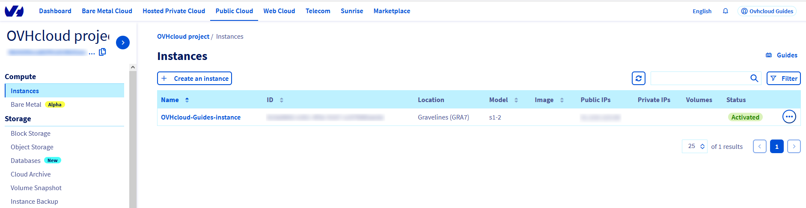

**Last updated 11th February 2022**

## Objective

Your Public Cloud instance may become inaccessible due to a lost SSH key or configuration errors.

In such circumstances, you can use the rescue mode to reconfigure your instance or to recover your data. 

**This guide explains how to put your OVHcloud Public Cloud instance in rescue mode and access your data.**

## Requirements

- A [Public Cloud instance](https://www.ovhcloud.com/en-ca/public-cloud/) in your OVHcloud account
- Access to the [OVHcloud Control Panel](https://ca.ovh.com/auth/?action=gotomanager&from=https://www.ovh.com/ca/en/&ovhSubsidiary=ca)
- Administrative access (root) to your instance via SSH

## Instructions

### Step 1: Activating rescue mode

Log in to the [OVHcloud Control Panel](https://ca.ovh.com/auth/?action=gotomanager&from=https://www.ovh.com/ca/en/&ovhSubsidiary=ca) and open your `Public Cloud`{.action} project. Then click on `Instances`{.action} in the left-hand menu.

{.thumbnail}

Click on `...`{.action} in the row of the instance concerned and select `Reboot in rescue mode`{.action}.

{.thumbnail}

You will now see the `Reboot in rescue mode` dialog box. Click the drop-down list to select the distribution you would like to use in rescue mode and then click the `Restart`{.action} button.

{.thumbnail}

Once your instance has been rebooted in rescue mode, an information box will display the available ways of access. Your temporary **rescue mode password** will only be shown in the VNC console. Click on your instance in the table, then switch to the tab `VNC console`{.action} to retrieve it.

{.thumbnail}


### Step 2: Accessing your data

When rescue mode has been activated, your instance's data will be attached as an additional disk. You will now need to mount it, by taking the following steps.

First, establish an SSH connection to your instance. Once you are connected, verify the available disks with this command:

```bash
root@instance:/home/admin# lsblk

NAME MAJ:MIN RM SIZE RO TYPE MOUNTPOINT
vda 253:0 0 1G 0 disk
└─vda1 253:1 0 1023M 0 part /
vdb 253:16 0 10G 0 disk
└─vdb1 253:17 0 10G 0 part
```

Next, mount the partition:

```bash
root@instance:/home/admin# mount /dev/vdb1 /mnt
```

Your data will now be accessible from the `/mnt` folder.

### Step 3: Deactivating rescue mode

Once you have completed your tasks, you can deactivate rescue mode by rebooting your instance from the Control Panel interface. To execute this, click on `...`{.action} and select `Exit rescue mode`{.action}.

{.thumbnail}

### Activating rescue mode using the OpenStack API

You can also activate rescue mode via the OpenStack API using the following command:

```bash
root@instance:~# nova rescue INSTANCE_ID
```

To exit rescue mode, use the following command:

```bash
root@instance:~# nova unrescue INSTANCE_ID
```

## Go further

Join our community of users on <https://community.ovh.com/en/>.
