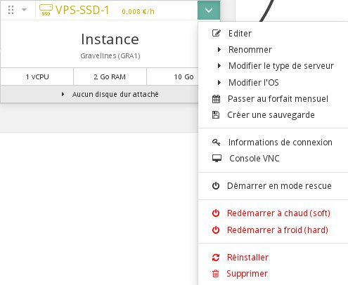
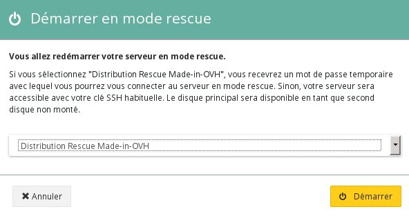
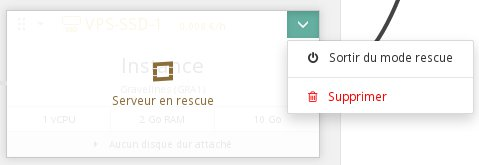

## 
Existen casos en los que es posible que no pueda acceder a su instancia, como una configuración inadecuada o la pérdida de la clave SSL.

OVH ofrece un modo de rescate (rescue mode) que permite acceder a los datos para poder corregir los archivos de configuración. Su funcionamiento es bastante sencillo: la instancia se inicia en una nueva imagen, es decir, una instancia con una configuración básica. El disco de la instancia se conecta a la instancia como un disco adicional, de modo que solo hay que montarlo para poder acceder a los datos.

A continuación se describe cómo utilizar el modo de rescate.


## Requisitos previos
[Crear una instancia desde el área de cliente de OVH](https://docs.ovh.com/es/public-cloud/crear_una_instancia_desde_el_area_de_cliente_de_ovh/)


## Pasar a modo de rescate
Para poner el servidor en modo de rescate, solo hay que hacer clic en en la flecha situada en la esquina superior derecha de la instancia y seleccionar «Reiniciar en modo de rescate».

{.thumbnail}
A continuación deberá seleccionar la imagen en la que quiere reiniciar el servidor en modo de rescate.

{.thumbnail}
En la lista desplegable se mostrarán las imágenes que ofrecemos por defecto y una imagen adicional llamada «Distribución Rescue Made-in-OVH» que permite conectarse a la instancia en modo de rescate con una contraseña temporal.

Una vez que el servidor se haya iniciado en modo de rescate, aparecerá una nueva ventana en la esquina inferior derecha de la pantalla con la contraseña temporal.

{.thumbnail}


## Acceder a los datos
Como se explica más arriba, los datos de la instancia se conectarán al modo de rescate como un disco adicional. Por lo tanto, solo tiene que montarlo como se indica a continuación para poder acceder a ellos:

Conectarse como root:

```
admin@instance:~$ sudo su
```


Comprobar los discos disponibles:

```
root@instance:/home/admin# lsblk
NAME MAJ:MIN RM SIZE RO TYPE MOUNTPOINT
vda 253:0 0 1G 0 disk 
└─vda1 253:1 0 1023M 0 part /
vdb 253:16 0 10G 0 disk 
└─vdb1 253:17 0 10G 0 part
```


Montar la partición:

```
root@instance:/home/admin# mount /dev/vdb1 /mnt
```


Sus datos estarán disponibles en la carpeta /mnt.

Así podrá, por ejemplo, editar el archivo que contiene la lista de llaves SSH que puede utilizar el usuario admin:


```
root@instance:/home/admin# vim /mnt/home/admin/.ssh/authorized_keys
```


## Reiniciar la instancia en modo normal
Cuando haya realizado las operaciones necesarias, puede reiniciar la instancia en modo normal. Para ello, solo tiene que hacer clic en la flecha situada en la esquina superior derecha de la instancia y seleccionar «Salir del modo de rescate».

{.thumbnail}


## Con la API OpenStack
Puede reiniciar la instancia en modo de rescate mediante la API OpenStack utilizando el siguiente comando:

```
root@server:~# nova rescue INSTANCE_ID
```


Para salir del modo de rescate, puede utilizar el siguiente comando:

```
root@server:~# nova unrescue INSTANCE_ID
```