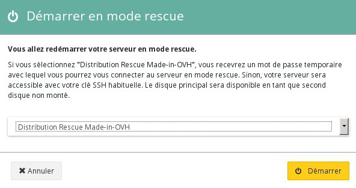
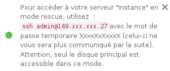
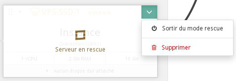

## Préambule
En cas de mauvaises configurations, ou de pertes de clé SSH, il est possible que vous ne soyez plus en mesure d'accéder à votre instance. Nous vous proposons un mode rescue afin de vous permettre d'accéder à vos données, pour ensuite corriger vos différents fichiers de configuration.

Celui-ci fonctionne de manière assez simple : Votre instance est lancée sur une nouvelle image, soit une instance avec une configuration basique. Le disque de votre instance est attaché à votre instance comme un disque additionnel, il suffit donc de le monter pour pouvoir accéder aux données.

Ce guide vous explique comment utiliser le mode rescue.


### Prérequis
- [Créer une instance dans l'espace client OVH](../guide.fr-fr.md){.ref}


## Utilisation du mode rescue

### Passer en mode rescue
Pour passer votre serveur en mode rescue, il suffit de cliquer sur la flèche en haut a droite de votre instance et de sélectionner " **Démarrer en mode rescue**" :


{.thumbnail}

Il faudra ensuite choisir l'image sur laquelle vous voulez redémarrer votre serveur en mode rescue :


{.thumbnail}

Vous trouverez les images que nous proposons par défaut, ainsi qu'une image supplémentaire " **Distribution Rescue Made-in-OVH**" qui vous permet de vous connecter sur votre instance en mode rescue à l'aide d'un mot de passe temporaire.

Une fois le serveur passé en mode rescue, une nouvelle fenêtre apparaitra en bas à droite contenant votre mot de passe temporaire :


{.thumbnail}


### Acceder a vos donnees
Comme expliqué précédemment, les données de votre instance seront attachées au mode rescue comme un disque additionnel. Il suffit donc de le monter en suivant la procédure suivante pour pouvoir y accéder :

- Se connecter en root :
- Vérifier les disques disponibles :
- Monter la partition ;

Vos données sont désormais accessibles depuis le dossier  **/mnt** .

Vous pouvez, par exemple, éditer le fichier contenant la liste des clés SSH utilisables pour l'utilisateur admin :


```bash
root@instance:/home/admin# vim /mnt/home/admin/.ssh/authorized_keys
```


### Redemarrer votre instance normalement
Une fois vos opérations effectuées, il est possible de redémarrer votre instance normalement, pour cela, il suffit de cliquer sur la flèche en haut a droite de votre instance et de sélectionner " **Sortir du mode rescue**" :


{.thumbnail}


### Avec les API OpenStack
Vous pouvez redémarrer votre instance en mode rescue via les API OpenStack en utilisant la commande suivante :


```bash
root@server:~# nova rescue INSTANCE_ID
```

Pour sortir du mode rescue, vous pouvez utiliser la commande suivante :


```bash
root@server:~# nova unrescue INSTANCE_ID
```