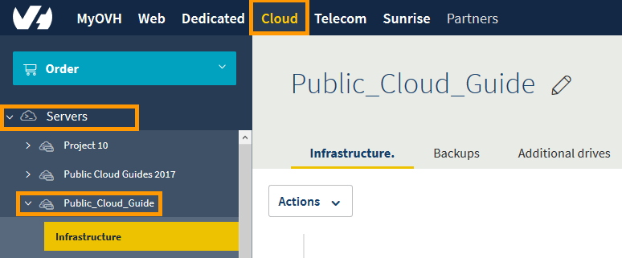
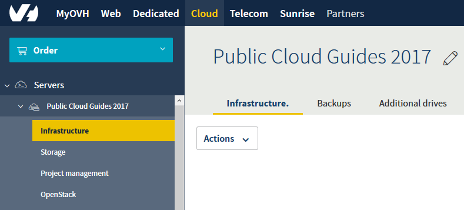
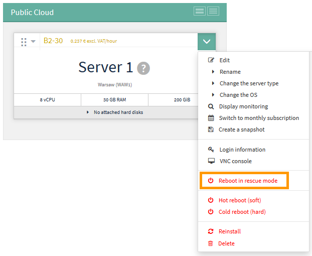
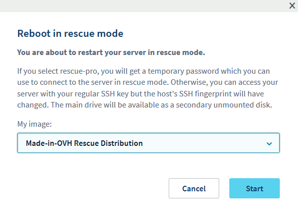
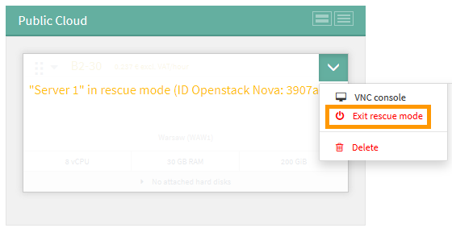

**Dernière mise à jour le 13 mars 2019**

## Objectif

En cas de mauvaises configurations, ou de perte de clé SSH, votre instance peut être inaccessible.

Dans de telles circonstances, vous pouvez utiliser le mode rescue pour reconfigurer votre instance ou récupérer vos données. 

**Ce guide vous explique comment mettre votre instance en mode rescue**

## Prérequis

* Une [Instance Public Cloud](https://www.ovh.co.uk/public-cloud/instances/){.external} dans votre compte OVH
* Avoir accès à votre [espace client OVH](https://www.ovh.com/auth/?action=gotomanager){.external}
* Avoir accès à votre instance via SSH en tant qu'administrateur (root)

## Instructions

### Activer le mode rescue

Tout d’abord, connectez-vous à [l’Espace client d’OVH](https://www.ovh.com/auth/?action=gotomanager){.external} et cliquez sur le menu `Cloud`{.action}.

{.thumbnail}

Ensuite, sélectionnez votre projet PCI dans le menu latéral à gauche de l'écran.

{.thumbnail}

Après, cliquez sur la flèche déroulante de votre instance et sélectionnez `Démarrer en mode rescue`{.action}

{.thumbnail}

Vous allez maintenant voir la boîte de dialogue 'Démarrer en mode rescue'. Cliquez sur la liste déroulante pour sélectionner la distribution Linux que vous souhaitez utiliser en mode rescue, puis cliquez sur le bouton `Démarrer`{.action}.

{.thumbnail}

Une fois l’instance redémarrée en mode rescue, un message apparaît en haut de l'écran, contenant votre mot de passe temporaire.

{.thumbnail}

### Accéder à vos données

Une fois le mode rescue activé, les données de votre instance seront attachées en tant que disque supplémentaire. Il suffit donc de le monter, en suivant les étapes suivantes.

En premier, ouvrez une connexion SSH avec votre instance. Une fois connecté, vérifiez les disques disponibles avec cette commande :

```
root@instance:/home/admin# lsblk

NAME MAJ:MIN RM SIZE RO TYPE MOUNTPOINT
vda 253:0 0 1G 0 disk
+-vda1 253:1 0 1023M 0 part /
vdb 253:16 0 10G 0 disk
+-vdb1 253:17 0 10G 0 part
```

Ensuite, montez la partition :

```
root@instance:/home/admin# mount /dev/vdb1 /mnt
```

Vos données seront maintenant accessibles depuis le dossier /mnt.

### Désactiver le mode rescue

Une fois vos tâches terminées, vous pouvez désactiver le mode rescue en redémarrant votre instance normalement. Pour cela, cliquez sur la flèche déroulante de votre instance et sélectionnez `Sortir du mode rescue`{.action}

{.thumbnail}

### Activer le mode rescue avec les API OpenStack

Vous pouvez activer le mode rescue via les API OpenStack en utilisant la commande suivante :

```
# root@server:~# nova rescue INSTANCE_ID
```

Pour sortir du mode rescue, utilisez la commande suivante :

```
# root@server:~# nova unrescue INSTANCE_ID
```

## Aller plus loin

Échangez avec notre communauté d'utilisateurs sur <https://community.ovh.com/en/>.
