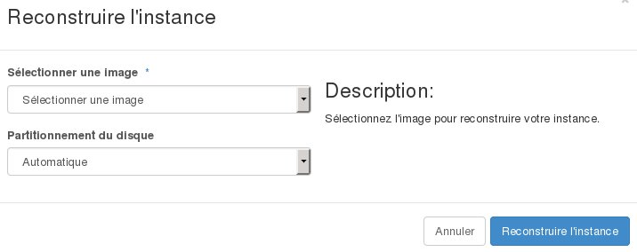

## 
En algunos casos, será necesario reinstalar su instancia para reconfigurarla en una nueva base o, sencillamente, para cambiar el sistema operativo. 
Esta guía explica cómo reconstruir una instancia en OpenStack Horizon para instalar una nueva imagen, conservando la misma dirección IP.

## Atención:
Los datos contenidos en la instancia se eliminarán.

## Requisitos

- [Crear un acceso a Horizon](https://docs.ovh.com/es/public-cloud/crear_un_acceso_a_horizon/)
- Una instancia

## 
Para reconstruir (reinstalar) una instancia:

- Conéctese a Horizon.
- En el menú izquierdo, haga clic en «Instancias».
- En el menú desplegable de la columna «Acciones» correspondiente a la instancia que quiera reconstruir, seleccione «Reconstruir instancia».

{.thumbnail}

- Seleccione la imagen para la reconstrucción.
- Seleccione el tipo de particionamiento («Automático» o «Manual»).
- Haga clic en el botón «Reconstruir instancia».