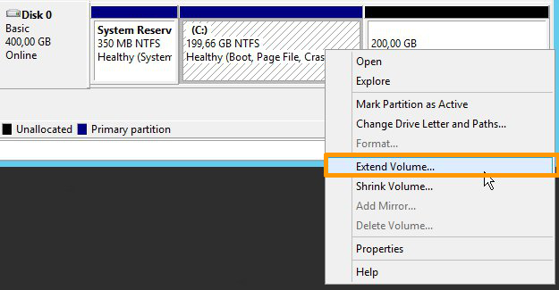

**Last updated 22nd August 2022**

## Objective

As a result of increased activity, or simply new needs, your instance may not be able to meet this new burden due to a lack of resources. However, with the Public Cloud, you can increase the resources available to your instance, and this can be done with just a few clicks.

**This guide will show you how to resize your instance in your OVHcloud Control Panel.**

> [!warning]
>
> Only upscaling is possible for classic models.
> In addition, this manipulation causes the instance to be shut down for the time of the operation.
> 

> [!success]
>
> Flex instances allow resizing to higher or lower models due to a locked single disk size.
> 

## Requirements

- A [Public Cloud instance](https://www.ovhcloud.com/en-au/public-cloud/) in your OVHcloud account
- [Access to the OVHcloud Control Panel](https://ca.ovh.com/auth/?action=gotomanager&from=https://www.ovh.com.au/&ovhSubsidiary=au)

## Instructions

Log into the [OVHcloud Control Panel](https://ca.ovh.com/auth/?action=gotomanager&from=https://www.ovh.com.au/&ovhSubsidiary=au), and open your `Public Cloud`{.action} project. Then click on `Instances`{.action} in the left-hand menu. Click on `...`{.action} in the row of the instance concerned and select `Edit`{.action}.

{.thumbnail}

In the new tab, scroll down to the **Template** section to select the model of your choice.

{.thumbnail}

> [!primary]
>
> For classic models, you can switch to any flavor that have a similar or bigger disk. You can't switch to a model with a smaller disk. 
>
> Only **Flexible instances** can be upgraded and downgraded while maintaining a fix disk size of 50GB.
>

If your disk is equal or smaller to 50GB, you can switch to a `Flexible instance`{.action} if desired.

> [!warning]
> Note that in case you are editing a flex instance, it is not possible to revert to a classic instance via the control panel. For more information, please consult our guide on [Revert a flex instance](https://docs.ovh.com/au/en/public-cloud/revert-a-flex-instance/).
>

Once the selection has been made, click on `modify template`{.action} to confirm your choice.

### Resizing a disk in Windows

When performing a resize for a Windows Instance, please note that the partition size is not automatically updated, so you will have to extend it using the **disk manager**:

- Right-click on the `Start`{.action} menu and launch the disk manager by clicking on `Disk Management`{.action}:

{.thumbnail}

- Right-click on the main partition, then click on `Extend Volume`{.action}.

{.thumbnail}

- In the `Extend Volume Wizard` menu, click on `Next`{.action} to proceed. In the next tab, choose the disk resources to extend and click on `Next`{.action}. 

{.thumbnail}

Once done, click on `Finish`{.action} to confirm your choice.

{.thumbnail}

- The new disk size will then be displayed in the disk manager.

{.thumbnail}

## Go further

Join our community of users on <https://community.ovh.com/en/>.