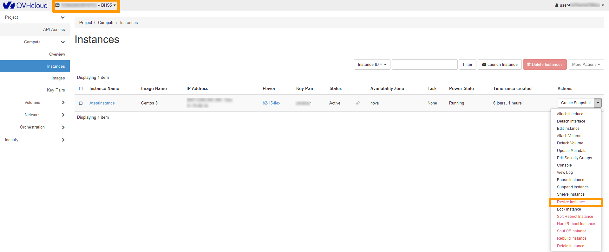
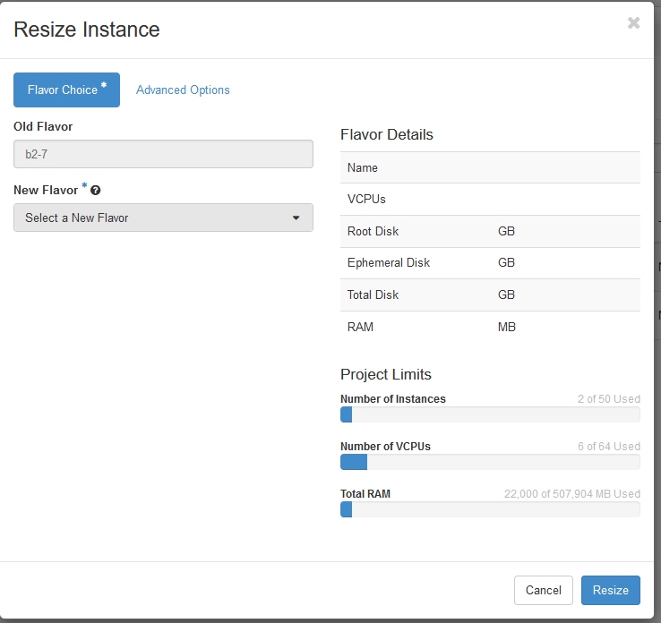

**Last updated 22nd November 2021**

## Objective

As a result of increased activity, or simply new needs, your instance may not be able to meet this new burden due to a lack of resources. However, with the Public Cloud, you can increase the resources available to your instance, and this can be done with just a few clicks.

**This guide will show you how to resize your instance using the OpenStack Horizon interface.**

> [!warning]
>
> Only upscaling is possible for classic models.
> In addition, this manipulation causes the instance to be shut down for the time of the operation.
> 

> [!success]
>
> Flex instances allow resizing to higher or lower models due to a locked single disk size.
> 

## Requirements

- An [OVHcloud Public Cloud instance](https://docs.ovh.com/asia/en/public-cloud/public-cloud-first-steps/#create-instance)
- [Access to the Horizon interface](../configure_user_access_to_horizon/)

## Instructions

Log into the [Horizon interface](https://horizon.cloud.ovh.net/auth/login/), and make sure you are in the correct region. You can verify this on the top left corner. 
Next, click on the `Compute`{.action} menu on the left side and select `Instances`{.action}. Select `Resize Instance`{.action} in the drop list for the corresponding instance.

{.thumbnail}

### Template Selection Tab (Flavor Choice)

This section shows the current template (old flavor) and allows you to select a new template (new flavor) for the instance resource.

{.thumbnail}

#### Flavor Details

In this section, you will see the resources associated with the new template you have chosen. 

#### Project Limits 

Under this section, you can view the occupied resources in relation to the total resources allocated to the project.

> [!warning]
> Please note that you cannot switch models when resizing an instance. A resizing can only be done from a Linux model to another Linux model or from a Windows model to another Windows model.
>

### Advanced Options

Use this section to manage the **Disk Partition** and **Server Group**.

{.thumbnail}

Once the configuration is complete, click on `Resize`{.action}.

### Resizing a disk in Windows

When performing a resize for a Windows Instance, please note that the partition size is not automatically updated, so you will have to extend it using the **disk manager**:

- Right-click on the `Start`{.action} menu and launch the disk manager by clicking on `Disk Management`{.action}:

{.thumbnail}

- Right-click on the main partition, then click on `Extend Volume`{.action}.

{.thumbnail}

- In the `Extend Volume Wizard` menu, click on `Next`{.action} to proceed. In the next tab, choose the disk resources to extend and click on `Next`{.action}. 

{.thumbnail}

Once done, click on `Finish`{.action} to confirm your choice.

{.thumbnail}

- The new disk size will then be displayed in the disk manager.

{.thumbnail}

## Go further

Join our community of users on <https://community.ovh.com/en/>.