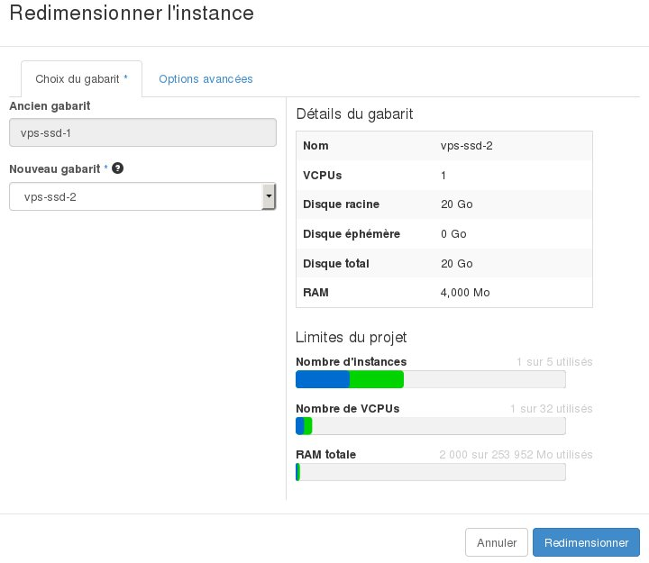

## 
En algunos casos, bien debido a un aumento de la actividad o a sus nuevas necesidades, es posible que su instancia no pueda dar respuesta a esta nueva carga debido a la falta de recursos. 
Sin embargo, Public Cloud le permite aumentar los recursos de su instancia, con tal solo unos clics. 
Esta guía explica cómo redimensionar una instancia en OpenStack Horizon.

## Atención:
Solo es posible redimensionar la instancia a un modelo superior. 

Además, esta acción conlleva una interrupción de la instancia durante la operación.

## Requisitos

- [Crear un acceso a Horizon](https://docs.ovh.com/es/public-cloud/crear_un_acceso_a_horizon/)
- Una instancia

## Redimensionar una instancia
Para redimensionar una instancia:

- Conéctese a Horizon.
- En el menú izquierdo, haga clic en «Instancias».
- En el menú desplegable de la columna «Acciones» correspondiente a la instancia que quiera redimensionar, seleccione «Redimensionar instancia».

{.thumbnail}

## Elección del sabor
En esta pestaña se indica la plantilla actual y le permite seleccionar una nueva plantilla para la instancia.

{.thumbnail}

## Consejo:
Es posible ver la parte de recursos utilizados de los recursos totales asignados al proyecto.

## Opciones avanzadas
Desde esta pestaña es posible gestionar el particionamiento del disco.

En el desplegable «Partición de disco», seleccione «Automático» o «Manual».

{.thumbnail}

- Cuando termine la configuración, haga clic en «Redimensionar».

## Redimensionar el disco en Windows
Atención
Al redimensionar una Instancia Windows, el tamaño de la partición no se actualiza automáticamente. Tendremos que aumentar el tamaño utilizando la «Administración de discos»: 

- Inicie la administración de discos.

{.thumbnail}

- Haga clic con el botón derecho sobre la partición principal.

{.thumbnail}

- Haga clic en «Extender volumen».

{.thumbnail}

- Acepte la extensión del disco.

{.thumbnail}