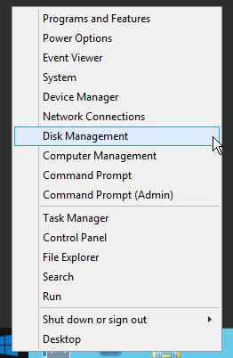
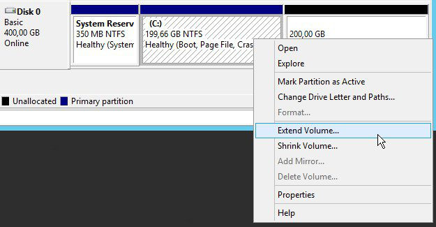
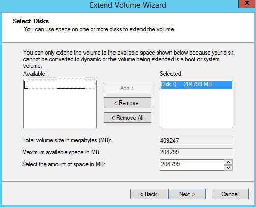

## Preambule
Suite à un accroissement d'activité, ou simplement à de nouveaux besoins, il est possible que votre instance ne puissent pas répondre à cette nouvelle charge en raison d'un manque de ressources. Cependant, grâce au Public Cloud, vous pouvez augmenter les ressources dont votre instance dispose, et cela simplement en quelques clics.

Ce guide vous indique la procédure à suivre afin de redimensionner votre instance depuis l'interface OpenStack Horizon.

> [!alert]
>
> Seul le redimensionnement vers un modèle supérieur est possible pour les modèles classiques.
> De plus, cette manipulation entraine une coupure de l'instance le temps de
> l'opération.
> 

> [!success]
>
> Les instances de type flex permettent le redimensionnement vers les modèles suppérieurs ou inférieurs grâce à une taille de disque unique.
> 

### Prérequis
- [Créer un accès à Horizon]({legacy}1773){.ref}
- Une instance

## Redimensionner une instance

### Redimensionner une instance
Pour redimensionner une instance, il faut :

- Se connecter à Horizon
- Cliquer sur Instances dans le menu à gauche.
- Sélectionner Redimensionner l'instance dans la liste déroulante correspondant à l'instance.

{.thumbnail}

### Onglet choix du gabarit
Cette section indique le gabarit actuel et vous permet de sélectionner un nouveau gabarit pour la ressource de l'instance.

{.thumbnail}

> [!success]
>
> Il est possible de visionner les ressources prises sur les ressources totales
> allouées au projet.
> 

### Onglet Options avancees
Cette section permet de gérer le partitionnement du disque.

**Partitionnement du disque**  : ( **Automatique**  ou  **Manuel** )

{.thumbnail}

- Une fois la configuration terminée, cliquer sur Redimensionner

### Redimensionnement du disque sous Windows
Attention Lors d'un redimensionnement pour une Instance Windows, la taille de la partition n'est pas automatiquement mise a jour, il faudra du coup étendre celle ci en utilisant le  **Gestionnaire de disque**  :

- Lancer le gestionnaire de disque :

{.thumbnail}

- Faire un clic droite sur la partition principale

{.thumbnail}

- Étendre la partition principale :

{.thumbnail}

- Valider l'extension du disque :

{.thumbnail}
