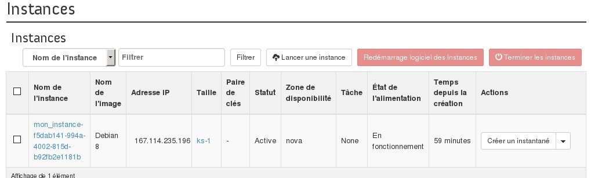
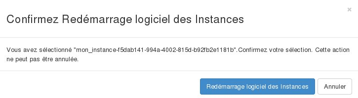
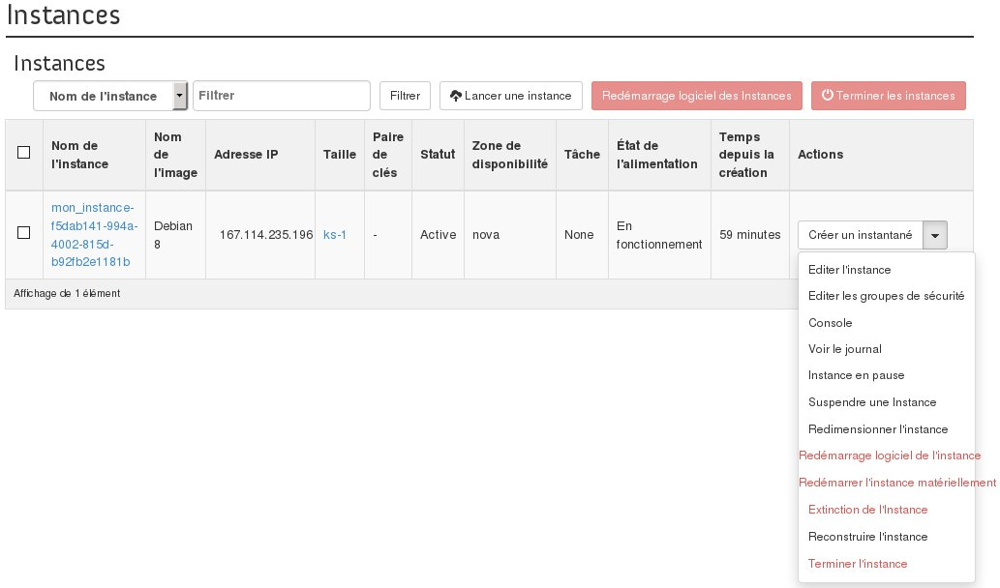

## 
In dieser Hilfe wird der Neustart einer Instanz im OpenStack Horizon Manager beschrieben.

## 
Um einen Soft Reboot einer Instanz durchzuführen gehen Sie wie folgt vor:

- Verbinden Sie sich mit Horizon
- Klicken Sie in dem Menü auf der linken Seite auf Instanzen
- Wählen Sie die Instanz aus, die neu gestartet werden soll
- Klicken Sie auf Soft Reboot Instanz

{.thumbnail}

{.thumbnail}

## 
Um einen Hard Reboot einer Instanz durchzuführen gehen Sie wie folgt vor:

- Verbinden Sie sich mit Horizon
- Klicken Sie in dem Menü auf der linken Seite auf Instanzen
- Wählen Sie in der Dropdown-Liste für die Instanz Hard Reboot Instanz aus

{.thumbnail}

- Bestätigen Sie den Neustart

{.thumbnail}
Sie können eine Instanz neu starten, die ausgeschaltet oder deaktiviert wurde:

- Indem Sie bei einer ausgeschalteten Instanz auf den Button Instanz starten klicken
- Indem Sie bei einer deaktivierten Instanz in deren Dropdown-Liste Instanz wiederaufnehmen auswählen

## 
[Zurück zum Index der Cloud Hilfen]({legacy}1785)

