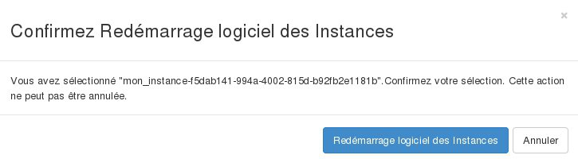
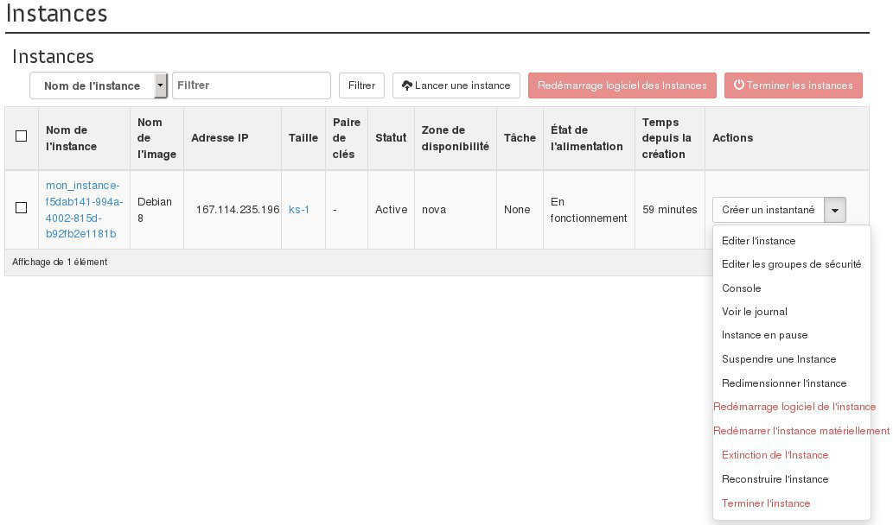
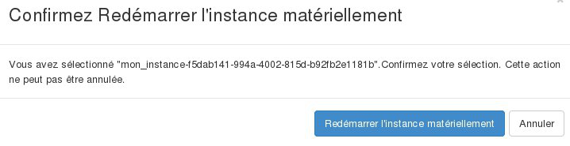

## Preambule
Dans certains types de situations, vous serez probablement amener à redémarrer vos instances, ce guide vous indique comment faire cela depuis l'interface Openstack Horizon.

## Redemarrage logiciel d'une instance
Pour redémarrer une instance, il faut :

- Se connecter à Horizon
- Cliquer sur Instances dans le menu à gauche.
- Sélectionner l'instance à redémarrer.
- Cliquer sur Redémarrage logiciel des instances .

{.thumbnail}

{.thumbnail}

## Redemarrer l'instance materiellement
Pour Redémarrer une instance matériellement il faut :

- Se connecter à horizon.
- Cliquer sur Instances dans le menu à gauche.
- Sélectionner "Redémarrer l'instance matériellement" dans liste déroulante pour l'instance.

{.thumbnail}

- Confirmer le redémarrage.

{.thumbnail}

> [!success]
>
> Vous pouvez redémarrer une instance qui a été éteinte ou suspendue :
> - 
> en cliquant sur le bouton "Démarrer une instance" lorsque celle ci
> est éteinte.
> - 
> en sélectionnant "Reprendre une Instance" dans liste déroulante pour
> l'instance suspendue.
> 
> 