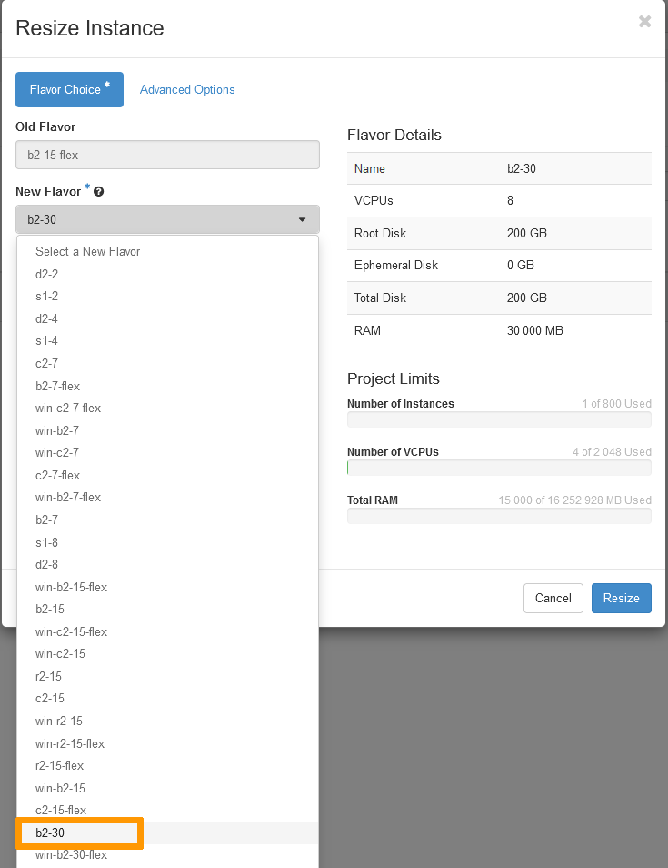

> [!primary]
> Esta tradução foi automaticamente gerada pelo nosso parceiro SYSTRAN. Em certos casos, poderão ocorrer formulações imprecisas, como por exemplo nomes de botões ou detalhes técnicos. Recomendamos que consulte a versão inglesa ou francesa do manual, caso tenha alguma dúvida. Se nos quiser ajudar a melhorar esta tradução, clique em "Contribuir" nesta página.
>

**Última atualização: 10/12/2021**

## Objetivo

Uma instância *flex* é uma instância de disco único (50 GB) que oferece um processo mais rápido para as snapshots. Permite um redimensionamento para modelos superiores ou inferiores com um espaço de armazenamento fixo, ao passo que os modelos clássicos só podem ser redimensionados para modelos superiores.  Com uma infraestrutura em constante evolução, pode ter necessidade de aumentar o espaço de armazenamento da sua instância. Neste caso, deverá migrar a sua instância *flex* para um modelo clássico. Esta ação só é possível a partir da interface Horizon.

 **Este guia explica-lhe como migrar de um modelo *flex* para um modelo clássico e redimensionar a sua instância *flex* a partir da interface OpenStack Horizon.**

## Requisitos

- Dispor de uma [instância Public Cloud da OVHcloud](../public-cloud-primeiros-passos/#3o-passo-criacao-de-uma-instancia) do tipo *flex*.
- [Criar um acesso à interface Horizon](https://docs.ovh.com/pt/public-cloud/horizon/)

## Instruções

Ligue-se à [interface Horizon](https://horizon.cloud.ovh.net/auth/login/) e certifique-se de que está na região certa. Podem verificá-lo no canto superior esquerdo. 

{.thumbnail}

Clique no menu `Compute`{.action} à esquerda e selecione `Instances`{.action}. Selecione a `Resize Instance`{.action} no menu pendente à direita da instância em questão.

{.thumbnail}

**Escolha do template (*Flavor Choice*)** 

Esta secção indica o template atual (*old flavor*) e permite-lhe selecionar um novo template (*new flavor*) para o recurso da instância.

No nosso exemplo, o nosso template é « b2-15-flex ». Podemos voltar a um template clássico « b2-15 » ou atualizar a instância para o template « b2-30 » para obter mais espaço de armazenamento. No nosso caso, desejamos atualizar a nossa instância para o modelo clássico « b2-30 » para aumentar o nosso espaço de armazenamento.

{.thumbnail}

> [!warning]
> - Só pode passar de um modelo Linux para outro modelo Linux e de um modelo Windows para outro modelo Windows.
>
> - A opção *flex* não está disponível para todos os modelos.
>

**Opções avançadas (*Advanced Options*)**

Esta secção permite gerir o particionamento do disco (*Disk Partition*) e o grupo de servidores (*Server Group*).

{.thumbnail}

Para continuar, clique no botão `Resize`{.action}.

Uma vez terminado o processo, a sua instância será transferida para um modelo clássico, com mais espaço de armazenamento.

{.thumbnail}

No caso em que deseja voltar a um modelo *flex*, pode fazê-lo através dos mesmos passos [acima](#flavorchoice), selecionando um template *flex* em vez de um template clássico. 

Também pode [editar a configuração da instância](https://docs.ovh.com/pt/public-cloud/comecar-com-uma-instancia-public-cloud/#editar-a-configuracao-de-uma-instancia) a partir da Área de Cliente.

## Quer saber mais?

Fale com a nossa comunidade de utilizadores: <https://community.ovh.com/en/>.