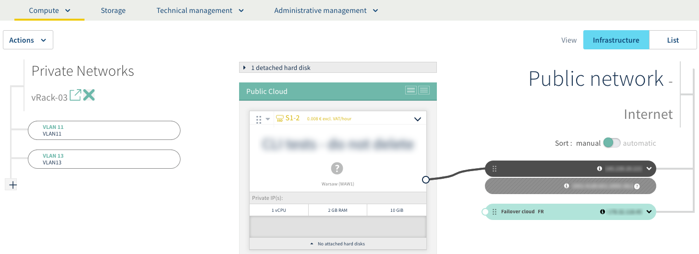
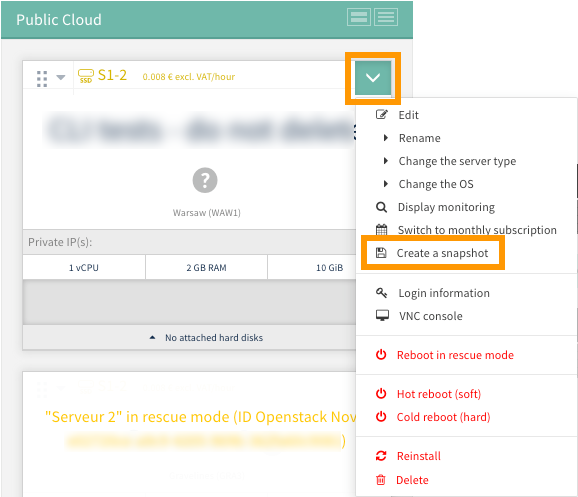
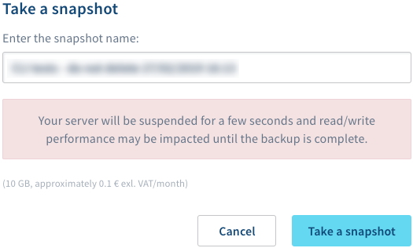
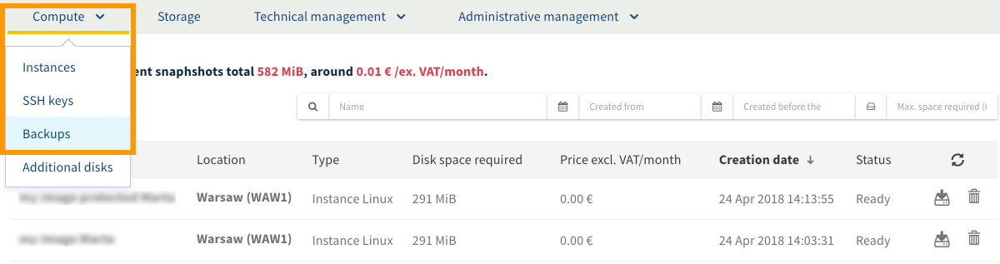

**Last updated 27th March 2018**

## Objective

You can create a backup of your Instance at any time via the [OVH Control Panel](https://www.ovh.com/auth/?action=gotomanager){.external}. You can use a backup to restore your Instance to an old configuration, or recreate it.

**Create a backup of a Public Cloud Instance in just a few clicks.**

## Requirements

- an [OVH Public Cloud Instance](../create_an_instance_in_your_ovh_customer_account/)
- access to the `Cloud`{.action} section of the [OVH Control Panel](https://www.ovh.com/auth/?action=gotomanager){.external}

## Instructions

### Step 1: Log in to your Instance’s interface.

Log in to the [Control Panel.](https://www.ovh.com/auth/?action=gotomanager){.external} In the ‘Cloud’ section, click on `Servers`{.action} in the services bar on the left-hand side. Then select the Public Cloud Instance concerned. Finally, in the `Compute`{.action} tab, check that you are in the ‘Instances’ section.

{.thumbnail}

### Step 2: Create a backup of an Instance.

In the Instance's management interface, click on the down-arrow icon, and select `Create a snapshot`{.action}.

{.thumbnail}

In the window that opens, enter a name for the backup. **Please also check any information regarding potential costs for creating the backup.**

Once you are ready, click `Take a snapshot`{.action}.

{.thumbnail}

### Step 3: Access an Instance’s backups.

To access backups of a Public Cloud Instance, go to the `Compute`{.action} tab, then `Backups`{.action}.

There, you will find a grid listing all of the available backups. Use the buttons on the right-hand side to interact with them.

{.thumbnail}

## Go further

Join our community of users on <https://community.ovh.com/en/>.