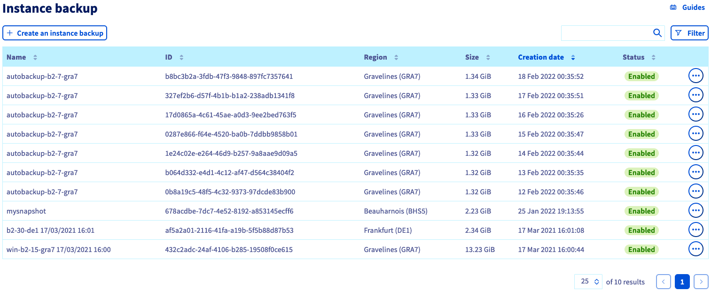

**Last updated 28th February 2022**

## Objective

You can create a single backup of an instance or configure a schedule in order to automate your instance backups. Backups can be used to restore your instance to a previous state or to create a new, identical instance.

**This guide explains how to create manual and automatic backups of a Public Cloud instance.**

## Requirements

- A [Public Cloud instance](https://www.ovhcloud.com/en-ie/public-cloud/) in your OVHcloud account
- Access to the [OVHcloud Control Panel](https://www.ovh.com/auth/?action=gotomanager&from=https://www.ovh.ie/&ovhSubsidiary=ie)

## Instructions

### Creating a backup of an instance

Log in to the [OVHcloud Control Panel](https://www.ovh.com/auth/?action=gotomanager&from=https://www.ovh.ie/&ovhSubsidiary=ie) and open your `Public Cloud`{.action} project. Then click on `Instances`{.action} in the left-hand menu.

Click on the `...`{.action} button to the right of the instance and select `Create a backup`{.action}.

{.thumbnail}

Enter a name for the backup on the next page. Take note of the pricing information and click on `Confirm`{.action}.

{.thumbnail}

Once the backup is completed, it will be available in the `Instance Backup`{.action} section.

{.thumbnail}

### Creating an automated backup of an instance

Click on the `...`{.action} button to the right of the instance and select `Create an automatic backup`{.action}.

{.thumbnail}

You can configure the following backup settings on the next page:

#### **The workflow** 

Currently, only one workflow exists. It will create a backup for the instance and its primary volume.

{.thumbnail}

#### **The resource** 

You can select the instance to back up.

{.thumbnail}

#### **The schedule** 

You can set up a custom backup schedule or choose one of the default frequencies:

- Daily backup with retention of the last 7 backups
- Daily backup with retention of the last 14 backups

{.thumbnail}

#### **The name** 

Enter a name for the automatic backup schedule. Take note of the pricing information and create the schedule with `Confirm`{.action}.
 
{.thumbnail}

### Managing backups and schedules

Schedules can be created and removed in the Public Cloud `Workflow Management`{.action} section.

{.thumbnail}

Your instance backups are managed in the Public Cloud `Instance Backup`{.action} section.

{.thumbnail}

Find out how to use backups to clone or restore instances in [this guide](https://docs.ovh.com/ie/en/public-cloud/create-restore-virtual-server-from-backup/).

## Go further

[Using instance backups to create or restore an instance](https://docs.ovh.com/ie/en/public-cloud/create-restore-virtual-server-from-backup/)

Join our community of users on <https://community.ovh.com/en/>.