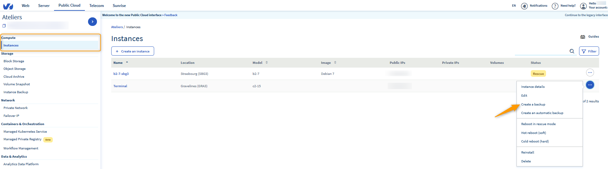
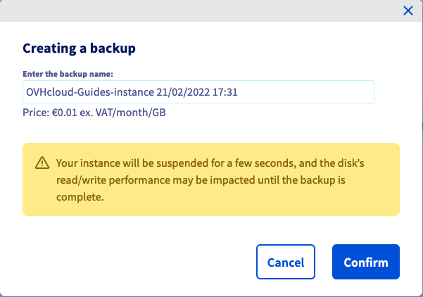
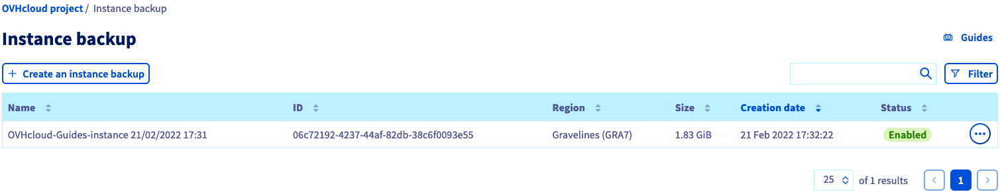
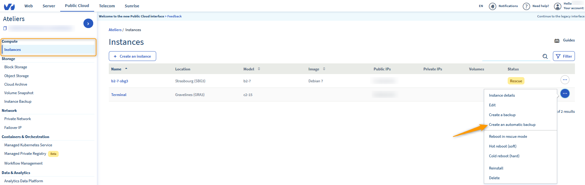
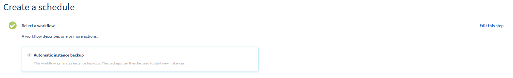
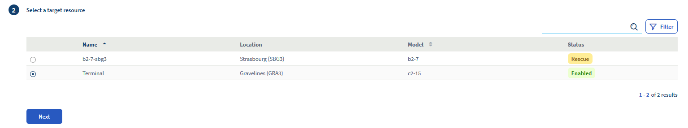
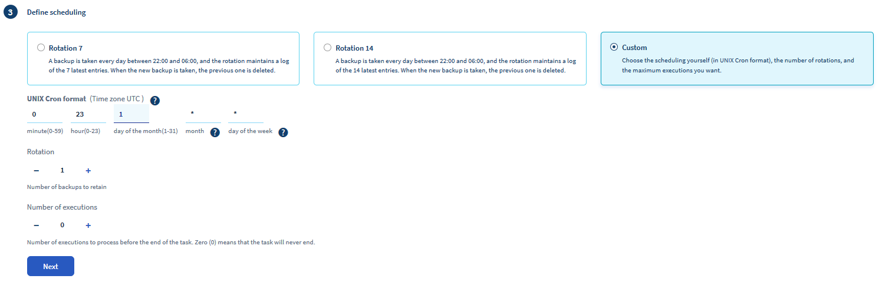
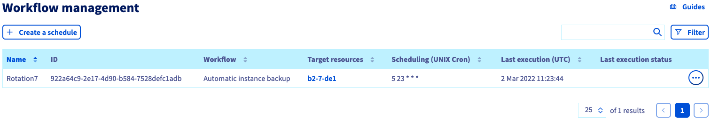

**Última actualización: 22/11/2019**

## Objetivo

En cualquier momento, podrá crear una copia de seguridad de una instancia desde su [área de cliente de OVHcloud](https://ca.ovh.com/auth/?action=gotomanager){.external}. Con ella, podrá restaurar su instancia con una configuración anterior o crear una nueva.

**Solo con unos clics, obtendrá una copia de seguridad de una instancia de Public Cloud.**

## Requisitos

- [Haber creado una instancia de Public Cloud desde su cuenta de cliente](../crear_una_instancia_desde_el_area_de_cliente_de_ovh/).
- Estar conectado a su [área de cliente de OVHcloud](https://ca.ovh.com/auth/?action=gotomanager){.external}.

## Procedimiento

### Crear una copia de seguridad de una instancia

Conéctese a su [área de cliente de OVHcloud](https://ca.ovh.com/auth/?action=gotomanager){.external}seleccione la pestaña Public Cloud y luego, a la sección`Instancias`{.action}.

Haga clic en los `...`{.action} a la derecha de la instancia seleccionada y por último, en `Crear un backup`{.action}.

{.thumbnail}

Ingrese un nombre para la copia de seguridad en la siguiente página.

{.thumbnail}

Una vez terminada, la copia se encontrará disponible en la sección `Instancia de backup`{.action}.

{.thumbnail}

### Crear una copia de seguridad automatizada de una instancia

En la sección `Instancias`{.action}, seleccione `Crear un backup automatizado`{.action} en las acciones disponibles de la instancia por guardar.

{.thumbnail}

Deberá ingresar varios datos en la siguiente página:

#### **El workflow (flujo de trabajo)** 

Hoy, solo existe un workflow, el que hará una copia de seguridad de la instancia y del volumen principal de esta.

{.thumbnail}

#### **El recurso** 

Basta con seleccionar la instancia correspondiente a la copia de seguridad.

{.thumbnail}

#### **La planificación** 

El objetivo es definir la frecuencia de las copias de seguridad. Se proponen dos opciones por defecto:

* Una copia de seguridad todos los días con un historial de siete días como máximo.
* Una copia de seguridad todos los días con un historial de catorce días como máximo.

{.thumbnail}

    
#### **La denominación** 

Solo se trata de asignar un nombre a la copia de seguridad.
 
{.thumbnail}

Una vez creada, la copia de seguridad estará disponible en la sección `Workflow Management`{.action} :

{.thumbnail}

Las copias de seguridad estarán disponibles en la sección `Instancia de Backup`{.action} y se facturarán como tal.

## Más información

Interactúe con nuestra comunidad de usuarios en <https://community.ovh.com/en/>.
