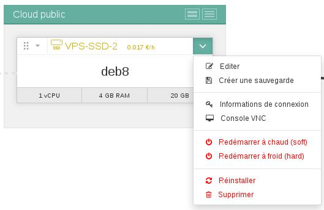
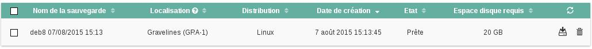

## 
Usługa Public Cloud pozwala na tworzenie kopii zapasowej instancji. Kopia ta będzie mogła służyć do:

- Przywrócenia starej konfiguracji
- Odtworzenia / zduplikowania instancji

Przewodnik ten wyjaśnia, jak za pomocą kilku kliknięć, utworzyć kopie zapasową (snapshot).

## Wstępne wymagania

- Zalogowanie do panelu klienta OVH Public Cloud
- Posiadanie utworzonej wirtualnej maszyny

## 

- Rozwiń następujące menu na serwerze wirtualnym, dla którego chcesz wykonać kopię zapasową:

{.thumbnail}

- Kliknij na Utwórz kopię zapasową.
- Pojawi się następujące okno, w którym będziesz mógł spersonalizować nazwę kopii zapasowej:

{.thumbnail}

- Kliknij na Rozpocznij kopię zapasową:

{.thumbnail}
Panel klienta oszacuje miesięczny koszt kopii zapasowej.

- Kopie zapasowe będą dostępne w odpowiedniej sekcji:

{.thumbnail}

- Dostępne są szczegółowe informacje na temat kopii zapasowej:

{.thumbnail}

## 
[Przewodniki Cloud]({legacy}1785)

