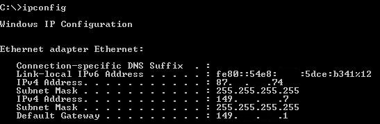
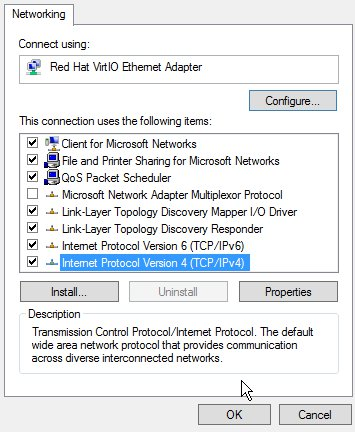

## Objective

You may need to configure a failover IP address on your instances, for one of the following reasons:

- you have a large number of websites on your instance, 
- you host international projects.

In order to do this you can either buy or import a failover IP address for your Public Cloud instances. 

However failover IPs will not be automatically configured on your instance. 

**This guide explains how to configure your instance's network interface so that a failover IP can be allocated to it.**

## Requirements

- [Make sure you have created an instance in your OVHcloud Control Panel](../create_an_instance_in_your_ovh_customer_account/)
- You must have a failover IP address

## Instructions

### Configuring the interface

Windows does not allow you to configure a failover IP address in addition to configuring a main IP address in DHCP. You therefore have to reconfigure your network card with a manually assigned IP address. 

- Recover network information using "ipconfig":

{.thumbnail}

- Go to the Control Panel then the Network and Sharing Centre

{.thumbnail}

-  Modify the card's parametres:

{.thumbnail}

- Access your interface's properties:

{.thumbnail}

- Access the TCP/IPv4 configuration

{.thumbnail}

- Complete your configuration manually, and use a similar configuration to the one shown below by adapating the IP addresses according to the information obtained from your "ipconfig", and then click on "Advanced:

{.thumbnail}

- Add your failover IP as follows:

{.thumbnail}

## Go further

[Migrating a failover IP](../migrating_a_failover_ip/)

Join our community of users on <https://community.ovh.com/en/>.
