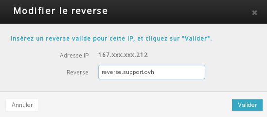
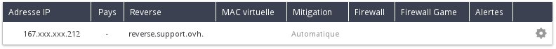

## Preambule
Dans le cadre de la configuration d'un serveur mail par exemple, il sera nécessaire de configurer un reverse DNS pour votre instance afin d'améliorer votre score lors de l'envoi de mail. Ce guide vous explique comment configurer un reverse DNS pour les adresses IP de vos instances.

### Prérequis
- Une instance
- Un enregistrement A dans votre zone DNS pointant vers votre adresse IP

## Configuration du reverse DNS
- Vérifier l'adresse IP de votre instance dans le partie Cloud de l'Espace Client OVH :

{.thumbnail}

- Se rendre dans la partie Dédié de l'Espace Client OVH

{.thumbnail}

- Se rendre dans la partie IP et sélectionner l'ID du projet dans Service :

{.thumbnail}

- Sélectionner Modifier le reverse en cliquant sur l'icône a droite de l'adresse IP concernée.
- Insérer votre reverse DNS dans le champ correspondant et valider

{.thumbnail}

> [!alert]
>
> Afin que cette étape soit correctement effectuée, il faudra dans un premier
> temps attendre la propagation de votre zone DNS si l'ajout du champ A a été
> fait récemment.
> 

Le reverse DNS est désormais visible dans la liste des adresses IP de votre projet.

{.thumbnail}
