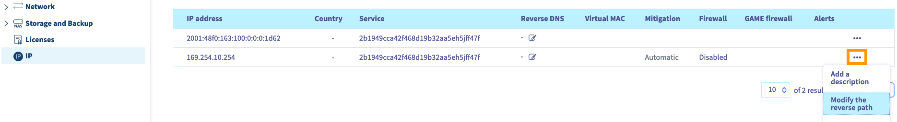

> [!primary]
> Questa traduzione è stata generata automaticamente dal nostro partner SYSTRAN. I contenuti potrebbero presentare imprecisioni, ad esempio la nomenclatura dei pulsanti o alcuni dettagli tecnici. In caso di dubbi consigliamo di fare riferimento alla versione inglese o francese della guida. Per aiutarci a migliorare questa traduzione, utilizza il pulsante "Contribuisci" di questa pagina.
>

**Ultimo aggiornamento: 12/11/2021**

## Obiettivo

Il **Reverse DNS** (*rDNS*) è il complemento della risoluzione "classica" dei DNS che permette di convertire un dominio in un indirizzo IP (record di tipo **A**). Una richiesta di questo tipo può essere risolta con il nome di dominio (record di tipo **PTR**). Ciò significa che le richieste DNS sull'indirizzo IP in questione restituiranno un dominio.

Configurare la risoluzione **Reverse DNS** di un'istanza è particolarmente utile per l'invio di email. Il rischio che i tuoi messaggi vengano inviati tramite un sistema di protezione dallo Spam diminuirà se l'indirizzo IP del tuo server di posta elettronica si risolve correttamente nel tuo dominio.

**Questa guida ti mostra come configurare il reverse DNS per gli indirizzi IP della tua istanza Public Cloud.**

## Prerequisiti

- Disporre di un'[istanza Public Cloud](https://www.ovhcloud.com/it/public-cloud/) sul proprio account OVHcloud
- Un dominio con il suo record `A` che punta verso l'istanza
- Avere accesso allo [Spazio Cliente OVHcloud](https://www.ovh.com/auth/?action=gotomanager&from=https://www.ovh.it/&ovhSubsidiary=it)

## Procedura

Accedi allo [Spazio Cliente OVHcloud](https://www.ovh.com/auth/?action=gotomanager&from=https://www.ovh.it/&ovhSubsidiary=it), accedi alla sezione `Bare Metal Cloud`{.action} e clicca su `IP`{.action} nel menu a sinistra.

La tabella di questa pagina contiene i tuoi servizi compatibili. L'ID del tuo progetto Public Cloud può essere filtrato utilizzando il menu a tendina **Service**.

{.thumbnail}

Clicca sui tre puntini `...`{.action} nella riga dell'indirizzo IP in questione e seleziona `Modifica il reverse`{.action}.

{.thumbnail}

Nella nuova finestra, inserisci il reverse e clicca su `Conferma`{.action}.

Potrai anche modificare il reverse direttamente tramite l'icona della colonna **Reverse** della tabella.

> [!primary]
>
Se la modifica non funziona come previsto, verifica che il record `A` sia configurato correttamente nella zona DNS del tuo dominio. Attenzione, la modifica della [zona DNS](https://docs.ovh.com/it/domains/web_hosting_modifica_la_tua_zona_dns/) può richiedere fino a 24 ore se hai modificato solo recentemente il record `A`.
>

## Spingiti oltre 

[Creare una prima istanza Public Cloud e connettersi](https://docs.ovh.com/it/public-cloud/primi-passi-public-cloud/)

Contatta la nostra Community di utenti all’indirizzo <https://community.ovh.com/en/>.
