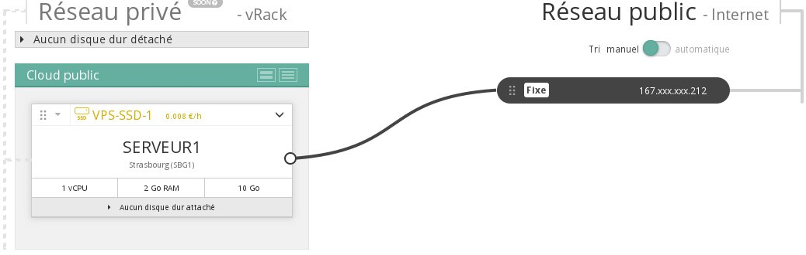
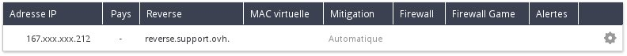

## 
W niektórych sytuacjach, na przykład w ramach konfiguracji serwera mailowego, konieczne będzie skonfigurowanie rewersu DNS dla instancji. 
Przewodnik ten wyjaśnia, jak skonfigurować rewers DNS dla adresów IP Twoich instancji.

## Wstępne wymagania

- Instancja
- Wpis A w strefie DNS wskazujący na Twój adres IP

## 

- Sprawdź adres IP swojej instancji w części Cloud w panelu klienta OVH:

{.thumbnail}

- Przejdź do części Dedykowane w panelu klienta.

{.thumbnail}

- Przejdź do części IP i wybierz ID projektu w części Usługa:

{.thumbnail}

- Wybierz Zmień rewers klikając na ikonkę z prawej strony adresu IP.

- Wprowadź rewers DNS w odpowiednim polu i kliknij na Zatwierdź.

{.thumbnail}
Aby etap ten został poprawnie wykonany, najpierw należy poczekać na propagację strefy DNS, jeśli pole A zostało niedawno dodane.
Rewers DNS jest już widoczny na liście adresów IP Twojego projektu.

{.thumbnail}

## 
[Przewodniki Cloud]({legacy}1785)

