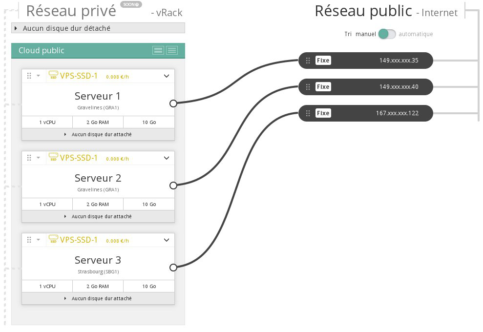
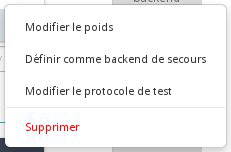

## Preambule
Afin de mettre en place des solutions d'infrastructure hautement disponibles ou pour effectuer de la répartition de charges, vous serez probablement amené à utiliser une IP LoadBalancing. Celle ci est évidemment compatible avec les instances du Public Cloud.

Ce guide vous expliquera comment configurer une IP LoadBalancing avec vos instances Public Cloud.

### Prérequis
- 2 instances
- 1 IP LoadBalancing

## Configuration de l'IP LoadBalancing

### Ajout d'adresse IP Backend
- Repérer les instances à ajouter en tant que backend

{.thumbnail}

- Se rendre dans la partie "Dédié" de l'Espace Client OVH

{.thumbnail}

- Se rendre dans le menu "IP" à gauche, puis sélectionner l'onglet "IP LoadBalancing"

{.thumbnail}

- Cliquer sur "Ajouter un backend" puis sélectionner l'adresse IP de vos instances

{.thumbnail}

> [!alert]
>
> Seules les adresses IP compatibles seront affichées si vous ne disposez pas de
> l'option  MultiDatacentres .
> 

### Autres operations
Une fois ajoutées, vos adresses IP backend seront affichées sur l'Espace Client OVH.

{.thumbnail}

Vous pourrez ensuite effectuer d'autres opérations telles que :

- Modifier le poids
- Modifier le protocole de test
- Définir comme backend de secours
- Supprimer le backend

{.thumbnail}