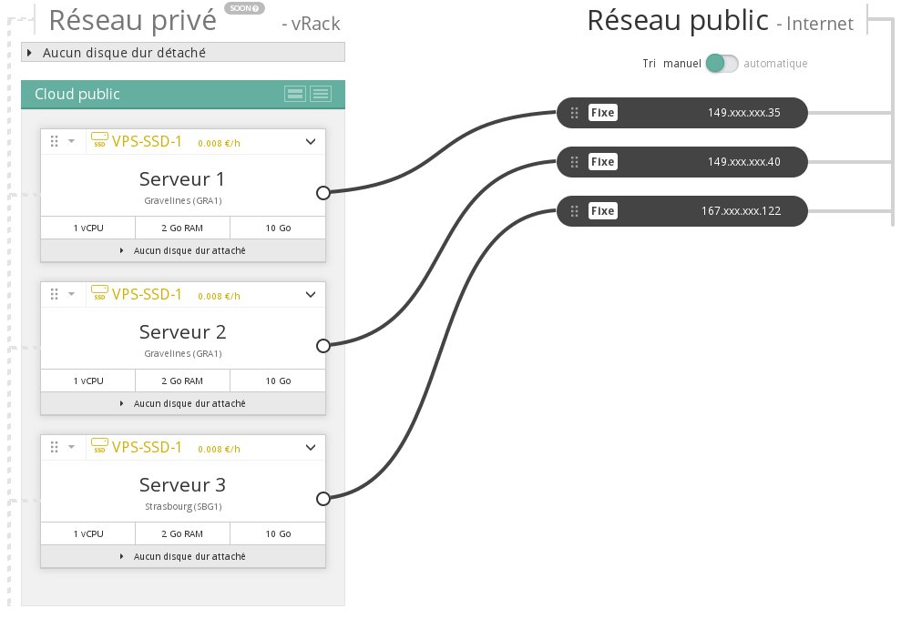
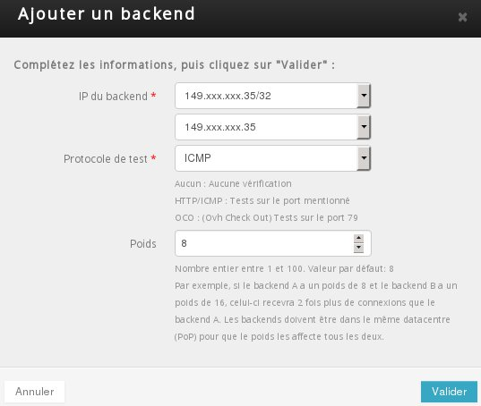
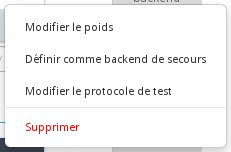

## 
Aby uruchamiać infrastruktury o wysokiej dostępności lub rozdzielać obciążenie, być może będziesz musiał korzystać z IP LoadBalancing.
Usługa ta jest kompatybilna z instancjami Public Cloud.

Przewodnik ten wyjaśnia, jak skonfigurować IP LoadBalancing z instancjami Public Cloud.

## Wstępne wymagania

- 2 instancje
- 1 IP LoadBalancing

## Dodanie adresu IP Backend

- Oznacz instancje do dodania jako backend.

{.thumbnail}

- Przejdź do sekcji "Dedykowane" w panelu klienta OVH.

{.thumbnail}

- Przejdź do menu "IP" z lewej strony i wybierz zakładkę "IP LoadBalancing".

{.thumbnail}

- Kliknij na "Dodaj backend" i wybierz adres IP swoich instancji.

{.thumbnail}
Zostaną wyświetlone tylko kompatybilne adresy IP, jeśli nie dysponujesz opcją MultiDatacenters.

## Inne operacje
Po dodaniu adresy IP backend będą widoczne w panelu klienta.

{.thumbnail}
Następnie będziesz mógł wykonywać operacje takie jak:

- Zmiana protokołu testowego
- Zdefiniowanie jako backend zapasowy
- Usuwanie backendu

{.thumbnail}

## 
[Przewodniki Cloud]({legacy}1785)

