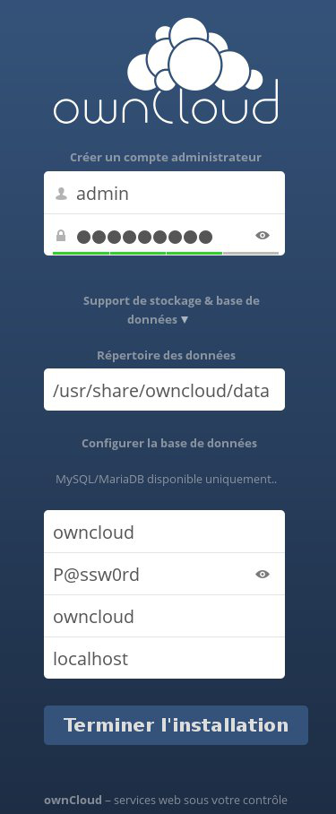
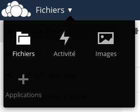
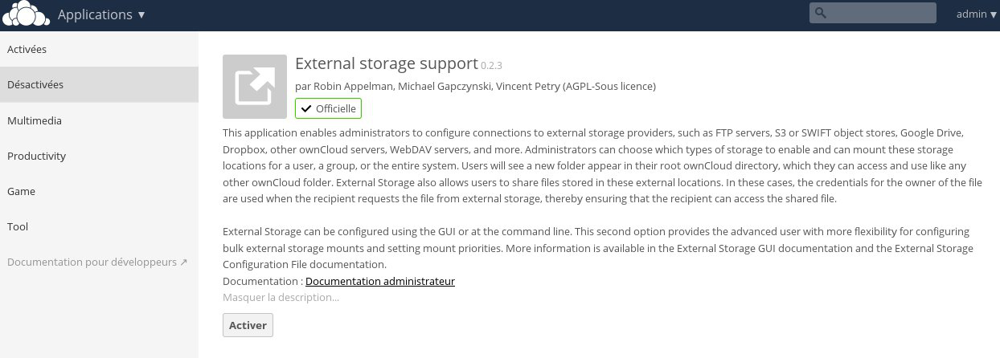
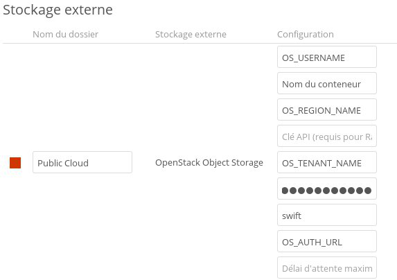
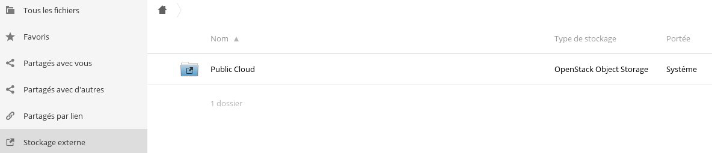

## Préambule
[Owncloud](https://owncloud.org/){.external} est une application de stockage en ligne et gestion de fichiers. Il propose des fonctionnalités telles que la synchronisation entre plusieurs périphériques par exemple. Il est aussi possible d'ajouter des espaces de stockage externe, notamment l'Object Storage d'OpenStack.

Ce guide vous expliquera donc la procédure à suivre pour configurer votre OwnCloud avec l'Object Storage


### Prérequis
- Télécharger le fichier OpenRC depuis l'Espace client OVH ou Horizon
- [Ajouter des espaces de stockage]({legacy}1790){.ref} dédiés à Owncloud


## Configuration de Owncloud

### Installation
Dans un premier temps, vous pouvez procéder à l'installation de OwnCloud :


```bash
root@instance:~$ apt-get install owncloud
```


> [!alert]
>
> Vérifier que vous utilisez bien les bons dépôts afin que la dernière version
> d'OwnCloud soit installé.
> 

Il est ensuite possible de procéder à l'installation de MySQL afin de disposer d'une base de données dont OwnCloud a besoin :


```bash
root@instance:~$ apt-get install mysql-server
```


### Configuration
Une fois la procédure d'installation terminée, nous pouvons passer à la configuration de la base de données qui sera utilisée par OwnCloud. On se connecte donc sur notre serveur MySQL avec le mot de passe  **root**  qu'on a configuré lors de l'installation de celui ci :


```bash
root@instance:~$ mysql -u root -p
```

Il est ensuite possible de créer un nouvel utilisateur et une base de données dédié à OwnCloud :


```sql
1. **** Création de l'utilisateur *****
2. mysql> CREATE USER 'owncloud'@'localhost' IDENTIFIED BY 'P@ssw0rd';
3. 
4. ***** Création de la base de données *****
5. mysql> CREATE DATABASE `owncloud` ;
6. 
7. ***** On donne ensuite tout les droits à l'utilisateur "owncloud" sur la base de donnée "owncloud"
8. mysql> GRANT ALL PRIVILEGES ON `owncloud` . * TO 'owncloud'@'localhost';
```

Après cela, nous pouvons nous connecter sur l'interface OwnCloud à l'aide d'un navigateur en inscrivant  **http://I.P.du.serveur/owncloud**  :


{.thumbnail}

Depuis cette interface, il faudra :

- Créer un compte administrateur
- Renseigner le répertoire des données (Facultatif si vous ne souhaitez utiliser que l'Object Storage, vous pouvez laisser par défaut dans ce cas)
- Renseigner les identifiants de votre base de données

Une fois validé, vous pourrez accéder à votre interface OwnCloud. À partir de celle ci, nous allons activer l'application nous permettant d'ajouter un support de stockage externe. Pour faire cela, cliquez sur le bouton " **Fichier**" en haut à gauche et selectionnez " **Application** ":


{.thumbnail}

Puis activer l'application " **External storage support**" depuis le menu des applications " **Désactivées** ":


{.thumbnail}

Aprés cela, nous pouvons passer à la configuration de cette application. Pour cela, cliquez sur le nom de votre utilisateur en haut à droite puis sur " **Administration**" :


{.thumbnail}

Retrouvez la section " **Section externe**" puis ajouter un type de stockage "**OpenStack Object Storage**" :


{.thumbnail}

Il faudra y renseigner différentes informations que vous pouvez retrouver dans votre fichier " **OpenRC**" :

- L'identifiant de votre utilisateur Horizon correspondant au champ " OS_USERNAME " dans le fichier " OpenRC "
- Le nom de votre conteneur que vous avez précédemment crée pour Owncloud
- Le nom de la région dans lequel se trouve votre conteneur, correspondant au champ " OS_REGION_NAME "
- Le nom du locataire, correspondant au champ " OS_TENANT_NAME "
- Le mot de passe de votre utilisateur Horizon
- Le nom du service correspondant à " swift "
- L'adresse du point d'accès, correspondant au champ " OS_AUTH_URL " soit " [https://auth.cloud.ovh.net/v2.0](https://auth.cloud.ovh.net/v2.0){.external} "

La " **clé API**" et le " **Délai d'attente maximum**" sont facultatifs.


> [!alert]
>
> L'utilisation d'un conteneur en tant que stockage primaire dans owncloud necessite qu'il soit dédié à Owncloud (qui y configurera des metadata particulières).
> L'utilisation d'un conteneur en tant que stockage externe dans owncloud [n'a pas cette contrainte](https://docs.nextcloud.com/server/11/admin_manual/configuration_files/primary_storage.html)

Lorsque toute les informations auront été renseignées et si celles ci sont correctes, le carré rouge devant votre nom de dossier passera au vert. Celui ci sera alors disponible depuis votre page principale dans la section " **Stockage Externe**" :


{.thumbnail}
