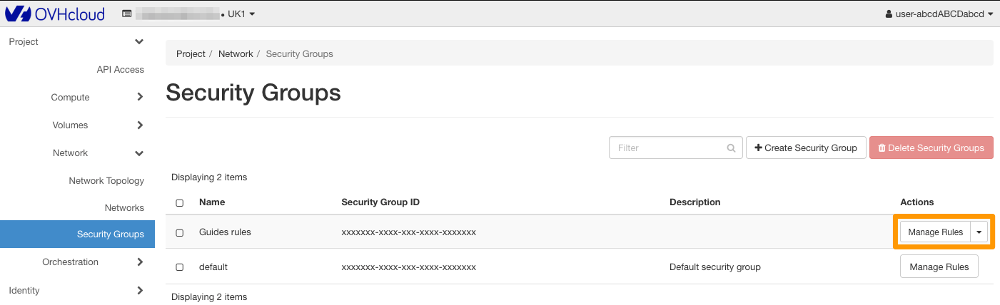
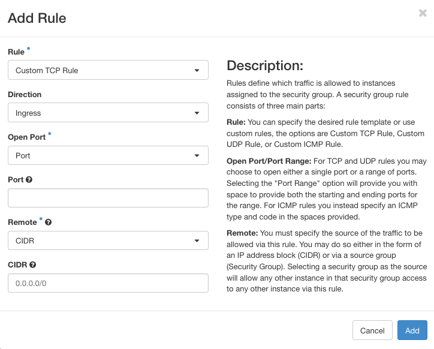

> [!primary]
> Esta traducción ha sido generada de forma automática por nuestro partner SYSTRAN. En algunos casos puede contener términos imprecisos, como en las etiquetas de los botones o los detalles técnicos. En caso de duda, le recomendamos que consulte la versión inglesa o francesa de la guía. Si quiere ayudarnos a mejorar esta traducción, por favor, utilice el botón «Contribuir» de esta página.
>

**Última actualización: 24/08/2021**

## Objetivo

Por motivos de seguridad, es posible configurar y utilizar reglas de filtrado que definan los accesos a sus instancias. En ella, puede autorizar o bloquear determinadas conexiones entrantes o salientes utilizando grupos de seguridad. Estas reglas pueden aplicarse al tráfico procedente de determinadas direcciones IP, o incluso a las instancias configuradas en grupos de seguridad en particular.

**Esta guía explica cómo crear un grupo de seguridad y configurarlo en una instancia de Public Cloud.**

## Requisitos

- Un [proyecto de Public Cloud](https://www.ovhcloud.com/es-es/public-cloud/).
- [Estar conectado a Horizon](https://docs.ovh.com/es/public-cloud/crear-y-eliminar-un-usuario-de-openstack/)

## Procedimiento

### 1\. crear un grupo de seguridad

Acceda a la interfaz [Horizon](https://docs.ovh.com/es/public-cloud/crear-y-eliminar-un-usuario-de-openstack/). Seleccione la región en la que desea crear un grupo de seguridad utilizando el botón superior izquierdo.

{.thumbnail}

> [!primary]
>
> Si un grupo de seguridad va a utilizarse en varias regiones, deberá crearlo para cada una de ellas.
>

Despliegue el menú `Network`{.action} y haga clic en `Security Groups`{.action}. Una tabla lista los grupos de seguridad creados. El grupo "default" ya está listado. que permite pasar todo el tráfico entrante y saliente.

Para añadir un nuevo grupo de seguridad, haga clic en el botón `+ Create Security Group`{.action}.

{.thumbnail}

En la nueva página, introduzca un nombre y una descripción para el grupo que vaya a crear. A continuación, haga clic en el botón `Create Security Group`{.action}.

{.thumbnail}

A continuación, en la pestaña `Security Groups`{.action}, la tabla mostrará el grupo que acaba de crear. Las reglas están configuradas por defecto. estas últimas dejan pasar únicamente el tráfico saliente. Si desea modificarlas, vaya al siguiente paso.

Si lo necesita, lea esta guía en el [paso 3\. Configurar un grupo de seguridad en la instancia](#instance-security-group).

### 2\. configurar las reglas de un grupo de seguridad

Para cambiar las reglas por defecto o, si lo necesita, haga clic en el botón `Manage Rules`{.action}.

{.thumbnail}

Si ha dejado las reglas por defecto en su grupo de seguridad, estas solo dejan pasar el tráfico saliente.

```bash
root@serveur:~$ ssh admin@149.xxx.xxx.177

ssh: connect to host 149.xxx.xxx.177 port 22: Connection timed out
```

A continuación, en la página de gestión de las reglas, podrá:

- eliminar una regla existente: Para ello, utilice el botón `Delete Rule`{.action}.
- añadir una nueva regla: para ello, utilice el botón `+ Add Rule`{.action}.

Al añadir una regla, deberá completar la información solicitada y hacer clic en `Add`{.action}.

En nuestro ejemplo, vamos a autorizar la conexión SSH a la instancia.

{.thumbnail}

Una vez que haya añadido la nueva regla, espere a que se aplique.

```bash
root@serveur:~$ ssh admin@149.xxx.xxx.177

Last login: Tue Oct 13 13:56:30 2015 from proxy-109-190-254-35.ovh.net
admin@serveur1:~$
```

### Configurar un grupo de seguridad en una instancia <a name="instance-security-group"></a>

Despliegue el menú `Compute`{.action} y seleccione `Instances`{.action} desde Horizon. Desde esta página, cree una nueva instancia utilizando el botón `Launch Instance`{.action}.

Al crear la instancia, puede elegir el nuevo grupo de seguridad creado en el paso anterior a través del menú `Security Groups`{.action}.

{.thumbnail}

Puede aplicar un nuevo grupo de seguridad a una instancia ya creada haciendo clic en `Edit Security Groups`{.action} a la derecha de la instancia.

{.thumbnail}

### Eliminar un grupo de seguridad

Para eliminar un grupo de seguridad, selecciónelo marcando la casilla correspondiente a la izquierda y haga clic en `Delete Security Groups`{.action}.

{.thumbnail}

## Más información

Interactúe con nuestra comunidad de usuarios en <https://community.ovh.com/en/>.
