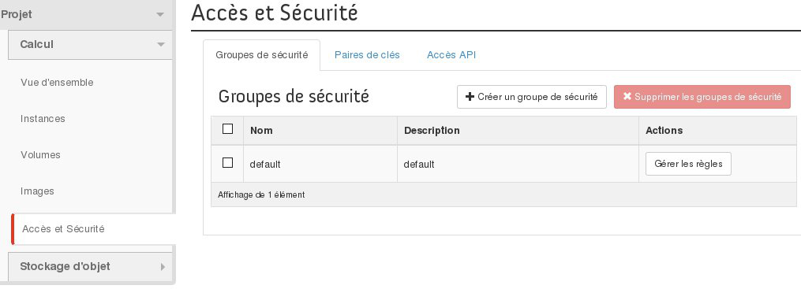
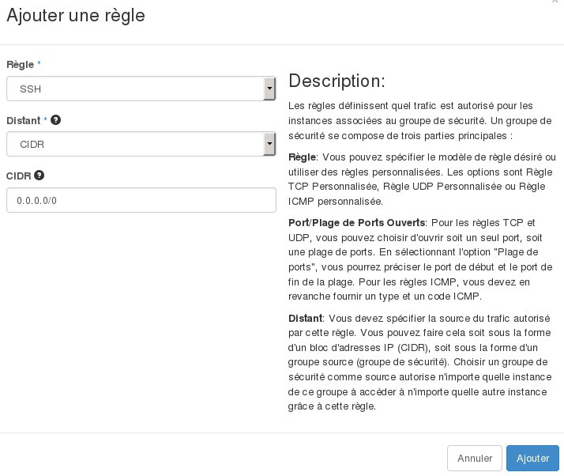

**Dernière mise à jour le 08/11/2018**

## Objectif

Pour des raisons de sécurité, il est possible de configurer et d'utiliser des règles de filtrage qui définiront les accès à vos instances. Vous pouvez y autoriser ou bloquer certaines connexions entrantes ou sortantes à l'aide de groupes de sécurité. Ces règles peuvent être appliquées pour du trafic provenant de certaines adresses IP, ou même pour des instances configurées sur des groupes de sécurité en particulier.

**Apprenez à créer un groupe de sécurité et à le configurer sur une instance Public Cloud.**

## Prérequis

- Être connecté à l'interface Horizon. Le guide « [Accéder à l’interface Horizon](https://docs.ovh.com/fr/public-cloud/creer-un-acces-a-horizon/){.external} » peut vous y aider.

## En pratique

### Étape 1 : créer un groupe de sécurité

Positionnez-vous sur le menu `Accès et Sécurité`{.action}, puis sur l'onglet `Groupes de sécurité`{.action}. Un tableau liste les groupes de sécurité créés. Le groupe « default » y est déjà listé. Celui-ci laisse passer tout le trafic entrant et sortant.

Pour ajouter un nouveau groupe de sécurité, cliquez sur le bouton `Créer un groupe de sécurité`{.action}.

{.thumbnail}

Sur la page qui apparaît, donnez un nom et une description au groupe que vous êtes sur le point de créer. Une fois ceci fait, cliquez sur le bouton `Créer un groupe de sécurité`{.action}.

{.thumbnail}

De retour sur sur l'onglet `Groupes de sécurité`{.action}, le tableau affiche désormais le groupe nouvellement créé. Des règles y sont configurées par défaut. Ces dernières laissent passer uniquement le trafic sortant. Poursuivez vers l'étape suivante si vous souhaitez modifier ces dernières.

Si ces règles vous conviennent, poursuivez vers l'étape 3 « [configurer un groupe de sécurité sur son instance](https://docs.ovh.com/fr/public-cloud/configurer-un-groupe-de-securite/#etape-3-configurer-un-groupe-de-securite-sur-son-instance){.external} » de cette documentation.

### Étape 2 : configurer les règles d'un groupe de sécurité

Pour modifier ces règles ou si vos besoins évoluent, rendez-vous dans le menu `Accès et Sécurité`{.action}, puis positionnez-vous sur l'onglet `Groupes de sécurité`{.action}. Cliquez à présent sur le bouton `Gérer les règles`{.action}. 

{.thumbnail}

Si vous avez laissé les règles par défaut sur votre groupe de sécurité, celles-ci ne laissent passer que le trafic sortant.

```bash
root@serveur:~$ ssh admin@149.xxx.xxx.177

ssh: connect to host 149.xxx.xxx.177 port 22: Connection timed out
```

Dès lors, sur la page de gestion des règles, vous avez la possibilité de :

- supprimer une règle existante : utilisez pour cela le bouton `Supprimer la Règle`{.action} ;
- ajouter une nouvelle règle : utilisez pour cela le bouton `Ajouter une règle`{.action}.

Lors de l'ajout d'une règle, vous devrez compléter les informations demandées, puis cliquer sur `Ajouter`{.action}. 

{.thumbnail}

Une fois l'ajout demandé, patientez quelques minutes le temps que celui-ci soit opérationnel.

```bash
root@serveur:~$ ssh admin@149.xxx.xxx.177

Last login: Tue Oct 13 13:56:30 2015 from proxy-109-190-254-35.ovh.net
admin@serveur1:~$
```

### Étape 3 : configurer un groupe de sécurité sur son instance

Toujours connecté à l'interface, positionnez-vous à présent sur le menu `Instances`{.action}. Depuis cette page, créez une nouvelle instance. 

Une fois ceci fait, rendez-vous sur l'onglet `Accès et Sécurité`{.action} pour y cocher le nouveau groupe de sécurité créé lors de l'étape précédente.

{.thumbnail}

Il est possible de changer la configuration des groupes de sécurité des instances déjà créés en sélectionnant l'option « Éditer les groupes de sécurité ».

{.thumbnail}

## Aller plus loin

Échangez avec notre communauté d'utilisateurs sur <https://community.ovh.com/>.