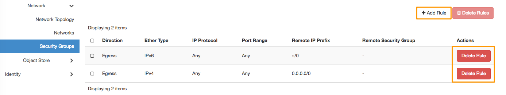
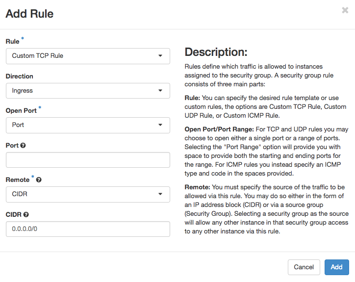
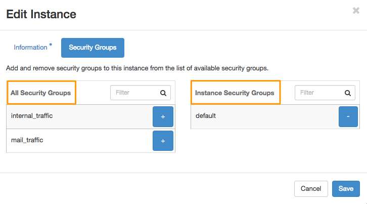

**Ostatnia aktualizacja dnia 2018-03-12**

## Wprowadzenie

W celu podniesienia bezpieczeństwa infrastruktury stosowane są reguły zabezpieczeń, czyli reguły filtrowania, które będą definiować dostęp do instancji. Możesz autoryzować lub blokować połączenia przychodzące lub wychodzące za pomocą grup zabezpieczeń, korzystając z predefiniowanych filtrów, na przykład dla ruchu w protokole UDP jak i filtrów konfigurowanych samodzielnie.

Funkcję tę można wykorzystywać jako szablon dla tworzonych instancji, w ten sposób nowo utworzone instancje od razu będą działały ze zdefiniowanymi wcześniej przez Ciebie regułami zabezpieczeń.

**Przewodnik ten wyjaśnia, jak posługiwać się konfiguratorem, aby ustawić potrzebne zabezpieczenia sieci dla usługi [Public Cloud](https://www.ovh.pl/public-cloud/instances/){.external}.**

W ten sposób grupy zabezpieczeń pozwalają na znaczne zaoszczędzenie czasu przy konfiguracji nowych instancji czy całych infrastruktur.

Także wprowadzanie zmian jest znacznie szybsze, zamiast wprowadzać je kolejno na wszystkich instancjach, wystarczy zmodyfikować konfigurację danej grupy zabezpieczeń. Wszystkie maszyny z niej korzystające automatycznie będą przez nie chronione.

## Wymagania początkowe

- Utworzony projekt [Public Cloud](https://www.ovh.pl/public-cloud/instances/){.external}
- Dostęp do [interfejsu Horizon](https://horizon.cloud.ovh.net/auth/login/){.external}

## W praktyce

### Konfiguracja grupy zabezpieczeń

Zaloguj się do Horizon upewniając się, że logujesz się do odpowiedniego Projektu Public Cloud. Po zalogowaniu sprawdź, czy wyświetlane są dane właściwego `Regionu` (zaznaczenie nr 1), w lewym menu wybierz `Network`{.action} (zaznaczenie numer 2), a następnie `Security Groups`{.action} (zaznaczenie nr 3).

{.thumbnail}

Możesz zmienić ustawienia domyślnie skonfigurowanej grupy klikając na  przycisk `Manage Rules`{.action} (zaznaczenie nr 4) lub utworzyć nową grupę zabezpieczeń (zaznaczenie nr 5).

Nowo utworzona grupa domyślnie umożliwia jedynie ruch wychodzący. Aby nowo utworzoną grupę skonfigurować według własnych potrzeb, kliknij na `Manage Rules`{.action}. Teraz możesz dodać nową regułę klikając na `+ Add Rule`{.action} lub usunąć istniejącą przyciskiem `Delete`{.action}.

{.thumbnail}

Zostanie otwarte okno konfiguracyjne:

{.thumbnail}

Pole `Rule`: możesz wybrać szablon reguły (np.: IMAP) lub użyć reguł niestandardowych, np dla ruchu z wykorzystaniem protokołu UDP.

Pole `Direction` określa jakiego ruchu dotyczy reguła, opcja dostępna dla reguł niestandardowych.

Pole `Open port` oraz `Port` służą do zdefiniowania jednego portu lub zakresu portów.
W przypadku reguł TCP i UDP można wybrać otwarcie jednego portu lub zakresu portów. W przypadku reguł ICMP należy zamiast portów podać typ ICMP i kod w dostarczonych przestrzeniach.

Pole `Remote` służy wskazaniu źródła ruchu, które będzie akceptowane przez tę regułę. Możesz to zrobić w postaci bloku adresu IP (CIDR) lub grupy źródłowej (grupa zabezpieczeń). 
Wybranie grupy zabezpieczeń jako źródła umożliwi dowolnej instancji w tej grupie zabezpieczeń na dostęp do dowolnej innej instancji za pośrednictwem tej reguły.

> [!primary]
>
> Każda grupa zabezpieczeń funkcjonuje tylko w jednym Regionie i tylko instancje z tego samego regionu będą mogły z niego korzystać. Aby taka sama grupa zabezpieczeń mogła funkcjonować w wielu Regionach, należy je utworzyć i kolejno skonfigurować.
>

### Dodawanie grupy zabezpieczeń do instancji

Aby dana grupa zabezpieczeń była respektowana dla danej instancji, należy tę grupę dodać w konfiguracji instancji. W panelu Horizon ta opcja jest dostępna także podczas tworzenia nowej instancji.

Przejdź do sekcji `Compute`{.action} a następnie `Instances`{.action} w lewym menu i wyświetl menu instancji, dla której chcesz zmienić ustawienia grup zabezpieczeń:

{.thumbnail}

W oknie edycyjnym wyświetlą się dwie kolumny: `All Security Groups` (wszystkie grupy zabezpieczeń), która prezentuje dostępne grupy zabezpieczeń dla danego Projektu i Regionu.

{.thumbnail}

W kolumnie `Instance Security Groups` (grupy zabezpieczeń instancji) prezentowana jest lista grup, w których pracuje ta instancja.

Użyj przycisków `+` i `-` aby przyłączyć lub odłączyć daną grupę. Zapisane zmiany będą wdrożone w ciągu kilku minut.

## Sprawdź również 

[Dostęp do panelu Horizon](https://docs.ovh.com/pl/public-cloud/tworzenie_dostepu_do_interfejsu_horizon/){.external}

[Tworzenie i usuwanie grup zabezpieczeń](https://docs.ovh.com/pl/public-cloud/tworzenie-usuwanie-grupy-bezpieczenstwa-horizon/){.external}

Przyłącz się do społeczności naszych użytkowników na stronie <https://community.ovh.com/en/>.