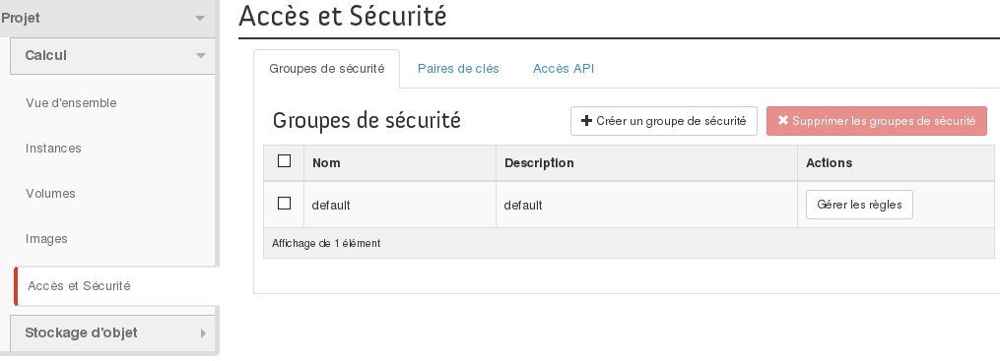
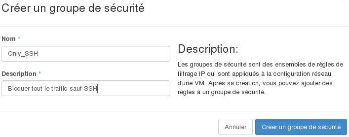
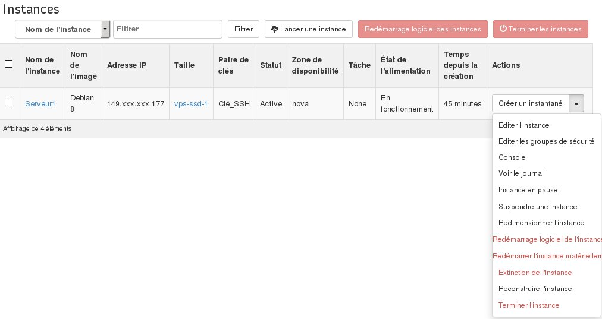
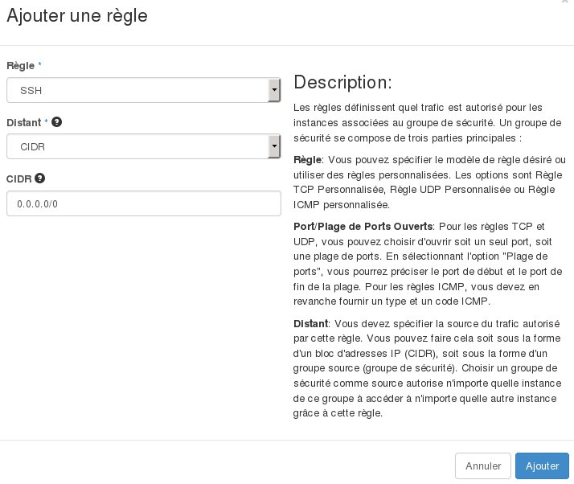
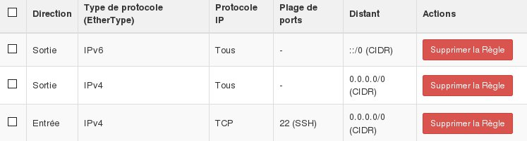

## 
Por razões de segurança é possível que configure e utilize regras de filtragem que definem o acesso às suas instâncias.
Poderá então autorizar e bloquear certas ligações de entrada e saída com a ajuda destes grupos de segurança.
Eles poderão ser aplicados ao tráfego proveniente de certos endereços IPs, ou mesmo de instânicas configuradas em grupos de segurança específicos.

Este guia irá explicar-lhe como poderá proteger as suas instâncias


## Pré-requisitos

- [Criar um acesso ao Horizon]({legacy}1773)
- Estar ligado no manager Horizon


## Criação do grupo de segurança

- Aceda ao menu "Acesso e Segurança" e aceda depois ao separador "Grupos de segurança".


{.thumbnail}
Um grupo de segurança "default" já está presente, deixando passar todo o tráfego de entrada e saída.

- Clique em "Criar um grupo de segurança"


{.thumbnail}

- Depois de preencher o nome e a descrição clique em "Criar um grupo de segurança".


Ao clicar em "Gerir as regras" poderá consultar as regras criadas de forma padrão:

{.thumbnail}
Um novo grupo de segurança deixará, de forma padrão, passar unicamente o tráfego de saída.


## Configuração de uma instância com o grupo de segurança

- Aceder ao menu "Instâncias"
- Criar uma nova instância
- Aceder ao separador "Acesso e Segurança" e selecione apenas o novo grupo de segurança.


{.thumbnail}
É possível alterar a configuração dos grupos de segurança de instâncias já criadas ao selecionar a opção "Editar os grupos de segurança".

{.thumbnail}


## Configuração do grupo de segurança
Como indicado anteriormente, o grupo de segurança criado somente permite, de forma padrão, passar o tráfego de saída:


```
root@serveur:~$ ssh admin@149.xxx.xxx.177

ssh: connect to host 149.xxx.xxx.177 port 22: Connection timed out
```


- Aceda ao menu "Acesso e Segurança" e depois aceda a "Grupos de segurança".
- Clique em "Gerir as regras" e depois clique em "Adicionar uma regra"


{.thumbnail}
Depois de adicionar a regra deverá aguardar alguns minutos para que a regra seja aplicada.

{.thumbnail}

```
root@serveur:~$ ssh admin@149.xxx.xxx.177

Last login: Tue Oct 13 13:56:30 2015 from proxy-109-190-254-35.ovh.net
admin@serveur1:~$
```


## 
[Voltar ao índice dos guias Cloud]({legacy}1785)

