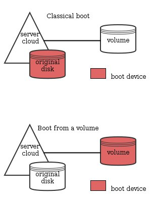

## 
I server Cloud vengono consegnati con un disco predefinito copiato a partire da un'immagine di sistema (Debian 8, Windows 10, ecc...), ma puoi utilizzare anche dischi aggiuntivi permanenti per archiviare i tuoi dati.

È possibile anche configurare un sistema operativo su un volume in modo che il server Cloud si avvii da questo volume invece che dal disco predefinito.

{.thumbnail}

## Altre funzionalità
OpenStack ti permette di avviare la tua istanza da un volume, configurandolo in modo che il server Cloud lo utilizzi come disco di avvio.

Effettuando questa operazione, però, non sarà più possibile utilizzare il disco predefinito, perché il volume prenderà il suo posto.

Questa guida ti mostra come evitare di perdere l'accesso al tuo disco predefinito e utilizzarne lo spazio disponibile.


## Requisiti necessari

- [Imposta le variabili d'ambiente OpenStack]({legacy}1852)
- un volume con un sistema operativo


## Imposta il volume come primario nell'ordine di avvio
Per fare in modo che il server Cloud possa considerare primario questo disco nella fase di avvio, aggiungi un metadato con questo comando:


```
cinder metadata 897ec71d-bae2-4394-b8c1-4d8fd373a725 set boot_from=True
```


## Associa il volume
Una volta configurato il volume con il metadato boot_from a True, associalo alla tua istanza.


```
nova volume-attach myinstance01 897ec71d-bae2-4394-b8c1-4d8fd373a72
```


## 
Per avviare l'istanza dal disco aggiuntivo, è necessario riavviarla.

Per farlo, utilizza l'azione nova stop e poi nova start, oppure forza il riavvio.


```
nova reboot --hard myinstance01
```


## Attenzione:
Un reboot "soft" non è sufficiente perché la modifica diventi effettiva.
Per verificare il corretto ordine di avvio, controlla i punti di mount.


```
$ lsblk
NAME MAJ:MIN RM SIZE RO TYPE MOUNTPOINT
vda 252:0 0 10G 0 disk
└─vda1 252:1 0 10G 0 part
vdb 252:16 0 15G 0 disk
└─vdb1 252:17 0 15G 0 part /
```


Il punto di mount / è configurato correttamente su /dev/vdb1.


## 

- [Aumenta la spazio del tuo disco aggiuntivo]({legacy}1865)


## 
[Ritorna all'indice delle guide Cloud]({legacy}1785)

