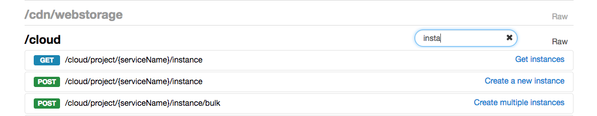
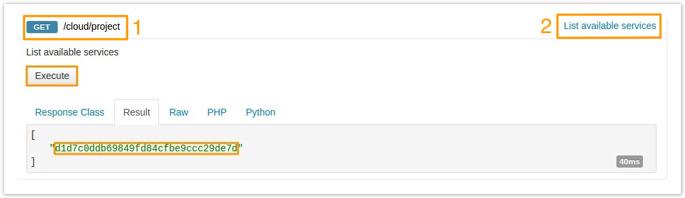
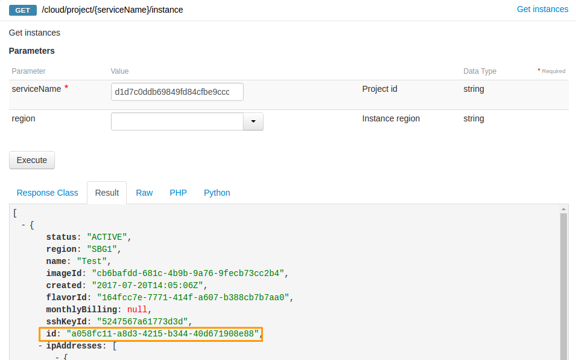
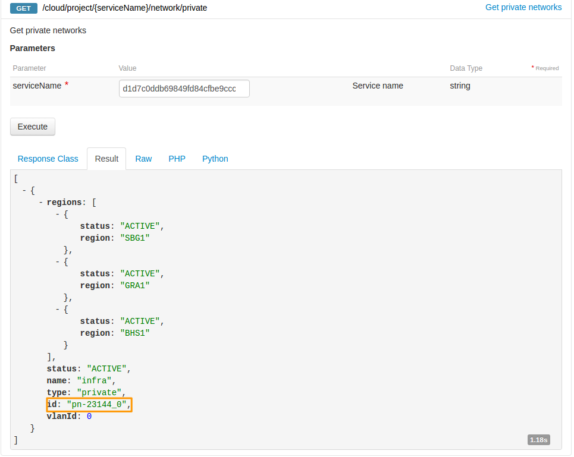
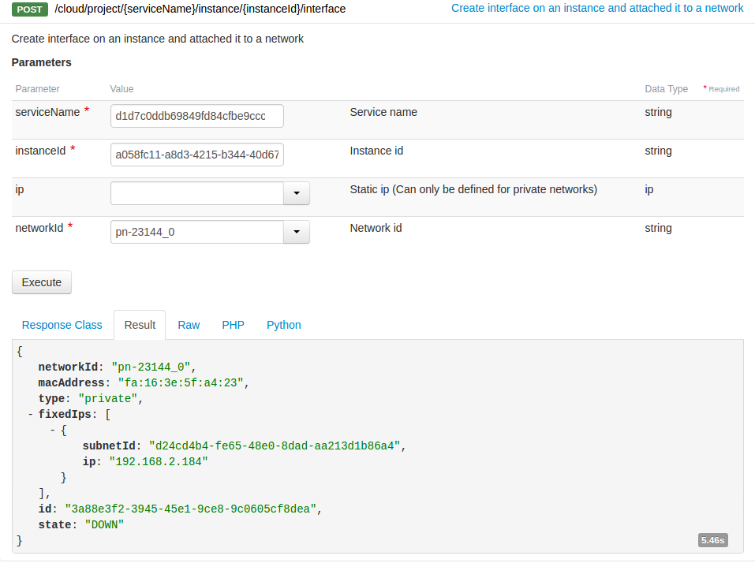
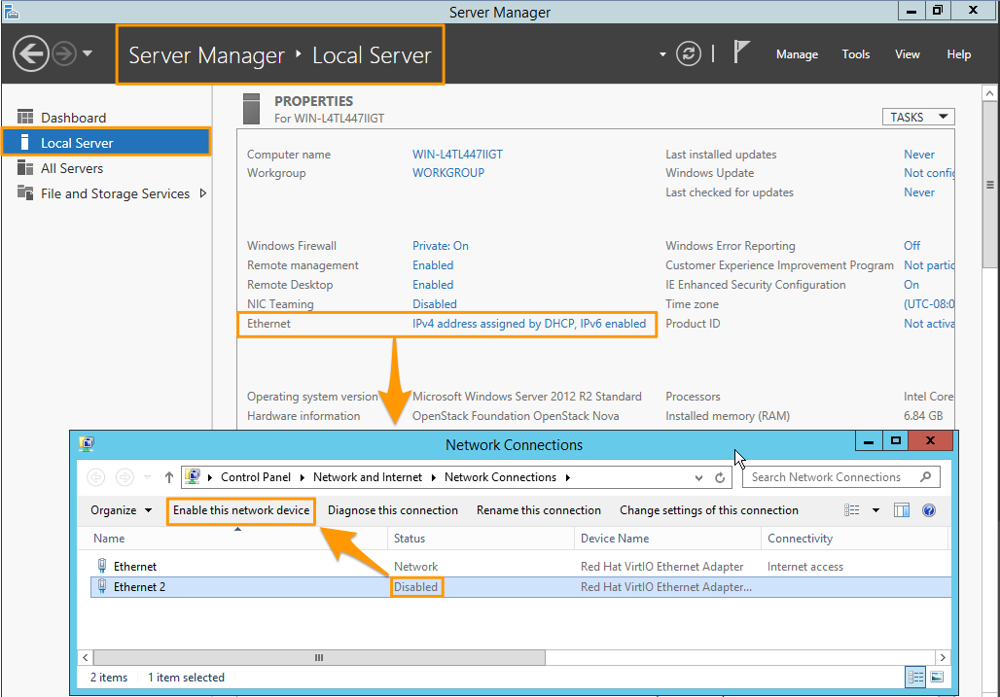

**Ostatnia aktualizacja dnia 2018-01-23**

## Wprowadzenie

Przewodnik przedstawia wdrożenie konfiguracji usługi vRack na instancjach, które zostały uruchomione wcześniej.
W takim przypadku instancje nie posiadają aktywnego drugiego interfejsu sieciowego dla vRack i należy go utworzyć.

**W tym przewodniku konfiguracja przewiduje, że podczas tworzenia sieci vLan została włączona funkcja DHCP i adresacja jest przypisywana automatycznie.**


## Wymagania początkowe

- [Instancja Public Cloud](https://www.ovh.pl/public-cloud/instances/){.external}
- Uruchomiona usługa [vRack](https://www.ovh.pl/rozwiazania/vrack/){.external}
- Utworzona sieć prywatna VLAN w projekcie
- Projekt Public Cloud przypisany do usługi vRack


## W praktyce

Zaloguj się do API OVH pod adresem URL: <https://api.ovh.com/console>, wykorzystując dane uwierzytelniające do Panelu klienta. Więcej informacji można uzyskać na głównej stronie [API OVH](https://api.ovh.com/){.external}

Po zalogowaniu wybierz zestaw komend /cloud. 

Następnie użyj zintegrowanej funkcji wyszukiwania po prawej stronie, aby wyświetlić tylko potrzebne w danym momencie funkcje. 

{.thumbnail}

Wiersz polecenia API otwieramy klikając na składnię funkcji (zaznaczenie nr 1) lub jej opis (zaznaczenie nr 2).

Kolejność wykonywania poleceń ma znaczenie, gdy chcesz wykorzystać do kolejnych komend dane otrzymane z wcześniejszych zapytań API. Wtedy też część danych do wymaganych pól będzie mogła zostać pobrana z wyników dla poprzedniego zapytania API.

### Etap 1: Tworzenie interfejsu sieciowego vRack

#### Krok 1. Pobranie identyfikatora projektu

Użyj funkcji:

> [!api] 
>
> @api {GET} /cloud/project
> 

Następnie kliknij `Execute`{.action}. Postępuj tak do uruchomienia każdej funkcji.

Identyfikator widoczny jest pomiędzy cudzysłowami:

{.thumbnail}

Zalecamy skopiowanie identyfikatora projektu, ponieważ będzie używany później. Numer ten jest też widoczny w Panelu Klienta poniej nazwy projektu.


#### Krok 2. Pobranie identyfikatora instancji

Kliknij:

> [!api] 
>
> @api {GET} /cloud/project/{serviceName}/instance 
>

wpisz identyfikator projektu, a następnie kliknij `Execute`{.action}.

Skopiuj ID instancji - potrzebna jest wartość wyświetlana między cudzysłowami:

{.thumbnail}

Dodatkowo uzyskasz wiele innych informacji o danej instancji. Między innymi, czy jest to już działająca instancja (status), gdzie jest uruchomiona (region), z którego obrazu został uruchomiony system (imageId), typ rozliczenia (monthlyBilling).


#### Krok 3. Pobranie identyfikatora sieci

Użyj funkcji:

> [!api] 
>
> @api {GET} /cloud/project/{serviceName}/network/private
>

Skopiuj ID usługi vRack (wartość umieszczona między cydzysłowami):

{.thumbnail}

W wyniku tego zapytania uzyskasz dodatkowe informacje, np. nazwę sieci, regiony działania danej sieci prywatnej.


#### Krok 4. Utworzenie interfejsu sieciowego vRack dla instancji

Użyj funkcji:

> [!api] 
> 
> @api {POST} /cloud/project/{serviceName}/instance/{instanceId}/interface 
>

do stworzenia nowego interfejsu sieciowego dla vRack. Wypełnij pola uzyskanymi wcześniej informacjami i zatwierdź przyciskiem `Execute`{.action}.

{.thumbnail}

W wyniku polecenia, otrzymasz informację o adresie IP przypisanym do interfejsu sieci prywatnej instancji - w tym przykładzie: 192.168.2.184

Nie jest to adres, który jest już skonfigurowany na interfejsie sieciowym instancji w systemie operacyjnym.

Chcąc skorzystać z tej adresacji, należy podnieść interfejs sieciowy, który zgodnie z listingiem ma status DOWN.


### Etap 2: Działania w systemie operacyjnym instancji

#### W systemach Linux

Możesz uruchomić interfejs np. za pomocą komendy:

```sh
# /sbin/ifconfig NAZWA_INTERFEJSU up
```

Nazwę interfejsu należy sprawdzić w konfiguracji systemu operacyjnego. Nazwa może być różna w zależności od dystrybucji.

Ostatnim etapem jest pobranie adresacji z serwera DHCP.

```sh
# dhclient NAZWA_INTERFEJSU IP
```
Jeśli nie chcesz korzystać z adresacji przydzielonej przez serwer DHCP, możesz samodzielnie zaadresować interfejs sieci prywatnej.

#### W systemach Windows

W zależności od wersji oprogramowania możemy spotkać się z różnymi widokami sekcji zarządzania sieciami, np. w systemie Windows Serwer 2012 R2 opcje zarządzania znajdziesz w ustawieniach serwera (Server Manager > Local Server) klikając na opcje dotyczące sieci "Ethernet". W efekcie otworzy się okno ustawień dla połączeń sieciowych.

Ścieżka wyświetlana w systemie to: Control Panel > Network and Internet > Network Connections:

{.thumbnail}

## Sprawdź również

Przyłącz się do społeczności naszych użytkowników na stronie <https://community.ovh.com/en/>.