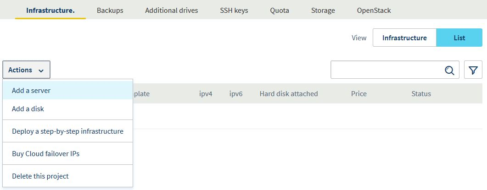
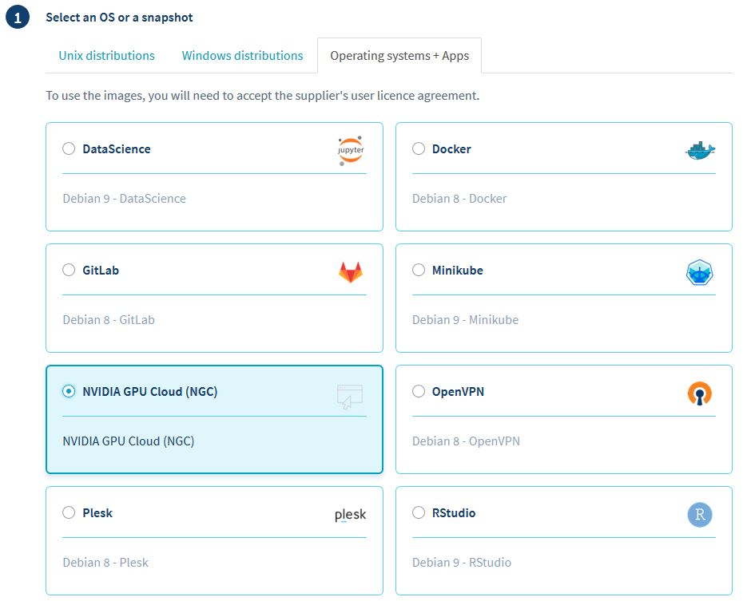
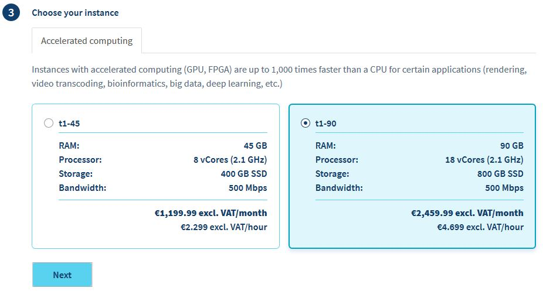
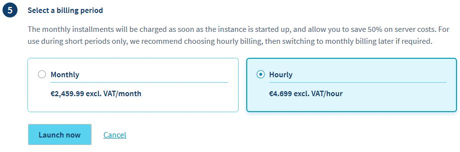

**Last updated 8th January 2019**

## Objective

**The purpose of this guide is to show you how to set up your first NVIDIA GPU Cloud container instance.**

The first part of the guide will be OVH specific for basic usage. The second part will be more advanced, using OpenStack client to automate NGC instance management.

Quick links:

- <a href='#via_manager'>Create an NGC instance via OVH Manager</a>
- <a href='#via_cli'>Create an NGC instance via the Command Line Interface</a>
- <a href='#connect_vm'>Connect to your NGC instance</a>

## Prerequisites

* Access to the [OVH Control Panel](https://www.ovh.com/auth/?action=gotomanager). 

## Instructions

<a id='via_manager'>
### Create an NGC instance via OVH Manager
</a>

The first step will be to [create a Public Cloud project](https://docs.ovh.com/gb/en/public-cloud/getting_started_with_public_cloud_logging_in_and_creating_a_project/){.external}

The second step will be to create an instance into the newly created project using the latest wizard. The previous wizard is documented [here](https://docs.ovh.com/gb/en/public-cloud/create_an_instance_in_your_ovh_customer_account/){.external}.

After selecting the `List`{.action} view, click on `Actions`{.action} -> `Add a server`{.action}.



Under `Operating systems + Apps`, select `NVIDIA GPU Cloud (NGC)`




The available flavors are `t1-45` or `t1-90` for 1 or 2 NVIDIA® Tesla® V100. Flavors with more GPU will be available later.




> [!warning]
>
> The billing starts as soon as the virtual machine is up.
>



<a id='via_cli'>
### Create an NGC instance via the Command Line Interface
</a>

You can manage your OVH Public Cloud instances using the standard OpenStack API and tools: `terraform`, `ansible`, ...

For now, we'll focus on the command line client `openstack`.

#### 1) Configure your local environment (one time step)

You first need to create a user account as described here <https://docs.ovh.com/gb/en/public-cloud/configure_user_access_to_horizon/>

Next, click on the `...`{.action} icon at the end of the line and then click the `Download OpenStack configuration file`{.action} link.

Save the file as `openrc.sh`.

From a **Windows client**, please follow this link to setup the OpenStack client <https://github.com/naturalis/openstack-docs/wiki/Howto:-Installing-and-configuring-the-OpenStack-commandline-tools-on-Windows>

From a **Linux client**, use your preferred package manager (i.e. `apt`, `yum`, `emerge`, etc) to install the `python-openstackclient` package and source the configuration file you previously saved (`. ./openrc.sh`).

#### 2) Create a NGC VM

The first step is to have a SSH Key pair. You can create one with:

```shell
openstack keypair create mykey > mykey.pem
```

Then, you'll need to gather the following information:

```shell
SOURCE_ID=`openstack image list --name 'NVIDIA GPU Cloud (NGC)'`
FLAVOR='t1-45' # get a list with `openstack flavor list | grep 't1-'`
NETWORK_ID=`openstack network list --name 'Ext-Net'`
```

Finally, create the VM with the following command:

```shell
openstack server create --key-name mykey --image $SOURCE_ID --flavor $FLAVOR --network $NETWORK_ID my_vm
```

> [!warning]
>
> The billing starts as soon as the virtual machine is up.
>

To inspect or delete the VM:

```shell
openstack server show my_vm # describes the VM status
openstack server delete my_vm # deletes the VM and stop the billing
```

Get the VM IP address

```shell
openstack server show my_vm
```

<a id='connect_vm'>
### Connect to your NGC instance
</a>

You can use [Putty](https://www.putty.org/) under Windows, `ssh` or another SSH client.

The default user is `ubuntu`

```shell
ssh -i ./mykey.pem ubuntu@<VM IP>
```

### Your first NGC container

Once you are logged into the VM, you can start pulling and running the container.

The list of available containers (TensorFlow, Caffe2, DIGITS, Matab, MXNet, PyTorch, TensorFlow, RAPIDS, ...) is available here:

<https://ngc.nvidia.com/catalog/containers>

Example:

```shell
docker pull nvcr.io/nvidia/tensorflow:xx.yy-pyN
nvidia-docker run -it --rm -v local_dir:container_dir nvcr.io/nvidia/tensorflow:xx.yy-pyN
```

<!--
Please click the link below to see an example of semantic segmentation with NVIDIA DIGITS:

<https://github.com/NVIDIA/DIGITS/tree/master/examples/semantic-segmentation>

```shell
docker pull nvcr.io/nvidia/digits:18.11-tensorflow
docker run -p 8888:5000 nvcr.io/nvidia/digits:18.11-tensorflow
```

Then navigate to `http://your_vm_ip:8888`. 

Please click the link below for more options and explanations:

<https://ngc.nvidia.com/catalog/containers/nvidia%2Fdigits>.
-->

## Go further

If you would like to automated the above steps, look at the `-f json` option of the openstack client and the `jq` [JSON command line tool parser](https://stedolan.github.io/jq/manual/){.external}.

Example:

```shell
SOURCE_ID=`openstack image list --name 'NVIDIA GPU Cloud (NGC)' -f json | jq -r '.[0].ID'`
```

Join our community of users on <https://community.ovh.com/en/>.
