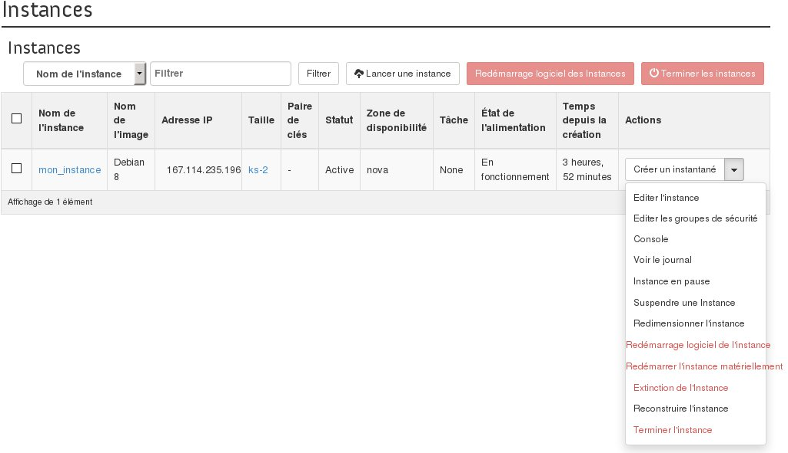

## 
Bei der Konfiguration einer hochverfügbaren Infrastruktur kann es vorkommen, dass Sie die Zugänge zu Ihren Instanzen unterbrechen möchten, um verschiedene Tests durchzuführen.

Mit OpenStack können Sie Ihre Instanz bei Bedarf aussetzen (entspricht einem Ruhezustand der Instanz) oder pausieren.
Der Status "Ausgesetzt" wird auch bei Abrechnungsproblemen verwendet.
In dieser Hilfe wird beschrieben, wie Sie in Horizon eine Instanz aussetzen (entspricht einem Ruhezustand der Instanz) oder pausieren können.

## Hinweis:
Diese Operation zieht eine weitere Abrechnung der Instanz nach sich, solange diese nicht terminiert wurde.

## Voraussetzungen

- [Erstellung eines Zugangs zu Horizon]({legacy}1773)
- Eine erstellte Instanz

## 
Um eine Instanz auszusetzen gehen Sie wie folgt vor:

- Verbinden Sie sich mit Horizon
- Klicken Sie in dem Menü auf der linken Seite auf Instanzen
- Wählen Sie für die gewünschte Instanz in der Dropdown-Liste Instanz aussetzen aus

{.thumbnail}

- Es wird dann eine Bestätigung angezeigt, dass die Instanz ausgesetzt wurde

## Hinweis:
Um die Instanz erneut zu starten wählen Sie für die gewünschte Instanz in der Dropdown-Liste Instanz wiederaufnehmen aus.

## 
Um eine Instanz zu pausieren gehen Sie wie folgt vor:

- Verbinden Sie sich mit Horizon
- Klicken Sie in dem Menü auf der linken Seite auf Instanzen
- Wählen Sie für die gewünschte Instanz in der Dropdown-Liste Pausiere Instanz aus

{.thumbnail}

- Es wird dann eine Bestätigung angezeigt, dass die Instanz pausiert wurde

## 
[Zurück zum Index der Cloud Hilfen]({legacy}1785)

