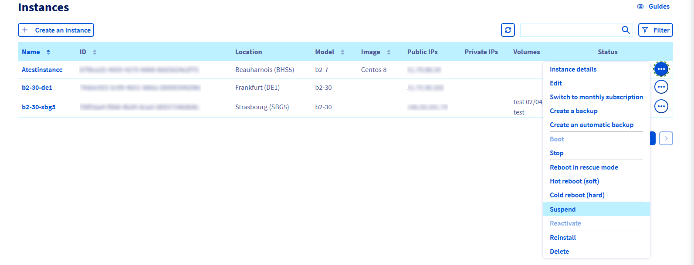
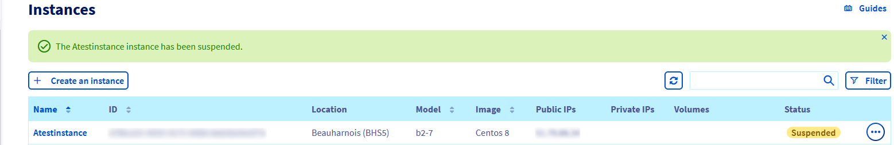
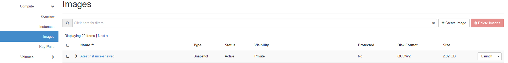
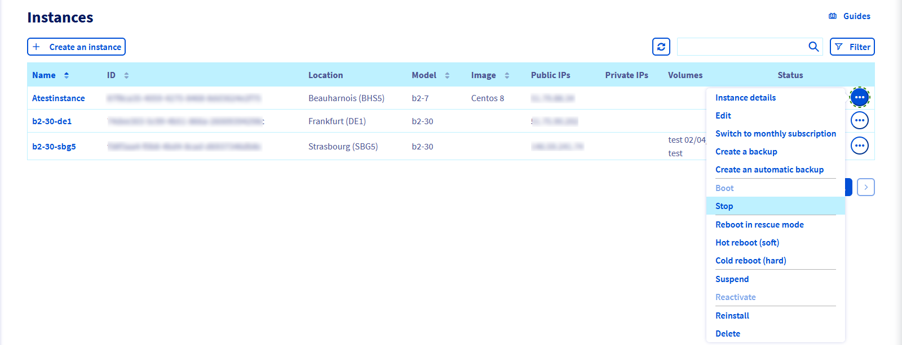
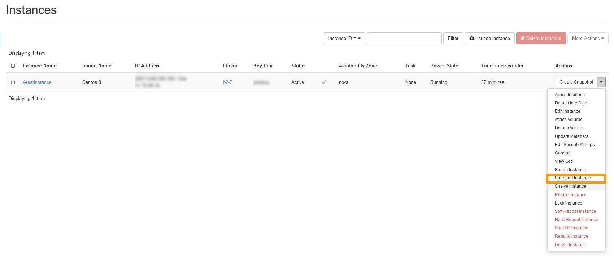

> [!primary]
> Tłumaczenie zostało wygenerowane automatycznie przez system naszego partnera SYSTRAN. W niektórych przypadkach mogą wystąpić nieprecyzyjne sformułowania, na przykład w tłumaczeniu nazw przycisków lub szczegółów technicznych. W przypadku jakichkolwiek wątpliwości zalecamy zapoznanie się z angielską/francuską wersją przewodnika. Jeśli chcesz przyczynić się do ulepszenia tłumaczenia, kliknij przycisk “Zaproponuj zmianę” na tej stronie.
>

**Ostatnia aktualizacja dnia 2021-10-01**

## Wprowadzenie

 Częścią konfiguracji infrastruktury o wysokiej dostępności może być konieczność odcięcia dostępu do instancji w celu przeprowadzenia różnych testów. OpenStack pozwala zatrzymać, wstrzymać lub zawiesić Twoją instancję. W każdym przypadku Twój adres IP jest zachowywany.

> [!warning]
> Nazwy tych opcji w Panelu klienta OVHcloud różnią się od nazw w interfejsie Openstack/Horizon. Jeśli przeprowadzasz tę operację w Panelu klienta OVHcloud, pamiętaj o wybraniu odpowiedniej opcji.
>

**Dowiedz się, jak zawiesić, wstrzymać lub zatrzymać swoją instancję.**

## Wymagania początkowe

- Utworzenie [instancji Public Cloud OVHcloud](https://docs.ovh.com/pl/public-cloud/public-cloud-pierwsze-kroki/) w abonamencie **godzina**
- Dostęp do [Panelu klienta OVHcloud](https://www.ovh.com/auth/?action=gotomanager&from=https://www.ovh.pl/&ovhSubsidiary=pl){.external} lub [interfejsu Horizon](https://docs.ovh.com/pl/public-cloud/tworzenie_dostepu_do_interfejsu_horizon/)
- Znajomość [API OpenStack](https://docs.ovh.com/pl/public-cloud/przygotowanie_srodowiska_dla_api_openstack/) i [Zmienne OpenStack](https://docs.ovh.com/pl/public-cloud/zmienne-srodowiskowe-openstack/)

## W praktyce

> [!alert]
>
> Po wykonaniu tych działań instancja nadal jest odpłatna.
>

Poniższa tabela pozwoli Ci odróżnić opcje dostępne dla Twoich instancji. Kontynuuj lekturę przewodnika, klikając wybraną opcję.

|Nazwa|Opis|Płatności|
|---|---|---|
|[Zawieś (*shelve*)](#shelve-instance)|Zachowuje zasoby i dane na dysku przez utworzenie migawki. Wszystkie inne zasoby zostaną zwolnione.|Płatność dotyczy tylko kopii zapasowych snapshot.|
|[Zatrzymaj (*suspend*)](#stop-suspend-instance)|Przechowuje stan VM na dysku. Zasoby przeznaczone na instancję są nadal zarezerwowane.|W przypadku Twojej instancji opłata jest taka sama.|
|[Wstrzymaj](#pause-instance)|Przechowuje stan wirtualnej maszyny w pamięci RAM. Wstrzymana instancja zostaje zablokowana.|W przypadku Twojej instancji opłata jest taka sama.|

### Zawieś (shelve) instancję <a name="shelve-instance"></a>

Ta opcja pozwoli Ci zwolnić zasoby dedykowane Twojej instancji Public Cloud, ale adres IP pozostanie. Dane z dysku lokalnego będą przechowywane w migawce utworzonej automatycznie po odłożeniu instancji na półkę. Dane przechowywane w pamięci i poza nią nie będą zachowywane.

#### W Panelu klienta OVHcloud

W Panelu klienta OVHcloud kliknij menu sekcji `Public Cloud`{.action}, wybierz projekt Public Cloud i kliknij pozycję `Instances`{.action} w menu bocznym po lewej stronie.

Kliknij przycisk `...`{.action} po prawej stronie instancji, którą chcesz zawiesić, a następnie `Zawieś`{.action}.

{.thumbnail}

W oknie, które się wyświetla, zapoznaj się z komunikatem i kliknij przycisk `Zatwierdź`{.action}.

{.thumbnail}

Po ukończeniu procesu Twoja instancja będzie wyświetlana jako *Zawieszona*.

{.thumbnail}

Aby wyświetlić migawkę, przejdź do menu po lewej stronie i kliknij pozycję Kopia zapasowa `Instance Backup`{.action}. Widoczna będzie teraz migawka o nazwie *xxxx-shelved*:

{.thumbnail}

#### Z poziomu interfejsu Horizon

Aby kontynuować, należy [tworzenie dostepu do interfejsu Horizon](../horizon/) i [zalogować się do interfejsu Horizon](https://horizon.cloud.ovh.net/auth/login/).

Jeśli wdrożyłeś instancje w różnych regionach, upewnij się, że jesteś we właściwym regionie. Weryfikacji dokonujesz w lewym górnym rogu w interfejsie Horizon.

{.thumbnail}

Kliknij menu `Compute`{.action} po lewej stronie i wybierz pozycję `Instances`{.action}. Wybierz pozycję `Shelve Instance`{.action} z listy rozwijanej dla odpowiedniej instancji.

{.thumbnail}

Po ukończeniu procesu Twoja instancja będzie wyświetlana jako odciążona z *Shelved Offloaded*.

{.thumbnail}

Aby wyświetlić migawkę, w menu `Compute`{.action} kliknij pozycję `Images`{.action}.

{.thumbnail}

#### Korzystanie z API OpenStack/Nova

Przed kontynuowaniem zalecamy zapoznanie się z następującymi przewodnikami:

- [Przygotowanie środowiska dla API OpenStack](https://docs.ovh.com/pl/public-cloud/przygotowanie_srodowiska_dla_api_openstack/)
- [Ustawianie zmiennych środowiskowych OpenStack](https://docs.ovh.com/pl/public-cloud/zmienne-srodowiskowe-openstack/)

Kiedy Twoje środowisko jest gotowe, wpisz w wierszu poleceń:

```bash
openstack server shelve <UUID server>
 
=====================================

nova shelve <UUID server> 
```

### Pobranie z odłożenia (ponowne uaktywnienie) instancji

Ta opcja pozwoli Ci na ponowne utworzenie instancji, abyś mógł z niej nadal korzystać. Uwaga: po tej operacji fakturowanie zostanie wznowione w trybie normalnym.

> [!alert] **Operacje na snapshot**
>
> Wszelkie działania na snapshotach inne niż reaktywacja (*unshelve*) mogą być bardzo niebezpieczne dla infrastruktury, jeśli zostaną niewłaściwie użyte. Po ponownej aktywacji (*unshelve*) instancji, snapshot jest automatycznie usuwany. Nie jest zalecane wdrażanie nowej instancji ze snapshota utworzonego w wyniku zawieszenia (*shelve*) instancji.
>
> OVH oddaje do Twojej dyspozycji usługi, za które przejmujesz odpowiedzialność. Firma OVH nie ma dostępu do Twoich serwerów, nie pełni funkcji administratora i w związku z tym nie będzie mogła udzielić Ci wsparcia. Oddajemy w Twojej ręce niniejszy przewodnik, którego celem jest pomoc w jak najlepszym wykonywaniu bieżących zadań. W przypadku problemów z administrowaniem, użytkowaniem czy zabezpieczeniem serwera rekomendujemy skorzystanie z usług wyspecjalizowanej firmy. Więcej informacji znajduje się w sekcji “Sprawdź również”. 
>

#### W Panelu klienta OVHcloud

W Panelu klienta OVHcloud kliknij menu sekcji `Public Cloud`{.action}, wybierz projekt Public Cloud i kliknij pozycję `Instances`{.action} w menu bocznym po lewej stronie.

Kliknij przycisk `...`{.action} po prawej stronie instancji, a następnie wybierz opcję `Przywróć`{.action}.

{.thumbnail}

W oknie, które się wyświetla, zapoznaj się z komunikatem i kliknij przycisk `Zatwierdź`{.action}.

Po ukończeniu procesu Twoja instancja będzie widoczna jako *Włączona*.

#### Z poziomu interfejsu horizon

W interfejsie Horizon kliknij menu `Compute`{.action} po lewej stronie, a następnie wybierz pozycję `Instances`{.action}. Wybierz pozycję `Unshelve Instance`{.action} z odłożenia z listy rozwijanej dla odpowiedniej instancji.

{.thumbnail}

Po ukończeniu procesu Twoja instancja będzie widoczna jako *Active*.

#### Korzystanie z API OpenStack/Nova

Kiedy Twoje środowisko jest gotowe, wpisz w wierszu poleceń:

```bash
~$ openstack server unshelve <UUID server>

=========================================

~$ nova unshelve <UUID server>
```

### Zatrzymaj (suspend) instancję <a name="stop-suspend-instance"></a>

Ta opcja pozwoli na zamknięcie instancji i zapisanie stanu VM na dysku, a pamięć zostanie zapisana na dysku.

#### W Panelu klienta OVHcloud

W Panelu klienta OVHcloud kliknij menu sekcji `Public Cloud`{.action}, wybierz projekt Public Cloud i kliknij pozycję `Instances`{.action} w menu bocznym po lewej stronie.

Kliknij przycisk `...`{.action} po prawej stronie instancji, którą chcesz zatrzymać, a następnie `Zatrzymaj`{.action}.

{.thumbnail}

W oknie, które się wyświetla, zapoznaj się z komunikatem i kliknij przycisk `Zatwierdź`{.action}.

Po ukończeniu procesu Twoja instancja będzie wyświetlana jako *Wyłączona*.

Aby ponownie włączyć instancję, wykonaj kroki opisane powyżej. Kliknij przycisk `...`{.action} po prawej stronie instancji i wybierz pozycję `Uruchom`{.action}. W niektórych przypadkach może być konieczne wykonanie restartu sprzętowego.

#### Z poziomu interfejsu horizon

W interfejsie Horizon kliknij menu `Compute`{.action} po lewej stronie, a następnie wybierz pozycję `Instances`{.action}. Wybierz pozycję `Suspend Instance`{.action} z listy rozwijanej dla odpowiedniej instancji.

{.thumbnail}

Pojawi się komunikat potwierdzenia wskazujący, że instancja została zawieszona.

Aby ponownie włączyć instancję, wykonaj kroki opisane powyżej. Z listy rozwijanej odpowiedniej instancji wybierz pozycję `Resume Instance`{.action}.

#### Korzystanie z API OpenStack/Nova

Kiedy Twoje środowisko jest gotowe, wpisz w wierszu poleceń:

```bash
~$ openstack server suspend <UUID server>

=========================================

~$ nova suspend <UUID server>
```

Aby ponownie włączyć instancję, w wierszu polecenia wpisz następujące polecenie:

```bash
~$ openstack server unsuspend <UUID server>

=========================================

~$ nova unsuspend <UUID server>
```

### Wstrzymaj instancję <a name="pause-instance"></a>

Operacja ta jest możliwa wyłącznie w interfejsie Horizon lub poprzez API OpenStack/Nova. Umożliwia ona *zamrożenie* instancji.

#### Korzystanie z programu Horizon

W interfejsie Horizon kliknij menu `Compute`{.action} po lewej stronie, a następnie wybierz pozycję `Instances`{.action}. Na liście rozwijanej zaznacz opcję `Pause Instance`{.action} dla odpowiedniej instancji.

{.thumbnail}

Zostanie wyświetlony komunikat potwierdzenia z informacją o wstrzymaniu instancji.

Aby ponownie włączyć instancję, wykonaj kroki opisane powyżej. Z listy rozwijanej odpowiedniej instancji wybierz pozycję `Resume Instance`{.action}.

#### Korzystanie z API OpenStack/Nova

Kiedy Twoje środowisko jest gotowe, wpisz w wierszu poleceń:

```bash
~$ openstack server pause <UUID server>

=========================================

~$ nova pause <UUID server>
```

Aby ponownie włączyć instancję, wpisz w wierszu polecenia:

```bash
~$ openstack server unpause <UUID server>

=========================================

~$ nova unpause <UUID server>
```

## Sprawdź również

[Dokumentacja OpenStack](https://docs.openstack.org/mitaka/user-guide/cli_stop_and_start_an_instance.html)

Przyłącz się do społeczności naszych użytkowników na stronie: <https://community.ovh.com/en/>.
