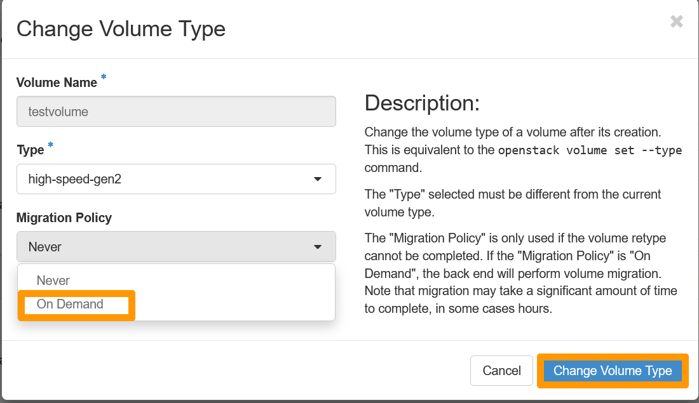

## Objectif

L'objectif de ce guide est de vous montrer comment changer un type de volume Block Storage, de Classic ou High speed à High speed gen2.

## Prérequis

- [Accéder à l'interface Horizon](/pages/platform/public-cloud/introducing_horizon)
- Un volume [Block Storage](/pages/platform/public-cloud/create_and_configure_an_additional_disk_on_an_instance) créé dans votre projet [Public Cloud](https://www.ovhcloud.com/fr/public-cloud/)

## En pratique

Lors de la modification d'un type de volume Block Storage en un volume « High speed gen2 », la politique de migration doit être modifiée de `Never` à `On Demand`.

Par défaut, la politque de migration est définie sur `Never` car le volume reste sur le même cluster CEPH. Cependant, pour le « High speed gen2 », le volume devra être migré vers un nouveau cluster.

Cette modification peut être réalisée via Horizon ou via l’interface de ligne de commande OpenStack.

### Depuis l'interface Horizon

Connectez-vous à l'[interface Horizon](https://horizon.cloud.ovh.net/auth/login/) et assurez-vous d'être dans la bonne région. Vous pouvez le vérifier en haut à gauche. 

{.thumbnail}

Cliquez sur le menu `Volumes`{.action} à gauche puis sur `Volumes`{.action}.

Cliquez sur la flèche déroulante à côté de `Edit Volume`{.action} et sélectionnez `Change Volume Type`{.action}.

{.thumbnail}

Dans la fenêtre qui s'affiche, cliquez sur le menu déroulant sous `Type` et sélectionnez `high-speed-gen-2`{.action}. Cliquez ensuite sur la flèche déroulante sous `Migration Policy` et sélectionnez `On Demand`{.action}.

Une fois ces actions effectuées, cliquez sur `Change Volume Type`{.action} pour valider le changement.

{.thumbnail}

### Depuis la CLI OpenStack

Avant de commencer, consulter le guide suivant :

- [Préparer l’environnement pour utiliser l’API OpenStack](/pages/platform/public-cloud/prepare_the_environment_for_using_openstack/).

En premier, listez le type de volumes disponibles dans votre région avec la commande suivante :

```bash
#~$ openstack image list
+--------------------------------------+-----------------------------------------------+----------+
| ID                                   | Name                                          | Is Public |
+--------------------------------------+-----------------------------------------------+----------+
| 27844ef7-1a9a-4944-be59-6e4eb19a71f6 | high-speed-gen2                                    | True |
| 23f75fef-d4f6-416a-a884-95aa3fd45695 | classic                                            | True |
| 2f78e8af-93c9-4e5c-b177-83c4a7ec456a | high-speed                                         | True |
----------------------------------------------------------------------------------------------------
```

> [!warning]
> Veuillez noter que si le type de volume « high-speed-gen2 » n'apparaît pas dans la liste, cela signifie qu'il n'est pas disponible dans cette région.
>

Ensuite, changez le type de volume avec la commande suivante :

```bash
$ openstack volume set --type high-speed-gen2 --retype-policy on-demand VOLUME_NAME_OR_ID
```

## Aller plus loin

Si vous avez besoin d'une formation ou d'une assistance technique pour la mise en oeuvre de nos solutions, contactez votre commercial ou cliquez sur [ce lien](https://www.ovhcloud.com/fr/professional-services/) pour obtenir un devis et demander une analyse personnalisée de votre projet à nos experts de l’équipe Professional Services.

Échangez avec notre communauté d'utilisateurs sur <https://community.ovh.com/>.