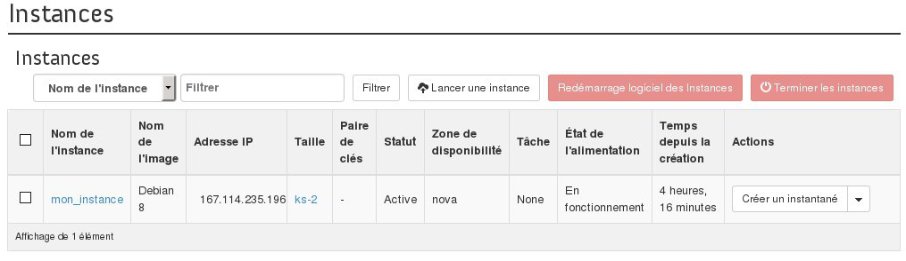
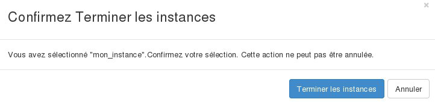

## Preambule
Si vous n'avez plus besoin de l'une de vos instances, vous pouvez à tout moment supprimer celle ci.

Ce tutoriel indique comment terminer une instance dans Horizon.

> [!alert]
>
> Les données présentes sur l' instance seront supprimées.
> Vous pouvez toujours créer une sauvegarde de cette instance si vous souhaitez conserver les données et relancer une instance identique ultérieurement.
> 

### Prérequis
- [Créer un accès à Horizon]({legacy}1773){.ref}
- Une instance

## Acceder a la console d'une instance
Pour terminer une instance, il faut :

- Se connecter à Horizon
- Cliquer sur Instances dans le menu à gauche.

{.thumbnail}

- Sélectionner l'instance.
- Cliquer sur le bouton Terminer les instances

{.thumbnail}

- Cliquer sur Terminer les instances pour confirmer la suppression.

> [!success]
>
> Une fois supprimée, votre instance ne vous sera plus facturée, et vous ne
> serez plus en mesure de la récupérer.
> 