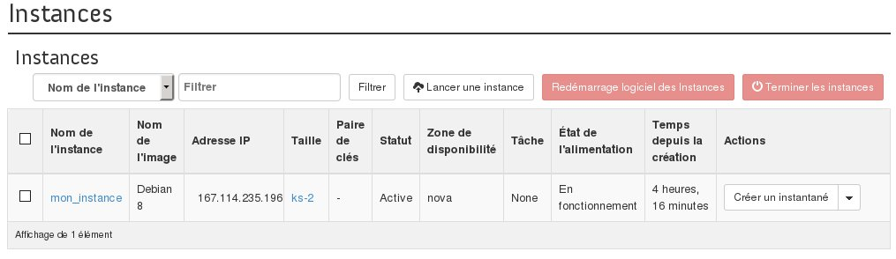

## 
Se já não necessita de uma das suas instâncias, pode eliminá-la a qualquer momento.

Este tutorial indica como suprimir uma instância a partir da interface Horizon.

## Atenção
Os dados presentes na sua instância serão eliminados.
Se desejar conservar os dados deverá criar um snapshot da mesma de forma a que mais tarde possa relançar uma instância idêntica.

## Pré-requisitos

- [Criar um acesso ao Horizon]({legacy}1773)
- Uma instância

## 
Para eliminar uma instância é necessário:

- Ligar-se à interface Horizon;
- Clicar em ElInstâncias no menu à esquerda.

{.thumbnail}

- Selecionar a instância.
- Clicar no botão Terminar as instâncias

{.thumbnail}

- Clicar em Eliminar as instâncias para confirmar a supressão.

## Informação
Após a eliminação da instância a mesma deixará de ser faturada, e não será possível recuperá-la.

## 
[Voltar ao índice dos guias Cloud]({legacy}1785)

