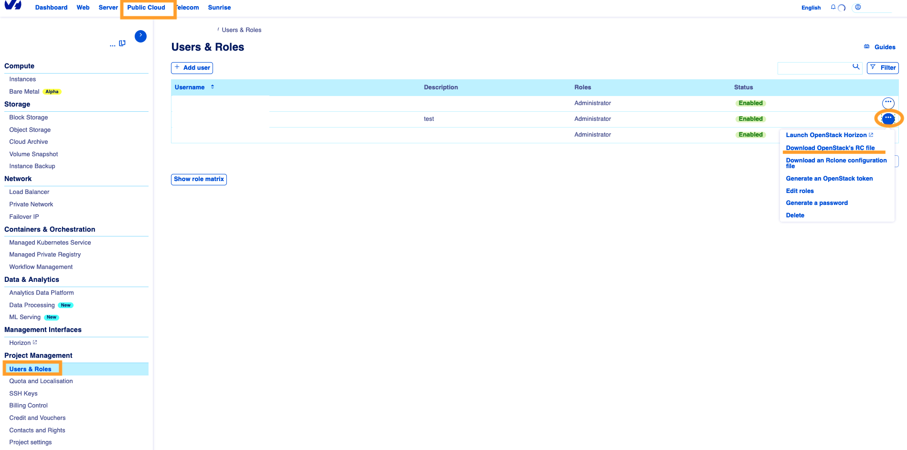
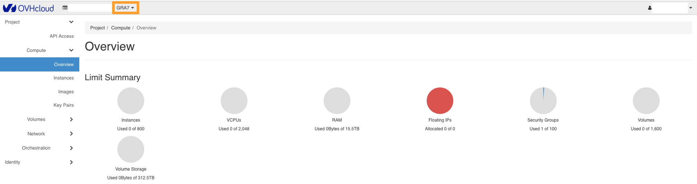

**Dernière mise à jour le 26/10/2020**

## Objectif

OVHcloud offre aux clients Public Cloud des images prêtes à l'emploi, mais également la possibilité d'utiliser leurs propres images.

**Découvrez comment importer vos propres images dans votre projet Public Cloud.**

## Prérequis

- une [instance Public Cloud](../create_an_instance_in_your_ovh_customer_account/) sur votre espace client OVHcloud
- votre propre image RAW/QCOW2 (formats recommandés) 
- un utilisateur [OpenStack](../creation-et-suppression-dun-utilisateur-openstack/) 
- un environnement [compatible avec la CLI OpenStack](../prepare_the_environment_for_using_the_openstack_api/) (si vous utilisez CLI)

## En pratique

### Avant de commencer

Il est conseillé d'utiliser des images compatibles cloud fournies par le distributeur ou de créer votre propre image en utilisant des solutions telles que [Packer OpenStack builder](../packer-openstack-builder/).

Les images compatibles cloud sont disponibles ici :

- <https://cloud.centos.org/centos/>{.external}
- <https://cloud.debian.org/images/cloud/>{.external}
- <https://cloud-images.ubuntu.com/releases/>{.external}
- <https://alt.fedoraproject.org/cloud/>{.external}

D'autres systèmes d'exploitation proposent aussi des images ISO qui sont également applicables lors de la [création d'images avec Packer](https://www.packer.io/docs/builders) tels que QEMU et VirtualBox.

Assurez-vous que les éléments suivants sont installés sur vos images pour qu'elles soient intégrables à l’environnement cloud :

- *QEMU Guest Agent*: cette opération permet de bénéficier d'une meilleure expérience de sauvegarde, car elle permet à l'hôte de communiquer avec l'instance pour les sauvegardes en direct. Tous les systèmes d'exploitation ne sont pas compatibles avec ce package.
- *cloud-init* : cela vous permettra de démarrer votre instance au premier démarrage, avec l'ajout de clés SSH et la configuration du réseau. La plupart des systèmes d'exploitation sont compatibles avec cette fonctionnalité.

Nous recommandons d'utiliser des images au format RAW ou QCOW2. Optimisez la taille de l'image pour qu'elle soit la plus petite possible afin de minimiser le coût de facturation mensuel et réduire le délai de génération de vos instances.

### Importer votre image

Avec OpenStack il y a deux méthodes pour importer votre propre image. Vous pouvez le faire via l'interface en ligne de commande OpenStack, ou avec [l'interface Horizon](https://horizon.cloud.ovh.net/auth/login/).

#### En ligne de commande OpenStack

Une fois que votre image est prête, suivez les étapes ci-dessous pour lancer l'importation à l'aide de la CLI OpenStack ::

1\. Téléchargez votre fichier openrc.sh pour votre utilisateur OpenStack à partir de votre espace client OVHcloud (sélectionnez la région vers laquelle vous souhaitez effectuer le téléchargement).

{.thumbnail}

2\. Chargez le fichier openrc :

```sh
source openrc.sh
```

3\. Une fois le fichier chargé, vous serez invité à entrer le mot de passe de l'utilisateur OpenStack.

4\. Vous pouvez à présent importer votre image. L'exemple de commande ci-dessous effectue les opérations suivantes :

- Le format de disque est « RAW »
- Télécharge une image à partir du chemin actuel appelé « debian9.raw »
- Appelle l'image « Debian 9 - Mon image »
- Définit l'image à l'état privé
- Définit les propriétés recommandées. Une configuration optimale permet l'utilisation de fonctionnalités telles que *live-snapshot* et *cloud-init* (nécessite l'utilisation du nom d'utilisateur)

```sh
openstack image create --disk-format raw --container-format bare --file debian9.raw "Debian 9 - Mon image" --private --property distribution=debian --property hw_disk_bus=scsi --property hw_scsi_model=virtio-scsi --property hw_qemu_guest_agent=yes --property image_original_user=debian
```

#### Depuis l'interface Horizon

Une fois que votre image est prête à être importée, suivez les étapes ci-dessous pour l'importer depuis l'interface Web OpenStack Horizon :

1\. Connectez-vous à [l'interface Horizon](https://horizon.cloud.ovh.net/auth/login/).

2\. Sélectionnez en haut à gauche la région vers laquelle vous souhaitez télécharger votre image.

{.thumbnail}

3\. Dirigez-vous vers la section `Images` puis cliquez sur `Create Image`{.action}.

{.thumbnail}

4\. Entrez les détails de votre image et sélectionnez le fichier depuis votre ordinateur.

{.thumbnail}

5\. Entrez les métadonnées de l'instance (vous pouvez aussi entrer les métadonnées personnalisées de votre choix), puis cliquez sur `Create Image`{.action}.

{.thumbnail}

## Aller plus loin

Échangez avec notre communauté d'utilisateurs sur <https://community.ovh.com>.
