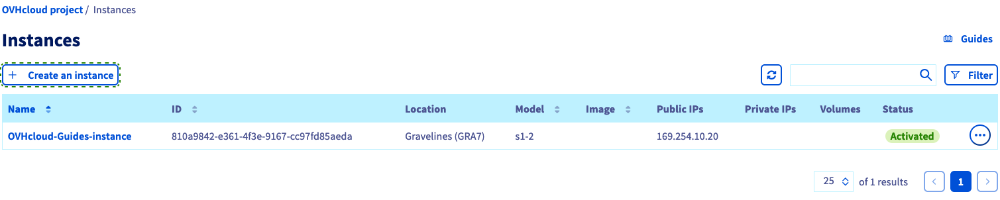
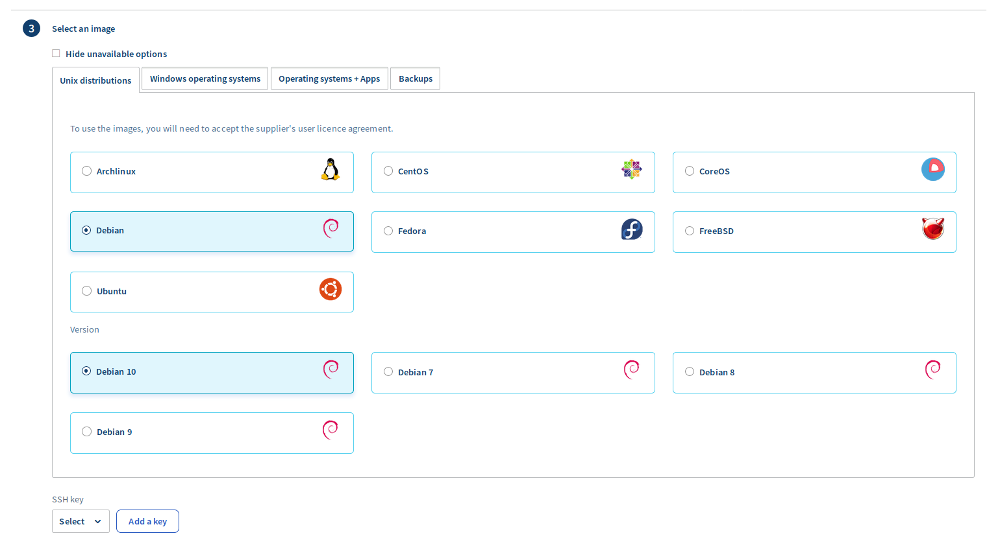
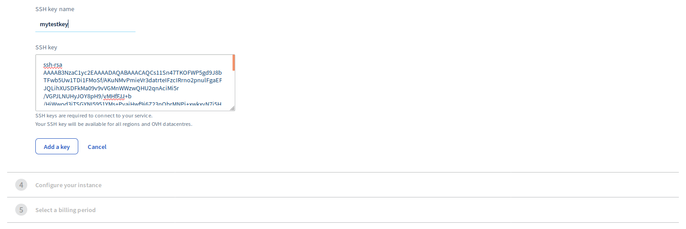
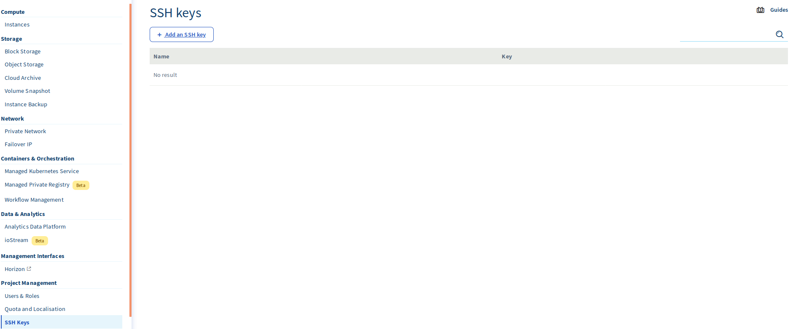
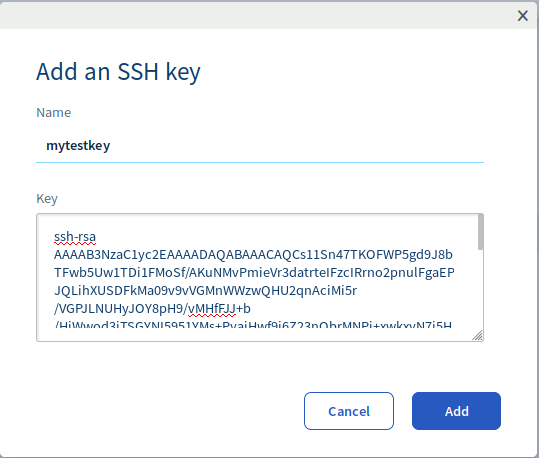

**Last updated 4th December 2019**

## Objective

SSH is a protocol making it possible to access and communicate with a server in an authenticated and encrypted manner.

**Find out how to use SSH keys with the OVHcloud Control Panel.**

## Requirements

- a [Public Cloud project]({ovh_www}/public-cloud/) in your OVHcloud account
- access to the [OVHcloud Control Panel](https://ca.ovh.com/auth/?action=gotomanager)
- an [SSH key](../create-ssh-keys/)

## Instructions

> [!primary]
>
If you would like to store an SSH key in the OVHcloud Control Panel, we recommend to use RSA or ECDSA encryption. ED25519 is currently not supported.
>

There are two ways to add an SSH key from the Public Cloud interface:

- The first and more direct method is done at the time of the creation of an instance.
- The second method is to add a key from the SSH key manager.

### Creation of an instance
From the Public Cloud client interface, to create a cloud instance, click on `Create an instance`{.action} in the Instances menu under the `Compute`{.action} section on the left-hand menu.

{.thumbnail}

Then, during the creation of the instance, and on step 3, you will be asked for your SSH key.

{.thumbnail}

If you already have keys, simply select the key of your choice.

If you want to add a key, click on `Add a key`{.action}. Create a name for your key in the "SSH Key name" box and paste the key into the box labeled "SSH key". Click `Add a key`{.action} to finish.

{.thumbnail}

### From the key management tool

Once the "SSH keys" has been selected from the left menu of your project, the "SSH keys" tab will be available.

{.thumbnail}

Click on `Add a key`{.action} then click on `Add this key`{.action} after you have named the key and pasted the key in the box.

{.thumbnail}

This key will be available to use at the next [creation of a Public Cloud instance](../get-started-with-a-public-cloud-instance/){.ref}.

## Go further

Join our community of users on <https://community.ovh.com/en/>.
