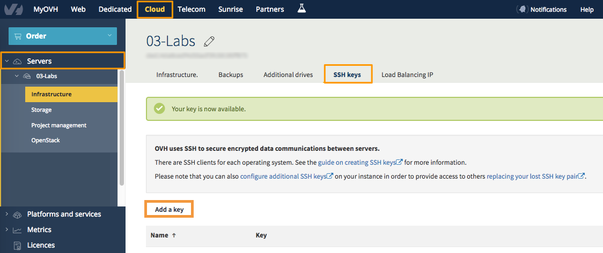
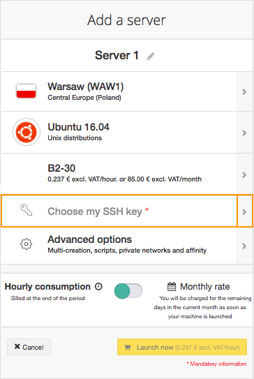
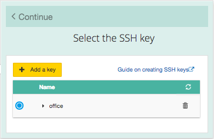
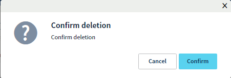

**Ostatnia aktualizacja dnia 2018-02-14**

## Wprowadzenie

SSH to protokół umożliwiający dostęp do serwera i komunikację z nim w uwierzytelniony i zaszyfrowany sposób. 

**Zarządzanie zbiorem kluczy pozwala na uniknięcie konieczności zapamiętywania wielu haseł. Pozwala również na uproszczenie logowania: korzystając z jednego klucza można połączyć się z kilkoma serwerami.** 

Podczas tworzenia instancji Public Cloud w OVH z systemem Linux/Unix, należy wprowadzić swój klucz SSH w Panelu klienta - wszystkie dystrybucje Linux/Unix pozwalają na dostęp z linii poleceń. 

Serwery Windows posiadają dostęp do zdalnego pulpitu zapewniony poprzez KVM z poziomu Panelu klienta. Klucz SSH nie jest więc wymagany.

## Wymagania początkowe

- Dostęp do [Panelu Klienta](https://www.ovh.com/auth/){.external}
- Utworzony i skonfigurowany klucz SSH

## W praktyce

W sekcji `Cloud`{.action}, w lewym menu wybierz `Projekt`{.action}, do którego chcesz dodać klucz SSH, następnie przejdź do zakładki `Klucz SSH`{.action}.
Każdy utworzony projekt ma własną strefę zarządzania kluczami SSH.
Dodanie lub usunięcie klucza nie powoduje zmian w systemie już uruchomionej instancji.

### Dodawanie klucza SSH

Istnieją dwa sposoby dodania klucza SSH z interfejsu chmury publicznej:
dodanie klucza SSH do projektu przed uruchomieniem instancji,
w momencie tworzenia instancji.

{.thumbnail}

Aby dodać nowy klucz, kliknij na przycisk `+ Dodaj klucz`{.action}. Zostanie wyświetlone okno edycyjne.
Nadaj kluczowi nazwę. Odpowiednia nazwa klucza ułatwi jego identyfikację. W polu `Klucz` należy umieścić klucz publiczny i zatwierdzić operację.

{.thumbnail}

Dodany raz klucz może być wykorzystywany wielokrotnie przy tworzeniu jednej lub wielu instancji jednocześnie, wystarczy wskazać ten klucz na liście podczas uruchamiania instancji:
 
{.thumbnail}

Zostanie wyświetlone poniższe okno:

{.thumbnail}

Szczegółowe informacje odnośnie uruchamiania instancji, znajdziesz w przewodniku: Tworzenie i usuwanie instancji Public Cloud w Panelu Klienta.

Jeśli klucz nie został wcześniej dodany lub chcesz dodać kolejny dla nowej instancji, skorzystaj z opcji `+ Dodaj klucz`{.action} w oknie wyboru klucza.
Nadaj kluczowi nazwę i wprowadź klucz publiczny, następnie zatwierdź operację.

{.thumbnail}

Instancja zostanie uruchomiona a klucz zostanie dodany w systemie instancji jako domyślny.
Jeśli potrzebujesz dodać więcej kluczy dla jednej instancji, przeczytaj również ten przewodnik: [Konfiguracja dodatkowych kluczy SSH](https://docs.ovh.com/pl/public-cloud/konfiguracja_dodatkowych_kluczy_ssh/){.external}

### Usuwanie klucza SSH

W sekcji `Cloud`{.action}, w lewym menu wybierz `Projekt`{.action}, następnie przejdź do zakładki `Klucz SSH`{.action}.
W wierszu każdego dodanego klucza znajduje się ikona `Kosz`- kliknij na ikonę, aby rozpocząć usuwanie:

{.thumbnail}

> [!alert]
> 
> Potwierdź usuwanie klucza. Operacja jest nieodwracalna.
>

{.thumbnail}

Jeśli klucz był wykorzystywany do łączenia z którąś z instancji, nadal będzie obecny w jej systemie operacyjnym. Operacja usuwania dotyczy tylko Panelu klienta.

## Sprawdź również

Skontaktuj się ze społecznością naszych użytkowników na stronie <https://community.ovh.com/en/>.
