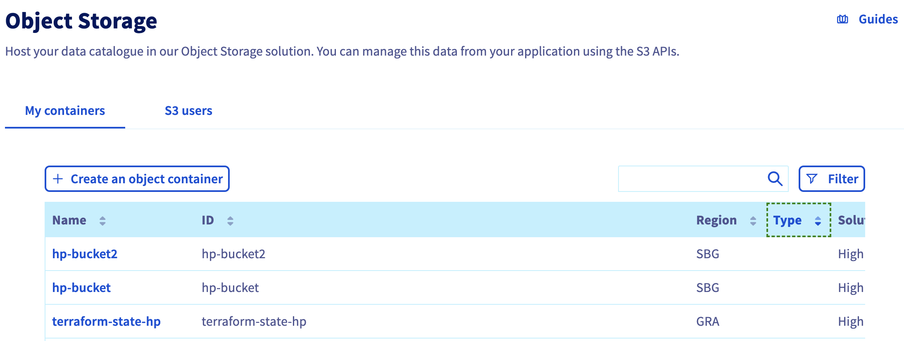

<style>
 pre {
     font-size: 14px;
 }
 pre.console {
   background-color: #300A24; 
   color: #ccc;
   font-family: monospace;
   padding: 5px;
   margin-bottom: 5px;
 }
 pre.console code {
   border: solid 0px transparent;
   font-family: monospace !important;
   font-size: 0.75em;
   color: #ccc;
 }
 .small {
     font-size: 0.75em;
 }
</style>

**Last updated 12th July 2022**

## Objective

It is possible to store Terraform state on a remote data store/backend like a AWS S3 bucket, a Google Cloud Storage (GCS)... but do you know that you can also store your Terraform states on an OVHcloud High Performance (S3) Object Storage container?

In this tutorial you will:

- create an High Performance (S3) Object Storage container
- create a Terraform remote backend
- initialize your Terraform backend

## Requirements

- Access to the [OVHcloud Control Panel](https://ca.ovh.com/auth/?action=gotomanager&from=https://www.ovh.com.au/&ovhSubsidiary=au)
- A [Public Cloud Instance](https://www.ovhcloud.com/en-au/public-cloud/) in your OVHcloud account
- Installing [Terraform CLI](https://www.terraform.io/downloads){.external}

## Before you begin

* You should have installed Terraform CLI, version 0.12.x minimum, on your machine. You can install it by following [detailed installation instructions](https://www.terraform.io/docs/cli/index.html){.external} or with the tool [tfenv](https://github.com/tfutils/tfenv){.external}.

## Terraform

[Terraform](https://www.terraform.io/) is an open-source infrastructure as code (IaC) tool created by [Hashicorp](https://www.hashicorp.com/) in 2014, written in Go. It aims to build, change and version control your infrastructure. You can define and provision your infrastructure by writing the definition of your resources in Hashicorp Configuration Language (HCL).

{.thumbnail}

This tool has a powerful and very intuitive command line interface (CLI).
If you are interested in leveraging your knowledge about Terraform CLI, a [Cheat Sheet](https://github.com/scraly/terraform-cheat-sheet/blob/master/terraform-cheat-sheet.pdf){.external} exists.

At OVHcloud we created a [Terraform provider](https://registry.terraform.io/providers/ovh/ovh/latest){.external} that you can use to interact with and manage OVHcloud resources.

### Terraform states and backend

Terraform has several concepts, one of them is the `state`.

A Terraform state is a snapshot of your infrastructure from when you last ran the `terraform apply` command.
By default, the state file is stored locally in a `terraform.tfstate` file.
But the common usage, in production environment, is to store it remotely.

{.thumbnail}

You can for example store your Terraform state on an OVHcloud High Performance (S3) Object Storage container.

In order to do that you need to configure a `backend` in your Terraform HCL configuration files.

> [!primary]
> 
> Terraform States are not encrypted at rest when stored inside an Object Storage container.

## Instructions

### Creating a High Performance Object Storage container/bucket

First, you need to have a High Performance Object Storage container. If you don't already had one, you can follow the [Creating a High Performance Object Storage container](../../storage/s3/getting-started-with-s3/) tutorial.

For this guide, our Object Storage container is named `terraform-state-hp`, its solution is `High Performance` and its region is `GRA`.

{.thumbnail}

In order to store your Terraform states on an Object Storage, and generally if you want to interact with the Object Storage, you need to have the rights to manage an Object Storage. So at this point of this tutorial you should have a High Performance Object Storage container, an user and you can interact with the `aws` CLI and list the OVHcloud High Performance Object Storage containers that the user is linked to:

```
$ aws s3 ls
2022-07-11 16:20:48 my-container
2022-07-11 16:55:20 terraform-state-hp
```

### Initializing Terraform configuration

Create a `backend.tf` file with the following content:

```yaml
terraform {
    backend "s3" {
      bucket = "terraform-state-hp"
      key    = "terraform.tfstate"
      region = "gra"
 #or sbg or any activated high performance storage region
      endpoint = "s3.gra.perf.cloud.ovh.net"
      skip_credentials_validation = true
      skip_region_validation = true
    }
}
```

In this file you define a [S3 Terraform backend](https://www.terraform.io/language/settings/backends/s3) in the `gra` region. Don't hesitate to change this parameter if you created an Object Storage container in another region.

### Terraform Init

Now you can initialize your Terraform configuration with the `terraform init` command.

The [terraform init](https://www.terraform.io/cli/commands/init) command is used to initialize a working directory containing Terraform configuration files. This is the first command that should be run after writing a new Terraform configuration or cloning an existing one from version control. It is safe to run this command multiple times.

This command initializes the backend (remote or local state).

After executing this command, you should obtain a result like this:

<pre class="console"><code>$ terraform init

Initializing the backend...

Successfully configured the backend "s3"! Terraform will automatically
use this backend unless the backend configuration changes.

Terraform has been successfully initialized!

You may now begin working with Terraform. Try running "terraform plan" to see
any changes that are required for your infrastructure. All Terraform commands
should now work.

If you ever set or change modules or backend configuration for Terraform,
rerun this command to reinitialize your working directory. If you forget, other
commands will detect it and remind you to do so if necessary.
</code></pre>

Now you can define your Terraform configuration files and providers and after running the `terraform apply` command, your Terraform state file will be stored in an OVHcloud Object Storage container.

## Go further

Join our community of users on <https://community.ovh.com/en/>.