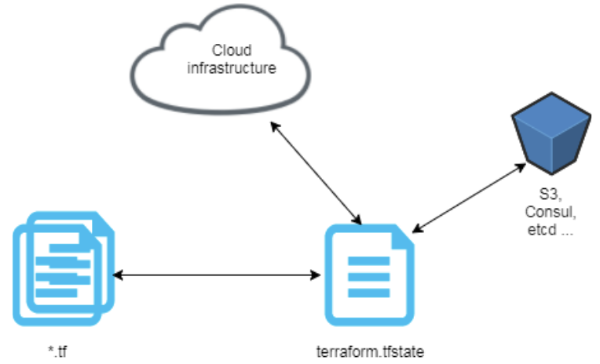
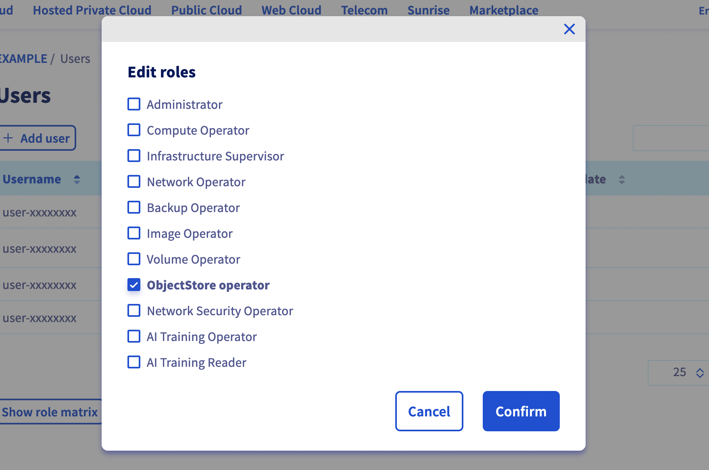

<style>
 pre {
     font-size: 14px;
 }
 pre.console {
   background-color: #300A24; 
   color: #ccc;
   font-family: monospace;
   padding: 5px;
   margin-bottom: 5px;
 }
 pre.console code {
   border: solid 0px transparent;
   font-family: monospace !important;
   font-size: 0.75em;
   color: #ccc;
 }
 .small {
     font-size: 0.75em;
 }
</style>

**Last updated 11th July 2022**

## Objective

It is possible to store Terraform state on a remote data store/backend like a AWS S3 bucket, a Google Cloud Storage (GCS)... but do you know that you can also store your Terraform states on an OVHcloud Standard (Swift) Object Storage container?

In this tutorial you will:

- create an Standard (Swift) Object Storage container
- create a Terraform remote backend
- create an OpenStack user with Object Storage rights and retrieve OpenStack credentials
- initialize your Terraform backend

## Requirements

- Access to the [OVHcloud Control Panel](https://ca.ovh.com/auth/?action=gotomanager&from=https://www.ovh.com/sg/&ovhSubsidiary=sg)
- A [Public Cloud Instance](https://www.ovhcloud.com/en-sg/public-cloud/) in your OVHcloud account
- Installing [Terraform CLI](https://www.terraform.io/downloads){.external}

## Before you begin

* You should have installed Terraform CLI, version 0.12.x minimum, on your machine. You can install it by following [detailed installation instructions](https://www.terraform.io/docs/cli/index.html){.external} or with the tool [tfenv](https://github.com/tfutils/tfenv){.external}.

## Terraform

[Terraform](https://www.terraform.io/) is an open-source infrastructure as code (IaC) tool created by [Hashicorp](https://www.hashicorp.com/) in 2014, written in Go. It aims to build, change and version control your infrastructure. You can define and provision your infrastructure by writing the definition of your resources in Hashicorp Configuration Language (HCL).

{.thumbnail}

This tool has a powerful and very intuitive command line interface (CLI).
If you are interested in leveraging your knowledge about Terraform CLI, a [Cheat Sheet](https://github.com/scraly/terraform-cheat-sheet/blob/master/terraform-cheat-sheet.pdf){.external} exists.

At OVHcloud we created a [Terraform provider](https://registry.terraform.io/providers/ovh/ovh/latest){.external} that you can use to interact with and manage OVHcloud resources.

### Terraform states and backend

Terraform has several concepts, one of them is the `state`.

A Terraform state is a snapshot of your infrastructure from when you last ran the `terraform apply` command.
By default, the state file is stored locally in a `terraform.tfstate` file.
But the common usage, in production environment, is to store it remotely.

{.thumbnail}

You can for example store your Terraform state on an OVHcloud Standard (Swift) Object Storage container.

In order to do that you need to configure a `backend` in your Terraform HCL configuration files.

> [!primary]
> 
> Terraform States are not encrypted at rest when stored inside an Object Storage container.

## Instructions

### Creating a Standard Object Storage container/bucket

First, you need to have a Standard Object Storage container. If you don't already had one, you can follow the [Creating an Object Storage container](../../storage/pcs/create-container/) tutorial.

For this guide, our Object Storage container is named `terraform-state`, its solution is `Standard (Swift)` and its region is `GRA`.

{.thumbnail}

### Initializing Terraform configuration

Create a `backend.tf` file with the following content:

```yaml
terraform {
    backend "swift" {
        container = "terraform-state"
        region_name = "GRA"
        cloud = "tfstate"
        archive_container = "terraform-state-archive"
    }
}
```

In this file you define a [Swift Terraform backend](https://www.terraform.io/language/settings/backends/swift) in the `GRA` region. Don't hesitate to change this parameter if you created an Object Storage container in another region.

> [!primary]
> 
> [`Swift` Terraform remote state backend is deprecated since Terraform version 1.2.3 (June 15, 2022)](https://github.com/hashicorp/terraform/releases/tag/v1.2.3).
> Please think about creating an OVHcloud High Performance Object Storage and use S3 remote state backend instead.

We also use an OpenStack `clouds.yaml` file.

> [!primary]
>
> Don't forget to define an `archive_container` to activate the object versioning in Swift.

### Creating an OpenStack user with Object Storage rights

In order to store your Terraform states on an Object Storage, and generally if you want to interact with the Object Storage, you need to have the rights to manage an Object Storage.

In order to do that you will create an OpenStack user.

Log in to the [OVHcloud Control Panel](https://ca.ovh.com/auth/?action=gotomanager&from=https://www.ovh.com/sg/&ovhSubsidiary=sg), go to the Public Cloud section and select the Public Cloud project concerned.

Access the administration UI for your OVHcloud Managed Kubernetes clusters by clicking on `Users & Roles`{.action} in the left-hand menu and click on `+ Add user`{.action}.

{.thumbnail}

Enter a description for the user you want to create, for example `Terraform` and click on `Next`{.action}.

{.thumbnail}

Check the `ObjectStore operator` role and click on `Confirm`{.action}.

{.thumbnail}

Your user is being created.
Username and password will be automatically generated and displayed in your Control Panel.

{.thumbnail}

Be sure to save the password shown in the green message box to a password manager at this time. The password cannot be recovered afterwards. However, you can always create a new password by clicking on `...`{.action} and selecting `Generate a password`{.action}.

{.thumbnail}

### Retrieve OpenStack credentials 

Now click on `...`{.action} and select `Launch OpenStack Horizon`.

Enter the user and password information you saved before then click on `Connect`{.action}.

{.thumbnail}

In the side bar, click on `API Access`{.action}.

{.thumbnail}

Click on `Download OpenStack RC File`{.action} button and then on `OpenStack clouds.yaml File`{.action}.

{.thumbnail}

Save the `clouds.yaml` file in your local machine.

You need to edit the generated `clouds.yaml` file in order to provide all details needed by Terraform.

Edit this `clouds.yaml` file like below:

```yaml
clouds:
  tfstate:
    auth:
      auth_url: https://auth.cloud.ovh.net/v3/
      domain_name: default
      username: "user-xxxxxx"
      password: xxxxx
      project_domain_name: default
      project_name: "xxxxx"
      user_domain_name: default
    region_name: GRA
```

> [!primary]
>
> If the `password` line is missing in your `clouds.yaml` file, please add it with the password you copied/pasted earlier.

Terraform needs to know where your OpenStack credentials are located (`clouds.yaml` file) so you have several possibilities:

- place the `clouds.yaml` into the current working directory of your Terraform files
- place it in `~/.config/openstack`
- or place it on `/etc/openstack`

Whatever the solution you choose, Terraform will automatically find the `clouds.yaml` file.

In this guide we choose to save it next to the `backend.tf` file:

```bash
.
├── backend.tf
└── clouds.yaml
```

### Terraform Init

Now you can initialize your Terraform configuration with the `terraform init` command.

The [terraform init](https://www.terraform.io/cli/commands/init) command is used to initialize a working directory containing Terraform configuration files. This is the first command that should be run after writing a new Terraform configuration or cloning an existing one from version control. It is safe to run this command multiple times.

This command initializes the backend (remote or local state).

After executing this command, you should obtain a result like this:

<pre class="console"><code>$ terraform init

Initializing the backend...

Successfully configured the backend "swift"! Terraform will automatically
use this backend unless the backend configuration changes.

Terraform has been successfully initialized!

You may now begin working with Terraform. Try running "terraform plan" to see
any changes that are required for your infrastructure. All Terraform commands
should now work.

If you ever set or change modules or backend configuration for Terraform,
rerun this command to reinitialize your working directory. If you forget, other
commands will detect it and remind you to do so if necessary.
</code></pre>

Now you can define your Terraform configuration files and providers and after running the `terraform apply` command, your Terraform state file will be stored in an OVHcloud Object Storage container.

## Go further

Join our community of users on <https://community.ovh.com/en/>.