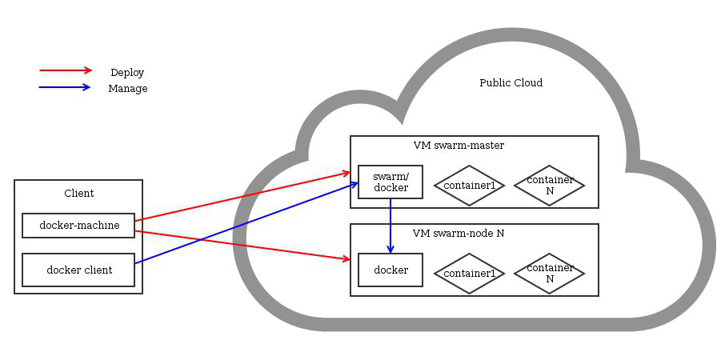

**Last updated 22th June 2020**

## Objective
Docker-machine us a tool for deploying docker ndoes. It allows them to be managed independently as specific environments or to use them in a cluster. By combining this tool with the Public Cloud, a new Docker node can be deployed with single command and few seconds.

## Requirements

* [Setting OpenStack environment variables](../loading_openstack_environment_variable)

## Instructions

### Installing docker-machine

Docker-machine can be deployed on different systems, this example will use a Debian 8 environment.

The docker package will be installed on for using the client, the server will be disabled.

```sh
# sudo apt-get update
# sudo apt-get install unzip curl docker.io
# sudo service docker stop
# sudo echo manual | sudo tee /etc/init/docker.override
# sudo curl -L https://github.com/docker/machine/releases/download/v0.5.0/docker-machine_linux-amd64.zip > machine.zip
# sudo unzip machine.zip
# sudo rm machine.zip
# sudo mv docker-machine* /usr/local/bin
```
	
### Deploying a docker node
Now that we have the tool, it is now possible to deploy a node with a simple command.

```sh
$ docker-machine create -d openstack
--openstack-flavor-name="vps-ssd-1"
--openstack-image-name="Ubuntu 20.04"
--openstack-net-name="Ext-Net"
--openstack-ssh-user-"admin"
docker-machine-server01
```
It is possible to deploy as many nodes as needed. The "docket-machine ls" command allows you to list the avaialble nodes.


### Using nodes
We will now load an environment to deploy containers on this node.

```sh
$ docker-machine env docker-machine-server01
$ eval "$(docker-machine env docket-machine-server01"
```

We are now ready to use docker on a remote node and deploy containers. For example:

```sh
$ docker pull ubuntu
$ docker run -i -t ubuntu /bin/bash
```

## Using a Docker node cluster
With docker-machine, it is possible to deploy multiple docker nodes and manage them by a single entry point thanks to Swarm.

Swarm is a multi-node docker orchestrator

{.thumbnail}

### Installation of docker-machine
[See previous chapter][./#Installing docker-machine]

## Retrieving a swarm token
It wil be required to use token. We will create an instance to generate this token and then delete it.

```sh
$ docker-machine create -d openstack \
--openstack-flavor-name="vps-ssd-1" \
--openstack-image-name="Ubuntu 14.04" \
--openstack-net-name="Ext-Net" \
--openstack-ssh-user="admin" \
swarm-token-generator
$ eval "$(docker-machine env swarm-token-generator)"
$ docker run swarm create
8957e0f0bbb49dbdcd04b4c9beb2dab3
$ docker-machine rm --force swarm-token-generator
```

### Deploying swam master
The master docker node will server as the entry point and will control the other nodes.

```sh
$ docker-machine create -d openstack \
--openstack-flavor-name="vps-ssd-1" \
--openstack-image-name="Ubuntu 14.04" \
--openstack-net-name="Ext-Net" \
--openstack-ssh-user="admin" \
--swarm --swarm-master --swarm-discovery \
token://YOUR_TOKEN docker-machine-swarm-master
```

### Deploying swarm Docker nodes
The goal is to add several nodes to the cluster so that you have enough resources to accomodate all the containers.

```sh
$ docker-machine create -d openstack \
--openstack-flavor-name="vps-ssd-1" \
--openstack-image-name="Ubuntu 14.04" \
--openstack-net-name="Ext-Net" \
--openstack-ssh-user="admin" \
--swarm --swarm-discovery \
token://YOUR_TOKEN docker-machine-swarm-node01
```

### Using the cluster

```sh
$ eval "$(docker-machine env --swarm docker-machine-swarm-master)"
$ docker pull ubuntu
docker-machine-swarm-node02: Pulling ubuntu:latest... : downloaded
docker-machine-swarm-master: Pulling ubuntu:latest... : downloaded
docker-machine-swarm-node01: Pulling ubuntu:latest... : downloaded
```

To see the status of the cluster:

```sh
$ docker info
Containers: 4
Images: 6
Storage Driver:
  Role: primary
  Strategy: spread
  Filters: health, port, dependency, affinity, constraint
  Nodes: 3
 docker-machine-swarm-master: 158.69.94.60:2376
  └ Containers: 2
  └ Reserved CPUs: 0 / 1
  └ Reserved Memory: 0 B / 2.004 GiB
  └ Labels: executiondriver=native-0.2, kernelversion=3.13.0-44-generic, operatingsystem=Ubuntu 14.04.1 LTS, provider=openstack, storagedriver=aufs
 docker-machine-swarm-node01: 158.69.94.66:2376
  └ Containers: 1
  └ Reserved CPUs: 0 / 1
  └ Reserved Memory: 0 B / 2.004 GiB
  └ Labels: executiondriver=native-0.2, kernelversion=3.13.0-44-generic, operatingsystem=Ubuntu 14.04.1 LTS, provider=openstack, storagedriver=aufs
 docker-machine-swarm-node02: 158.69.94.68:2376
  └ Containers: 1
  └ Reserved CPUs: 0 / 1
  └ Reserved Memory: 0 B / 2.004 GiB
  └ Labels: executiondriver=native-0.2, kernelversion=3.13.0-44-generic, operatingsystem=Ubuntu 14.04.1 LTS, provider=openstack, storagedriver=aufs
Execution Driver:
Kernel Version:
Operating System:
CPUs: 3
Total Memory: 6.011 GiB
Name: 94d31dd697b1
ID:
Http Proxy:
Https Proxy:
No Proxy:
```

Now that everything is ready, all that remains is to use docker as usual, swarm will take care of placing the containers on the different nodes.

## Go further

Join our community of users on https://community.ovh.com/en/

Join our community of users on <https://community.ovh.com/en/>.
