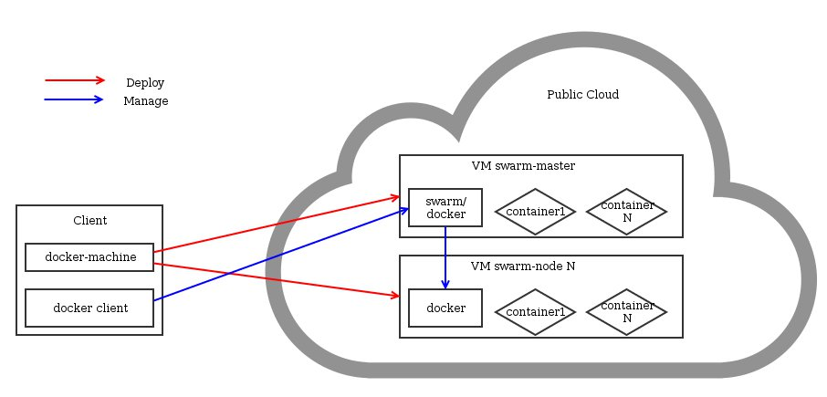

## 
Docker-machine to narzędzie pozwalające na wdrażanie węzłów docker. Narzędzie to pozwala na niezależne zarządzanie nimi jako specyficznymi środowiskami i na łączenie ich w klastry. Dzięki połączeniu tego narzędzia z instancjami Publi Cloud, wdrożenie nowego węzła docker polega na wpisaniu polecenia z linii poleceń i odczekaniu kilku sekund.


## Wymagania

- [Pobranie zmiennych środowiskowych OpenStack]({legacy}1852)


## Instalacja docker-machine
Docker-machine może być wdrożona na różnych systemach. Rozpoczniemy od systemu Debian 8.

Pakiet docker zostanie zainstalowany tylko do zastosowań klienckich. Wyłączymy część serwerową. 


```
# apt-get update
# apt-get install unzip curl docker.io
# service docker stop
# echo manual | sudo tee /etc/init/docker.override
# curl -L https://github.com/docker/machine/releases/download/v0.5.0/docker-machine_linux-amd64.zip >machine.zip
# unzip machine.zip
# rm machine.zip
# mv docker-machine* /usr/local/bin
```


## Wdrożenie węzła docker
Po zainstalowaniu narzędzia można wdrożyć węzeł docker za pomocą prostego polecenia. 


```
$ docker-machine create -d openstack \
--openstack-flavor-name="vps-ssd-1" \
--openstack-image-name="Ubuntu 14.04" \
--openstack-net-name="Ext-Net" \
--openstack-ssh-user="admin" \
docker-machine-server01
```


Można wdrożyć wybraną liczbę węzłów. Polecenie "docker-machine ls" pozwala na pobranie listy dostępnych węzłów.


## Korzystanie z węzłów
Pobierzemy teraz środowisko pozwalające na wdrożenie kontenerów na pierwszym węźle. 


```
$ docker-machine env docker-machine-server01
$ eval "$(docker-machine env docker-machine-server01)"
```


Jesteśmy gotowi do korzystania z usługi docker na zdalnym węźle i do wdrażania kontenerów. Na przykład:


```
$ docker pull ubuntu
$ docker run -i -t ubuntu /bin/bash
```


## 
Dzięki narzędziu docker-machine można wdrożyć kilka węzłów docker i zarządzać nimi z poziomu jednego punktu wejściowego. Odpowiada za to Swarm.

Swarm to oprogramowanie do zarządzania systemem wielu węzłów docker.

{.thumbnail}


## Instalacja docker-machine
Sprawdź poprzedni rozdział


## Pobieranie tokena swarm
Teraz trzeba będzie użyć tokena. Utworzymy instancję, aby wygenerować token. Następnie ją usuniemy.


```
$ docker-machine create -d openstack \
--openstack-flavor-name="vps-ssd-1" \
--openstack-image-name="Ubuntu 14.04" \
--openstack-net-name="Ext-Net" \
--openstack-ssh-user="admin" \
swarm-token-generator
$ eval "$(docker-machine env swarm-token-generator)"
$ docker run swarm create
8957e0f0bbb49dbdcd04b4c9beb2dab3
$ docker-machine rm --force swarm-token-generator
```


## Wdrażanie węzła swarm master
Węzeł docker master będzie punktem wejściowym i będzie administrował pozostałymi węzłami. 


```
$ docker-machine create -d openstack \
--openstack-flavor-name="vps-ssd-1" \
--openstack-image-name="Ubuntu 14.04" \
--openstack-net-name="Ext-Net" \
--openstack-ssh-user="admin" \
--swarm --swarm-master --swarm-discovery \
token://YOUR_TOKEN docker-machine-swarm-master
```


## Wdrażanie węzłów docker swarm
Można dodać kilka węzłów do klastra, aby utworzyć park maszyn wystarczająco duży, żeby obsłużyć wszystkie kontenery. 


```
$ docker-machine create -d openstack \
--openstack-flavor-name="vps-ssd-1" \
--openstack-image-name="Ubuntu 14.04" \
--openstack-net-name="Ext-Net" \
--openstack-ssh-user="admin" \
--swarm --swarm-discovery \
token://YOUR_TOKEN docker-machine-swarm-node01
```


## Korzystanie z klastra

```
$ eval "$(docker-machine env --swarm docker-machine-swarm-master)"
$ docker pull ubuntu
docker-machine-swarm-node02: Pulling ubuntu:latest... : downloaded
docker-machine-swarm-master: Pulling ubuntu:latest... : downloaded
docker-machine-swarm-node01: Pulling ubuntu:latest... : downloaded
```


Aby sprawdzić prawidłowe uruchamianie klastra:


```
$ docker info
Containers: 4
Images: 6
Storage Driver:
Role: primary
Strategy: spread
Filters: health, port, dependency, affinity, constraint
Nodes: 3
docker-machine-swarm-master: 158.69.94.60:2376
└ Containers: 2
└ Reserved CPUs: 0 / 1
└ Reserved Memory: 0 B / 2.004 GiB
└ Labels: executiondriver=native-0.2, kernelversion=3.13.0-44-generic, operatingsystem=Ubuntu 14.04.1 LTS, provider=openstack, storagedriver=aufs
docker-machine-swarm-node01: 158.69.94.66:2376
└ Containers: 1
└ Reserved CPUs: 0 / 1
└ Reserved Memory: 0 B / 2.004 GiB
└ Labels: executiondriver=native-0.2, kernelversion=3.13.0-44-generic, operatingsystem=Ubuntu 14.04.1 LTS, provider=openstack, storagedriver=aufs
docker-machine-swarm-node02: 158.69.94.68:2376
└ Containers: 1
└ Reserved CPUs: 0 / 1
└ Reserved Memory: 0 B / 2.004 GiB
└ Labels: executiondriver=native-0.2, kernelversion=3.13.0-44-generic, operatingsystem=Ubuntu 14.04.1 LTS, provider=openstack, storagedriver=aufs
Execution Driver:
Kernel Version:
Operating System:
CPUs: 3
Total Memory: 6.011 GiB
Name: 94d31dd697b1
ID:
Http Proxy:
Https Proxy:
No Proxy:
```


Teraz wystarczy korzystać z usługi docker tak jak zwykle. Swarm zajmie się umieszczeniem kontenerów na poszczególnych węzłach.


## 
[Przewodniki Cloud]({legacy}1785)

