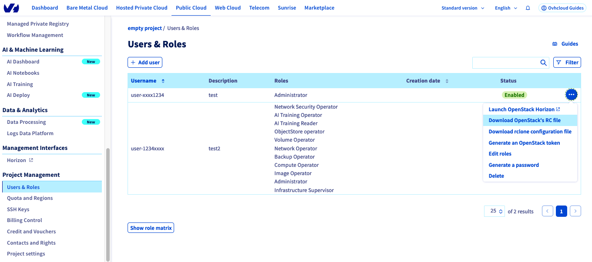

## Objective

**This guide provides best practices for performing a large number of OpenStack actions in a short time.**

> [!primary]
>
> The steps in this guide are based on the Keystone API version 3.0.
>

### Definitions

- **Endpoint**: HTTP address pointing directly to a service's API. For example [https://auth.cloud.ovh.net/v3/](https://auth.cloud.ovh.net/v3/) for the authentication endpoint or [https://image.compute.gra11.cloud.ovh.net/](https://image.compute.gra11.cloud.ovh.net/) for the GRA11 zone image management endpoint. 

- **Token**: A unique string of characters used to authenticate and access resources. The user requests it by entering their credentials (login details) to the authentication API. The token is generated and is valid for 24 hours.

- **OpenRC**: To improve the efficiency of interactions with the identity service through the OpenStack client, OpenStack supports simple client environment scripts also known as OpenRC files. This is a file containing common options for all clients, but which also supports unique options.

### Outline of a request

Most requests sent to the OpenStack API must follow an authorization procedure, which involves generating a token and validating it.

However, if you perform too many actions witin a short period of time, some OpenStack actions will fall in error due to too many API Calls. The current limit is 60 token creations per minutes and per OpenStack user. The authentication endpoint will return HTTP 429 errors beyond this limit. See our [Public Cloud API Rate Limits](/pages/platform/public-cloud/api_rate_limits) guide for more information.

For more information, see the [OpenStack API](http://developer.openstack.org/api-guide/quick-start/) documentation.

This guide will show you how to create an OpenStack token, use it for the actions you want to perform and how to revoke a token.

## Requirements 

- Access to the [OVHcloud Control Panel](https://www.ovh.com/auth/?action=gotomanager&from=https://www.ovh.co.uk/&ovhSubsidiary=GB){.external} 
- An [OpenStack CLI ready environment](/pages/platform/public-cloud/prepare_the_environment_for_using_the_openstack_api)

> [!primary]
>
> Find more information about this tool in the [OpenStack CLI documentation](https://docs.openstack.org/python-openstackclient/latest/).
>

You can install the client with the `apt` (for Debian-based distributions) or the `yum` (for RHEL/CentOS-based distributions) package manager.

```bash
# Debian-based distributions: 

sudo apt install python3-openstackclient

# CentOS-based distributions:

sudo yum install python3-openstackclient
```

Windows users can follow this guide to export environment variables: 

[Set OpenStack Environment Variables](/pages/platform/public-cloud/loading_openstack_environment_variables)

## Instructions

### Step 1: Download and source your OpenRC file

Log in to the [OVHcloud Control Panel](https://www.ovh.com/auth/?action=gotomanager&from=https://www.ovh.co.uk/&ovhSubsidiary=GB) and open your `Public Cloud`{.action} project. Click on `Users & Roles`{.action} in the `Project Management` section, then click on the `...`{.action} button to the right of your OpenStack user.<br>

Download this user's OpenRC file and specify the region where you want to perform actions.

{.thumbnail}

Once downloaded, edit your OpenRC file and add this line:

```bash
OS_PASSWORD=<your_password>
```

Make sure to adapt this line with your OpenStack user password that was given to you when the user was created.

Then source the file you previously downloaded:

```bash
source openrc.sh
```

### Step 2: Issuing an OpenStack token

> [!primary]
>
> An OpenStack token is valid for 24 hours after it is issued. For greater reliability, you can issue a token every 8 hours (as an example) to avoid actions with an expired token.
>
> If you are considering long-term actions such as snapshots, instance shelving, image creation, etc., prefer creating a new token rather than performing the desired action directly.
>

Once you have sourced your OpenRC file, run this command to issue a token:

```bash
openstack token issue
```

This command should produce an output similar to the following:

```bash
+------------+----------------------------------------------------------------+
| Field      | Value                                                          |
+------------+----------------------------------------------------------------+
| expires    | 2023-04-06T08:33:15+0000                                       |
| id         | gAAAAA[...]                                                    |
| project_id | 8a7[...]                                                       |
| user_id    | f99[...]                                                       |
+------------+----------------------------------------------------------------+
```

You can now export the ID of the previously issued token:

```bash
export OS_TOKEN = gAAAAA[...]
```

You can also export your token directly with this command: 

```bash
export OS_TOKEN=$(openstack token issue -f value -c id)
```

### Step 3: Remove useless variables

In order to use your token to perform actions with your user, you must remove the `OS_USER_DOMAIN_NAME' variable.

To do this, run the following command:

```bash
unset OS_USER_DOMAIN_NAME
```

### Step 4: Use the token to run commands

Now that you have your token, you can use classic OpenStack calls to manage your infrastructure.

```bash
openstack --os-auth-type token <command>
```

- Example : 

```bash
openstack --os-auth-type token image list
```

### Step 5: Revoke OpenStack token

Once you performed all the actions you wanted, you can revoke the used token to prevent it from being used for other actions.

To do this, use the following command:

```bash
openstack --os-auth-type token token revoke <token_id>

# or 

openstack --os-auth-type token token revoke $OS_TOKEN
```

## Go further

Join our community of users on <https://community.ovh.com/en/>.
