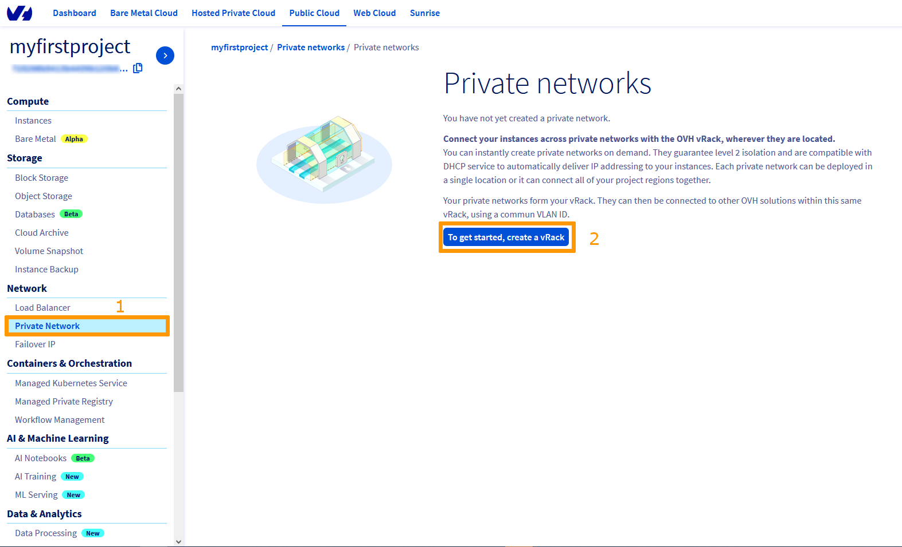
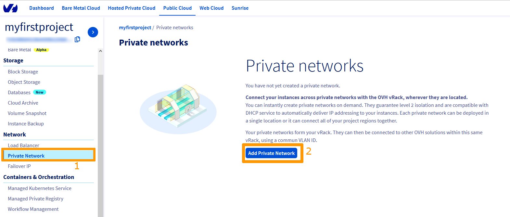
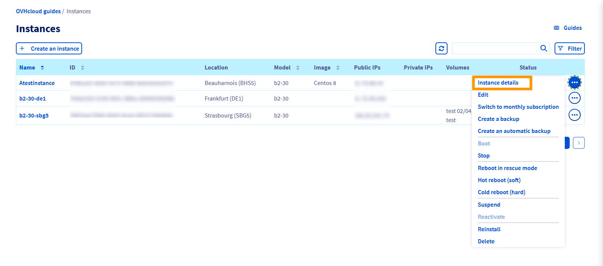

**Last updated 21st December 2021**

## Objective

The [vRack](https://www.ovh.com/ca/en/solutions/vrack/) is a private network that allows you to configure addressing between multiple compatible  OVHcloud services. It also allows you to add [Public Cloud instances](https://www.ovhcloud.com/en-ca/public-cloud/) to your private network to create an infrastructure of physical and virtual resources.

**This guide explains how to configure Public Cloud instances within your vRack.**

## Requirements

- A [Public Cloud project](https://www.ovhcloud.com/en-ca/public-cloud/) in your OVHcloud account
- Access to the [OVHcloud Control Panel](https://ca.ovh.com/auth/?action=gotomanager&from=https://www.ovh.com/ca/en/&ovhSubsidiary=ca){.external}
- An [OpenStack user](../creation-and-deletion-of-openstack-user/#create-an-openstack-user) (optional)
- Basic networking knowledge

## Understanding interfaces

Creating a vRack or adding an instance into the network can be done using the OVHcloud Control Panel, the OVHcloud APIv6, the OpenStack API, or the Horizon interface.

Depending on your technical profile and needs, it is mostly up to you which interface or method to use. For each option, the guide instructions below describe the necessary steps.

**To begin with, the following provides a brief description of the possible actions according to the chosen method/interface.**

### OVHcloud Control Panel

The [OVHcloud Control Panel](https://ca.ovh.com/auth/?action=gotomanager&from=https://www.ovh.com/ca/en/&ovhSubsidiary=ca) is a completely visual interface, making it an ideal interface if you have only one VLAN to manage. You will not be able to customise the private IP range, which will be in 10.x.x.x/16.

The VLAN will be deployed by default to all zones. You will only have the option of activating the gateways or not.

You can also manage billing for your services through your OVHcloud Control Panel.

### Horizon Interface

The [Horizon](https://horizon.cloud.ovh.net/auth/login/) interface (independent from OVHcloud) is the original implementation of the OpenStack dashboard, which provides a web user interface to OpenStack services, including Nova, Swift, Keystone, etc.

This multifunctional, technical interface allows you to manage almost all OpenStack actions. It is one of the necessary interfaces if you need to manage more than two VLANS, add private network interfaces to your instances, manage custom images, etc.

Consult the following [guide](../configure_user_access_to_horizon/) to familiarize yourself with Horizon.

> [!primary]
> Horizon functions zone-specific, therefore you need to remember to choose your logical (geographic) work zone at the top left of your interface (GRA5, SBG3, BHS1, etc.).
>

### APIv6 OVHcloud

Every action you take in your OVHcloud Control Panel can be called with the [OVHcloud API](https://ca.api.ovh.com/).
It even offers more possibilities than the graphical interface.

The API interface is less visual than the OVHcloud Control Panel but will allow you to perform a large number of actions. You can manage and customise your VLAN, add interfaces to your instances, or create highly customised servers.

You can simply access it from [our web page](https://ca.api.ovh.com/), but also use it to create your PHP or Python scripts. This way, you can freely automate basic tasks with scripts, optimize your own functions and much more.

You may need to retrieve various information before using some API calls because a specific input is required.

See the guide [First Steps with OVHcloud APIs](../../api/first-steps-with-ovh-api/) to get started with the OVHcloud APIv6.

### OpenStack API

It is possible to manage Public Cloud Services using Linux or Windows command lines after downloading and installing OpenStack tools.

This method requires a good knowledge of Linux or Windows to take advantage of it, but it allows you to leverage all the power of OpenStack.

Depending on the layer you want to manage, you will need to use the Nova (Compute), Neutron (network), Glance (Image) or Swift (Object Storage) client. The latest addition to the family, the Openstack client, allows you to manage almost all Openstack layers directly.

With the OpenStack API, you can also easily automate this management through your scripts.

To get familiar with the OpenStack API, please consult these guides:

- [Prepare the environment to use the OpenStack API](../prepare_the_environment_for_using_the_openstack_api/)
- [Setting OpenStack environment variables](../set-openstack-environment-variables/)

You will then be able to use the APIs dedicated to OpenStack, depending on your needs:

- Nova (compute)
- Glance (image)
- Cinder (image)
- Neutron (network)

> [!primary]
>In some cases, it will be easier to use the OpenStack APIs and in others, Nova APIs, Neutron APIs, etc.
>
> Moreover, some features may be missing from the OpenStack API depending on the version of your client and operating system.
For the purpose of making this guide more accessible, it presents the simplest and most intuitive options.
You can consult the [OpenStack official documentation](https://docs.openstack.org//){.external} at any time if you wish to go further in learning about its use.
>

## Instructions

### Step 1: Activate and manage a vRack

Using the vRack itself is free of charge and it can be delivered within a few minutes. However, it requires the creation and validation of an order form first.

Once the vRack is activated, you will find this service under the name "pn-xxxxxx".

#### From the OVHcloud Control Panel

Log in to your [OVHcloud Control Panel](https://ca.ovh.com/auth/?action=gotomanager&from=https://www.ovh.com/ca/en/&ovhSubsidiary=ca) and open your `Public Cloud`{.action} project.

Click on `Private Network`{.action} in the left side menu.

{.thumbnail}

Click the `To get started, create a vRack`{.action} button. You will then have to choose to create a new vRack or to use an existing vRack. In our example, we will create a new vRack. Once you have made your choice, click `Create`{.action}.

{.thumbnail}

To continue configuring the vRack from the OVHcloud Control Panel, skip to the section [Create a VLAN from the OVHcloud Control Panel](./#create-a-vlan-from-the-ovhcloud-control-panel) of this guide.

#### From the OVHcloud API

To enable and manage a vRack from the OVHcloud APIv6, please refer to [this section](../public-cloud-vrack-apiv6/#step-1-activate-and-manage-a-vrack) of the corresponding guide.

### Step 2: Create a VLAN in the vRack

It is necessary to create a VLAN (or virtual local area network) so that the vRack instances can communicate with each other.

On the Public Cloud, you can create up to 4,000 VLANs within a single vRack. This means that you can use each private IP address up to 4,000 times.
Thus, for example, IP 192.168.0.10 of VLAN 2 is different from IP 192.168.0.10 of VLAN 42.

This can be useful for segmenting your vRack between multiple virtual networks.

From the OVHcloud Control Panel, you can assign the VLAN of your choice, but you won't be able to customize the IP range. The vRack will be active in all zones.

From the OVHcloud API, you can customize all settings: IP range (e.g. 10.0.0.0/16), deployment zone, DHCP, Gateway, etc.

> [!primary]
> On dedicated servers, you are using VLAN 0 by default. The OpenStack infrastructure requires to specify your VLAN ID directly at the infrastructure level.
>
> Unlike dedicated servers, there is no need to tag a VLAN directly on a Public Cloud instance.
>
> For more information about vRack VLAN management for dedicated servers, see this guide: [Creating multiple vLANs in a vRack](../../dedicated/multiple-vlans/).

> [!warning]
> Because vRack is managed at the OVHcloud infrastructure level, you can only administer it through the OVHcloud Control Panel and the OVHcloud API.
>
> Since OpenStack is not located at the same level of the infrastructure, you will not be able to customize VLANs through the Horizon interface or the OpenStack APIs.
>

#### Create a VLAN from the OVHcloud Control Panel

Once the vRack is created, navigate to the `Private Network`{.action} section. 

{.thumbnail}

Click on the button `Add Private Network`{.action}. The following page allows you to customise multiple settings.

{.thumbnail}

If you select the `Set a VLAN ID` option, you will need to choose a VLAN ID number between 2 and 4,000.

If you have not ticked the box `Set a VLAN ID`, VLAN 0 will be set automatically.

In case you need to be able to communicate with dedicated servers in this VLAN, please consult the guide [Create multiple vLANs in a vRack](../../dedicated/multiple-vlans/).

The default DHCP range is 10.0.0.0/16. To change this IP range, you must use the OVHcloud API.

In the next step, choose the regions you want, enter a name for your private network, and then click `Create`{.action} to start the process.

> [!primary]
> Creating the private network can take several minutes.
>

#### Create a VLAN from the OVHcloud APIv6

To create a VLAN from the OVHcloud APIv6, click [here](../public-cloud-vrack-apiv6/#step-3-create-a-vlan-on-the-vrack_1) to view the specific guide.


### Step 3: Add an instance to the vRack

There are two possible scenarios:

- The instance to be integrated does not exist yet.
- An existing instance needs to be added to the vRack.

#### Cases of a new instance

##### **From the OVHcloud Control Panel** 

If you need assistance, follow this guide first: [Creating your first Public Cloud instance](../public-cloud-first-steps/). When creating an instance, you can specify, in Step 4, a private network to integrate your instance into. Choose your previously created vRack from the drop-down menu.

{.thumbnail}

> [!warning]
> You will be able to connect your instance to **only one** vRack from the OVHcloud Control Panel.
> To add multiple interfaces, you will need to go through the OpenStack or Horizon APIs.
>

##### **From the OVHcloud API**

Please refer to [this section](../public-cloud-vrack-apiv6/#step-4-adding-an-instance-to-the-vrack_1) of the corresponding guide.

##### **From the OpenStack API**

To use the OpenStack APIs, if you have not already done so, consider preparing your work environment as indicated in the [first part of this guide](./#openstack-api).

The following steps are necessary to create an instance directly in the vRack.

###### Obtaining the required information

Identifying public and private networks:

```bash
openstack network list
 
+--------------------------------------+------------+-------------------------------------+
| ID                                   | Name       | Subnets                             |
+--------------------------------------+------------+-------------------------------------+
| 12345678-90ab-cdef-xxxx-xxxxxxxxxxxx | MyVLAN-42 | xxxxxxxx-yyyy-xxxx-yyyy-xxxxxxxxxxxx|
| 34567890-12ab-cdef-xxxx-xxxxxxxxxxxx | Ext-Net    | zzzzzzzz-yyyy-xxxx-yyyy-xxxxxxxxxxxx|
| 67890123-4abc-ef12-xxxx-xxxxxxxxxxxx | MyVLAN_0  | yyyyyyyy-xxxx-xxxx-yyyy-xxxxxxxxxxxx|
+--------------------------------------+------------+-------------------------------------+
```

or

```bash
nova net-list

+--------------------------------------+------------+------+
| ID                                   | Label      | CIDR |
+--------------------------------------+------------+------+
| 12345678-90ab-cdef-xxxx-xxxxxxxxxxxx | MyVLAN-42 | None |
| 34567890-12ab-cdef-xxxx-xxxxxxxxxxxx | Ext-Net    | None |
| 67890123-4abc-ef12-xxxx-xxxxxxxxxxxx | MyVLAN_0  | None |
+--------------------------------------+------------+------+
```

> [!primary]
> You will need to note the network IDs of interest:
><br> - Ext-Net for a public IP address
><br> - The VLAN(s) required for your configuration
>

Also, note the following information, as indicated in the [Nova API User's Guide](../starting-with-nova-api/):

- ID or name of the OpenStack SSH key
- Instance Type ID (flavor)
- ID of the desired image (operating system, snapshot. etc.)

###### Instance Deployment

With the previously obtained information, an instance can be created by including it directly in the vRack:

```bash
nova boot --key-name SSHKEY --flavor [ID-flavor] --image [ID-Image] --nic net-id=[ID-Network 1] --nic net-id=[ID-Network 2] [name-of-instance]

Ex :
nova boot --key-name my-ssh-key --flavor xxxxxx-xxxx-xxxx-xxxx-xxxxxxxxxxxx --image yyyy-yyyy-yyyy-yyyy-yyyyyyyyyyyy --nic net-id=[id_Ext-Net] --nic net-id=[id_vLan] name_of_instance

+--------------------------------------+------------------------------------------------------+
| Property                             | Value                                                |
+--------------------------------------+------------------------------------------------------+
| OS-DCF:diskConfig                    | MANUAL                                               |
| OS-EXT-AZ:availability_zone          |                                                      |
| OS-EXT-STS:power_state               | 0                                                    |
| OS-EXT-STS:task_state                | scheduling                                           |
| OS-EXT-STS:vm_state                  | building                                             |
| OS-SRV-USG:launched_at               | -                                                    |
| OS-SRV-USG:terminated_at             | -                                                    |
| accessIPv4                           |                                                      |
| accessIPv6                           |                                                      |
| adminPass                            | xxxxxxxxxxxx                                         |
| config_drive                         |                                                      |
| created                              | YYYY-MM-DDTHH:MM:SSZ                                 |
| flavor                               | [Flavor Type] (xxxxxx-xxxx-xxxx-xxxx-xxxxxxxxxxxx)   |
| hostId                               |                                                      |
| id                                   | xxxxxx-xxxx-xxxx-xxxx-xxxxxxxxxxxx                   |
| image                                | [Image Type] (xxxxxx-xxxx-xxxx-xxxx-xxxxxxxxxxxx)    |
| key_name                             | [Key Name]                                           |
| metadata                             | {}                                                   |
| name                                 | [Name of instance]                                   |
| os-extended-volumes:volumes_attached | []                                                   |
| progress                             | 0                                                    |
| security_groups                      | default                                              |
| status                               | BUILD                                                |
| tenant_id                            | zzzzzzzzzzzzzzzzzzzzzzzzzzzzzzzz                     |
| updated                              | YYYY-MM-DDTHH:MM:SSZ                                 |
| user_id                              | zzzzzzzzzzzzzzzzzzzzzzzzzzzzzzzz                     |
+--------------------------------------+------------------------------------------------------+
```
or

```bash
openstack server create --key-name SSHKEY --flavor [ID-flavor] --image [ID-Image] --nic net-id=[ID-Network 1] --nic net-id=[ID-Network 2] [instance_name]

Ex :
openstack server create --key-name my-ssh-key --flavor xxxxxx-xxxx-xxxx-xxxx-xxxxxxxxxxxx --image yyyy-yyyy-yyyy-yyyy-yyyyyyyyyyyy --nic net-id=[id_Ext-Net] --nic net-id=[id_vLan] instance_name

+--------------------------------------+------------------------------------------------------+
| Property                             | Value                                                |
+--------------------------------------+------------------------------------------------------+
| OS-DCF:diskConfig                    | MANUAL                                               |
| OS-EXT-AZ:availability_zone          |                                                      |
| OS-EXT-STS:power_state               | 0                                                    |
| OS-EXT-STS:task_state                | scheduling                                           |
| OS-EXT-STS:vm_state                  | building                                             |
| OS-SRV-USG:launched_at               | -                                                    |
| OS-SRV-USG:terminated_at             | -                                                    |
| accessIPv4                           |                                                      |
| accessIPv6                           |                                                      |
| adminPass                            | xxxxxxxxxxxx                                         |
| config_drive                         |                                                      |
| created                              | YYYY-MM-DDTHH:MM:SSZ                                 |
| flavor                               | [Flavor Type] (xxxxxx-xxxx-xxxx-xxxx-xxxxxxxxxxxx)   |
| hostId                               |                                                      |
| id                                   | xxxxxx-xxxx-xxxx-xxxx-xxxxxxxxxxxx                   |
| image                                | [Image Type] (xxxxxx-xxxx-xxxx-xxxx-xxxxxxxxxxxx)    |
| key_name                             | [Name of key]                                        |
| metadata                             | {}                                                   |
| name                                 | [Name of instance]                                   |
| os-extended-volumes:volumes_attached | []                                                   |
| progress                             | 0                                                    |
| security_groups                      | default                                              |
| status                               | BUILD                                                |
| tenant_id                            | zzzzzzzzzzzzzzzzzzzzzzzzzzzzzzzz                     |
| updated                              | YYYY-MM-DDTHH:MM:SSZ                                 |
| user_id                              | zzzzzzzzzzzzzzzzzzzzzzzzzzzzzzzz                     |
+--------------------------------------+------------------------------------------------------+
```

You can set the IP address of the instance of your vRack interface at the OpenStack level.

To do this, you can add a single argument to the function "--nic":

--nic net-id=[ID-Network],v4-fixed-ip=[IP_static_vRack]

Example:

—nic net-id=[ID-vRack],v4-fixed-ip=192.168.0.42

###### Verifying the Instance

After a few moments you can check the list of existing instances to find the server you created:

```bash
openstack server list

+--------------------------------------+---------------------+--------+--------------------------------------------------+--------------------+
| ID                                   |       Name          | Status | Networks                                         |     Image Name     |
+--------------------------------------+---------------------+--------+--------------------------------------------------+--------------------+
| xxxxxx-xxxx-xxxx-xxxx-xxxxxxxxxxxxxx | [instance_name] | ACTIVE | Ext-Net=[IP_V4], [IP_V6]; MyVrack=[IP_V4_vRack] | [instance_name]|
+--------------------------------------+---------------------+--------+--------------------------------------------------+--------------------+
```

```bash
nova list
+--------------------------------------+--------------------+--------+------------+-------------+--------------------------------------------------+
| ID                                   | Name               | Status | Task State | Power State | Networks                                         |
+--------------------------------------+--------------------+--------+------------+-------------+--------------------------------------------------+
| xxxxxx-xxxx-xxxx-xxxx-xxxxxxxxxxxx   | [instance_name]| ACTIVE | -          | Running     | Ext-Net=[IP_V4], [IP_V6]; MyVrack=[IP_V4_vRack] |
+--------------------------------------+--------------------+--------+------------+-------------+--------------------------------------------------+
```

#### Cases of an already existing instance

The OVHcloud Control Panel allows you to attach an instance to one or more private networks but does not provide advanced configuration of network interfaces. If you want to further customize these, you will need to manage them either through the OVHcloud APIv6, through the OpenStack APIs or via Horizon.

The action will be to simply add a new network interface to your server, in addition to the existing one.

For example, if you have a public interface *eth0*, you will add the interface *eth1*.

> [!warning]
> The configuration of this new interface is rarely automatic.
> You will need to configure it in DHCP or a static IP depending on your infrastructure.
>


##### **From the OVHcloud Control Panel**

Log in to your [OVHcloud Control Panel](https://ca.ovh.com/auth/?action=gotomanager&from=https://www.ovh.com/ca/en/&ovhSubsidiary=ca){.external}, go to the `Public Cloud`{.action} section and select the relevant Public Cloud project in the top left.

Click on `Instances`{.action} in the left side menu and then on `...`{.action} to the right of the instance concerned. Select `Instance details`{.action}.

{.thumbnail}

The dashboard of your instance is presented to you. Click on the `...`{.action} button to the right of "Private networks" and then on `Attach a network`{.action}.

{.thumbnail}

In the popup window that appears, select the private network(s) to attach to your instance and click `Attach`{.action}.

{.thumbnail}

##### **Managing network interfaces with the OVHcloud APIv6**

Please refer to [this section](../public-cloud-vrack-apiv6/#cases-of-an-already-existing-instance_2) of the corresponding guide.

##### **Managing network interfaces with OpenStack Horizon**

Log in to the [Horizon interface](https://horizon.cloud.ovh.net/auth/login/){.external} using the method specified in the [first part of this guide](./#horizon-interface).

Select your region:

{.thumbnail}

Select `Compute` and then `Instances` from the menu.

{.thumbnail}

###### Add a private interface

To add an interface, click on the arrow in the "Actions" column to access the possible actions on the instance. Select `Attach Interface`{.action}.

{.thumbnail}

Select your interface and confirm.

{.thumbnail}

> [!primary]
> Your OVHcloud instance will have a new network interface in addition to the public interface (Ext-net).
><br>You can see in the instance summary the private IP address automatically assigned to your interface.
><br>It is your responsibility to correctly configure the interface through DHCP or by using the proper IP addresses through a static IP configuration.
>

###### Deleting a Private Interface

> [!warning]
> Removing an interface is permanent.
>
> If you remove the "Ext-Net" interface (public IP), this address will be released and put back into circulation. It is not possible to just reassign it.
><br>This action is only necessary if you want to isolate your server in the vRack (Ext-Net interface) or remove it from a VLAN.
>

To remove an interface, click on the arrow in the "Actions" column to access the possible actions on the instance. Select `Detach Interface`{.action}.

{.thumbnail}

Select the interface you want to remove and confirm:

{.thumbnail}

##### **Managing network interfaces from the OpenStack API**

To use the OpenStack APIs, if you have not already done so, consider preparing your working environment as indicated in the [first part of this guide](./#openstack-api).

The following steps are necessary to integrate an existing instance into the vRack.

###### Retrieving the required information

Identify your instances:

```bash
openstack server list

+--------------------------------------+--------------+--------+------------------------------------------------------------------------+------------+
| ID                                   | Name         | Status | Networks                                                               | Image Name |
+--------------------------------------+--------------+--------+------------------------------------------------------------------------+------------+
| 12345678-90ab-cdef-xxxx-xxxxxxxxxxxx | My-Instance | ACTIVE | Ext-Net=xx.xx.xx.xx, 2001:41d0:yyyy:yyyy::yyyy; MyVrack=192.168.0.124 | Debian 9   |
+--------------------------------------+--------------+--------+------------------------------------------------------------------------+------------+
```

or

```bash
nova list

+--------------------------------------+--------------+--------+------------+-------------+----------------------------------------------------------------------+
| ID                                   | Name         | Status | Task State | Power State | Networks                                                             |
+--------------------------------------+--------------+--------+------------+-------------+----------------------------------------------------------------------+
| 12345678-90ab-cdef-xxxx-xxxxxxxxxxxx | My-Instance | ACTIVE | -          | Running     | Ext-Net=xx.xx.xx.xx,2001:41d0:yyyy:yyyy::yyyy;MyVrack=192.168.0.124 |
+--------------------------------------+--------------+--------+------------+-------------+----------------------------------------------------------------------+
```
Identifying public and private networks:

```bash
openstack network list

+--------------------------------------+------------+-------------------------------------+
| ID                                   | Name       | Subnets                             |
+--------------------------------------+------------+-------------------------------------+
| 12345678-90ab-cdef-xxxx-xxxxxxxxxxxx | MyVLAN-42 | xxxxxxxx-yyyy-xxxx-yyyy-xxxxxxxxxxxx|
| 34567890-12ab-cdef-xxxx-xxxxxxxxxxxx | Ext-Net    | zzzzzzzz-yyyy-xxxx-yyyy-xxxxxxxxxxxx|
| 67890123-4abc-ef12-xxxx-xxxxxxxxxxxx | MyVlan-0  | yyyyyyyy-xxxx-xxxx-yyyy-xxxxxxxxxxxx|
+--------------------------------------+------------+-------------------------------------+
```

or

```bash

nova net-list

+--------------------------------------+------------+------+
| ID                                   | Label      | CIDR |
+--------------------------------------+------------+------+
| 12345678-90ab-cdef-xxxx-xxxxxxxxxxxx | MyVLAN-42 | None |
| 34567890-12ab-cdef-xxxx-xxxxxxxxxxxx | Ext-Net    | None |
| 67890123-4abc-ef12-xxxx-xxxxxxxxxxxx | MyVlan-0  | None |
+--------------------------------------+------------+------+
```

> [!primary]
> You will need to note the network IDs of interest:
><br> - Ext-Net for a public IP address
><br> - The VLAN(s) required for your configuration
>

###### Adding a private interface

To attach a new interface, execute the following command:

```bash
nova interface-attach --net-id <VLAN-ID> <ID-instance>
```

For example:

```bash
nova interface-attach --net-id 12345678-90ab-cdef-xxxx-xxxxxxxxxxxx 12345678-90ab-cdef-xxxx-xxxxxxxxxxxx
```

You can verify that the action has been taken into account:

```bash
nova show <ID-instance>

+--------------------------------------+----------------------------------------------------------+
| Property                             | Value                                                    |
+--------------------------------------+----------------------------------------------------------+
| Ext-Net network                      | xx.xx.xx.xx, 2001:41d0:xxx:xxxx::xxxx                    | => Your public IP
| MyVLAN-42 network                   | 192.168.0.x                                              | => Your Private IP
[...]
```

or

```bash
openstack server show <ID-instance>
+--------------------------------------+-------------------------------------------------------------------------+
| Field                                | Value                                                                   |
+--------------------------------------+-------------------------------------------------------------------------+
[...]
| addresses                            | Ext-Net=xx.xx.xx.xx, 2001:41d0:xxx:xxxx::xxxx ; MyVLAN-42=192.168.0.x  | => Your public IP ; Your private IP
[...]
```

###### Deleting an Interface

> [!warning]
> Removing an interface is permanent.
>
> If you delete the "Ext-Net" interface (public IP), this address will be released and put back into circulation. It is not possible to just reassign it.
><br>This action is only necessary if you want to isolate your server in the vRack (Ext-Net interface) or remove it from a VLAN.
>

In order to detach an interface, you will first need to identify the Neutron port that has been created.

To do this, you can use the following commands:

```bash
neutron port-list
+--------------------------------------+------+-------------------+---------------------------------------------------------------------------------------------------+
| id                                   | name | mac_address       | fixed_ips                                                                                         |
+--------------------------------------+------+-------------------+---------------------------------------------------------------------------------------------------+
| 12345678-abcd-ef01-2345-678910abcdef |      | fa:xx:xx:xx:xx:xx | {"subnet_id": "01234567-8901-abscdef12345678910abcd", "ip_address": "192.168.0.x"}                |
| 09876543-210a-bcde-f098-76543210abcd |      | fa:yy:yy:yy:yy:yy | {"subnet_id": "65432109-abcd-ef09-8765-43210abcdef1", "ip_address": "2001:41d0:xxx:xxxx::xxxx"}   |
|                                      |      |                   | {"subnet_id": "abcdef12-3456-7890-abcd-ef1234567890", "ip_address": "YY.YY.YY.YY"}                |
+--------------------------------------+------+-------------------+---------------------------------------------------------------------------------------------------+
```

or

```bash
openstack port list
+--------------------------------------+------+-------------------+-------------------------------------------------------------------------------------------+
| ID                                   | Name | MAC Address       | Fixed IP Addresses                                                                        |
+--------------------------------------+------+-------------------+-------------------------------------------------------------------------------------------+
| 12345678-abcd-ef01-2345-678910abcdef |      | fa:xx:xx:xx:xx:xx | ip_address='192.168.0.xx', subnet_id='301234567-8901-abscdef12345678910abcd'              |
| 09876543-210a-bcde-f098-76543210abcd |      | fa:yy:yy:yy:yy:yy | ip_address='2001:41d0:xxx:xxxx::xxxx', subnet_id='65432109-abcd-ef09-8765-43210abcdef1'   |
|                                      |      |                   | ip_address='YY.YY.YY.YY', subnet_id='abcdef12-3456-7890-abcd-ef1234567890'                |
+--------------------------------------+------+-------------------+-------------------------------------------------------------------------------------------+
```

Once you have identified the port to remove, you can execute the following command:

```bash
nova interface-detach <ID_instance> <port_id>
```

For example:

```bash
nova interface-detach 12345678-90ab-cdef-xxxx-xxxxxxxxxxxx 12345678-abcd-ef01-2345-678910abcdef
```

## Go further

[Configuring vRack for Public Cloud using OVHcloud APIv6](../public-cloud-vrack-apiv6)

[Creating multiple vLANs in a vRack](../../dedicated/multiple-vlans/)

Join our community of users on <https://community.ovh.com/en/>.

