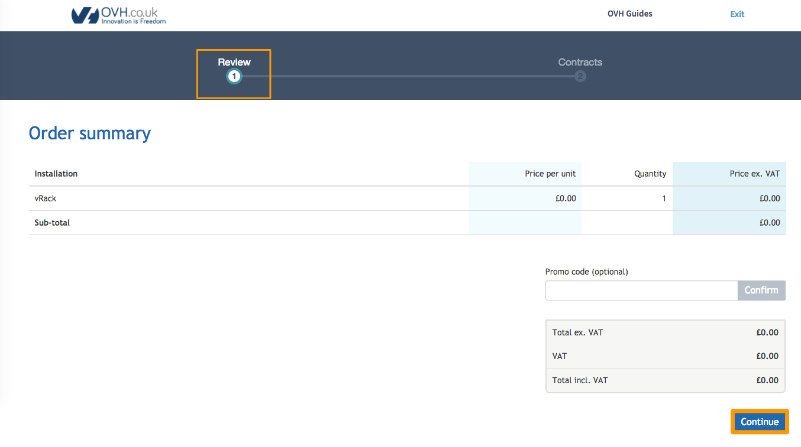
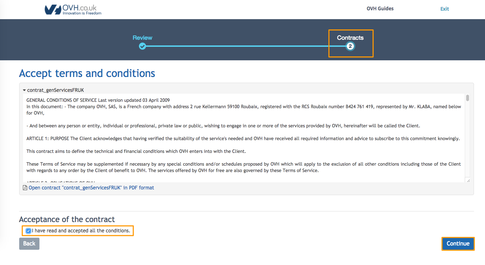
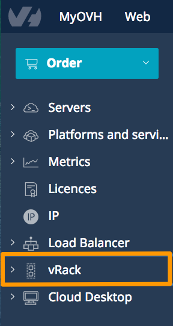
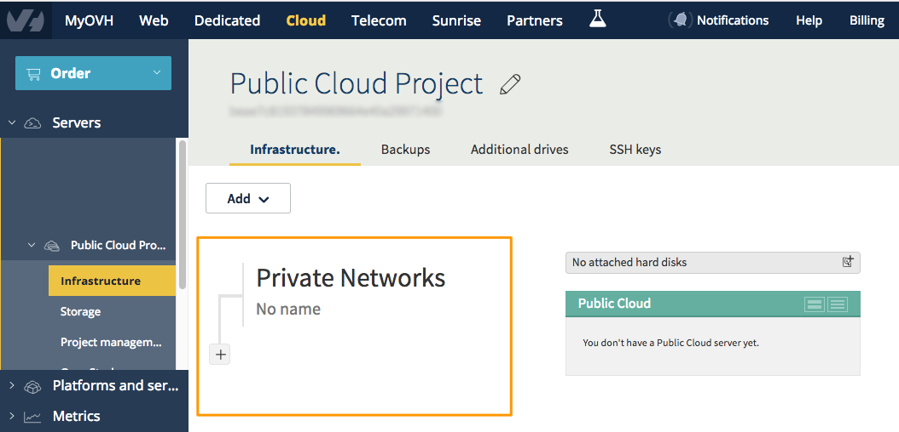

**Ostatnia aktualizacja dnia 2018-02-01**

## Wprowadzenie

vRack czyli wirtualna szafa pozwala na zebranie wielu serwerów, bez względu na ich liczbę i fizyczną lokalizację w naszych centrach danych, i na ich podłączenie do wirtualnego przełącznika w ramach tej samej prywatnej sieci. Technologia vRack pozwala na podłączenie, odizolowanie i rozdzielenie usług OVH w ramach jednej lub kilku prywatnych i zabezpieczonych sieci. Usługa vRack jest kompatybilna z serwerami dedykowanymi (zgodnie z ofertą), instancjami Public Cloud usługą Private Cloud OVH. Szczegółowe informacje można znaleźć na naszej stronie internetowej o [vRack](https://www.ovh.pl/rozwiazania/vrack/){.external}.

Aby utworzyć sieć prywatną, należy włączyć usługę vRack dla projektu. Jest to jednorazowa operacja i zajmuje tylko kilka minut.

Niniejszy przewodnik dotyczy sytuacji, w których sieci prywatne są tworzone przed pierwszym uruchomieniem (instalacją) instancji.

Jeśli chcesz dodać do vRack już istniejącą instancję, sprawdź przewodnik z tytułem: [Dodanie usługi vRack do instancji Public cloud przez API OVH](https://docs.ovh.com/pl/public-cloud/uruchomienie-vrack-instancje-api-ovh/){.external}.

## Wymagania początkowe

- Dostęp do [Panelu klienta](https://www.ovh.com/auth/?action=gotomanager){.external}
- Utworzony projekt w usłudze Public Cloud

## W praktyce

### Włączanie vRack

Przejdź do sekcji "Infrastruktura" Twojego projektu i kliknij na "Włącz vRack".

{.thumbnail}

Nastąpi przekierowanie bezpośrednio do nowej karty lub okna (może to zależeć od ustawień przeglądarki), gdzie zostanie wygenerowane bezpłatne zamówienie. Zamówienie usługi i potwierdzenie jest wymagane do udostępnienia usługi dla danego Projektu. Kliknij `Kontynuuj`{.action}.

{.thumbnail}

W drugim kroku wymagana jest akceptacja warunków świadczenia usługi, w dole okna znajduje się link do pliku w formacie PDF.

{.thumbnail}

Aby zakończyć realizację bezpłatnego zamówienia, należy kliknąć `Dalej`{.action}. Po sprawdzeniu poprawności, zamówienie będzie widoczne jako opłacone.

{.thumbnail}

Usługa vRack będzie gotowa do użycia w krótkim czasie, do 5 minut.

Teraz możesz dodać projekt do vRack i utworzyć prywatną sieć. Ta opcja jest dostępna w sekcji `vRack`{.action}, która znajduje się w menu po lewej stronie.

{.thumbnail}

Pełny proces jest opisany w przewodniku: [Połączenie instancji Public Cloud z innymi produktami OVH za pomocą vRack](https://docs.ovh.com/pl/public-cloud/polaczenie-vrack-public-cloud-inne-uslugi/){.external}.

Po uruchomieniu vRack dla Projektu, w sekcji sieci prywatnych pojawi się drzewo sieciowe z przyciskiem `+`.

{.thumbnail}

Teraz możesz tworzyć prywatne sieci. Maksymalny limit posiadanych sieci w ramach jednej usługi vRack to 4000.

### Wyłączenie usługi vRack

W sytuacji, gdy konieczne jest wyłączenie usługi vRack, utwórz zgłoszenie pomocy z nazwą usługi (np. Pn-1234).

## Sprawdź również

Przyłącz się do społeczności naszych użytkowników na stronie <https://community.ovh.com/en/>.